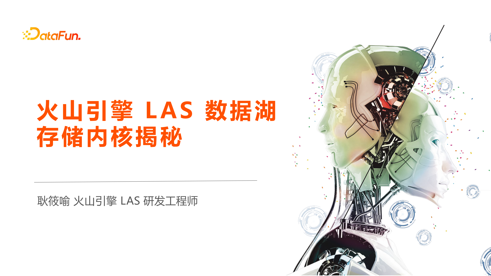

# 火山引擎LAS数据湖存储内核揭秘

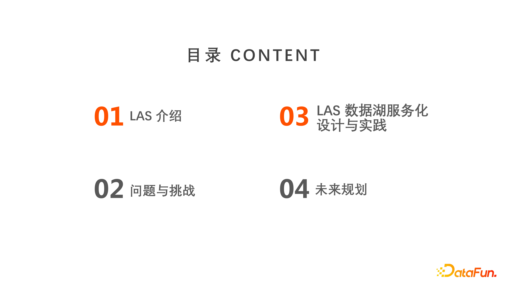

目录：

1. LAS介绍
2. 问题与挑战
3. LAS数据湖服务化设计与实践
4. 未来规划

 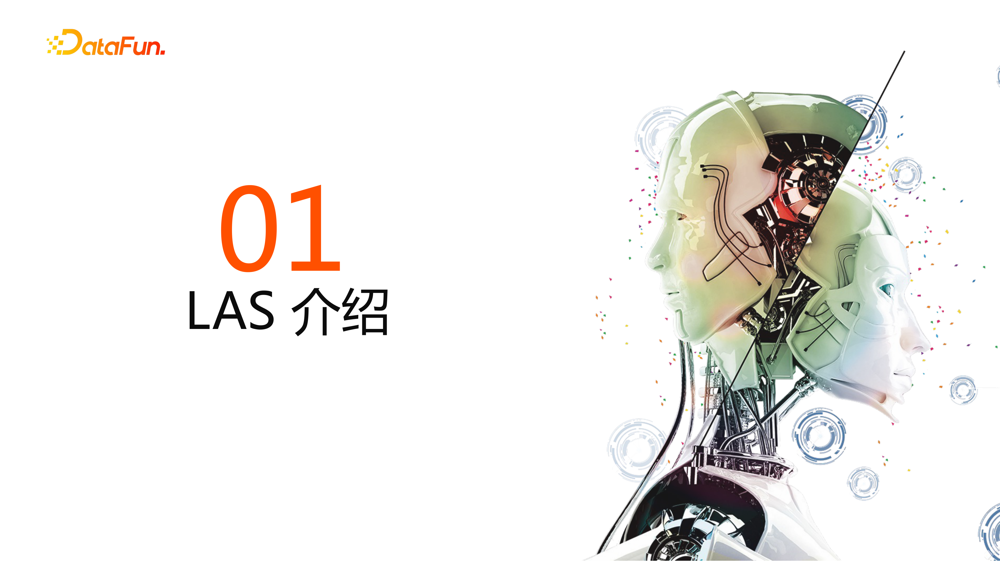

## LAS介绍

LAS全称（Lakehouse Analysis Service）湖仓一体分析服务，融合湖与仓的优势，既能够利用湖的优势将所有数据存储到廉价存储中，供机器学习，数据分析等场景使用。又能基于数据湖构建数仓供BI报表等业务使用。

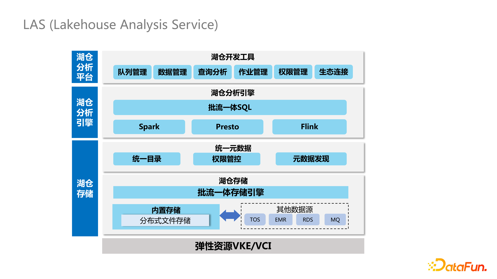

LAS整体架构如图所示，第一层是湖仓开发工具，然后是分析引擎，分析引擎支持流批一体SQL，一套SQL既能支持流作业又能支持批作业。并且我们支持引擎的智能选择及加速，根据SQL的特点自动路由到spark，presto或flink中去执行。再往下一层是统一元数据层，第四层是流批一体存储层。

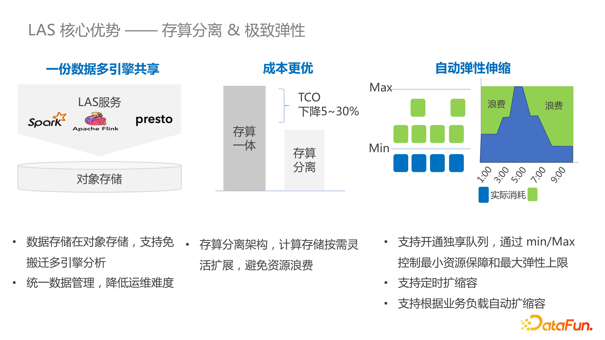

LAS的整体架构存算分离，计算存储可以按需扩展，避免资源浪费，因为存算分离，所以一份数据可以被多个引擎分析。想较存算一体，成本TCU可以下降30%-50%，并且我们支持动态弹性扩所容，进一步较低用户成本。

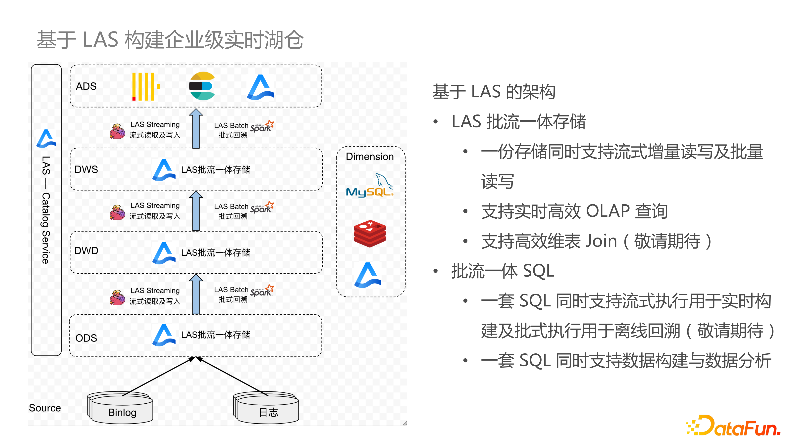

那么如何基于LAS构建企业级实时湖仓？

无论离线数据还是实时数据，都可以放到LAS流批一体存储中。如果需要实时处理的数据，可以直接利用LAS的streaming能力，流读流血，流式写入下一层表中，层层构建ODS，DWD等层级关系。如果需要进行离线回溯，不需要换存储，直解通过流批一体SQL运行离线任务。

## 问题与挑战

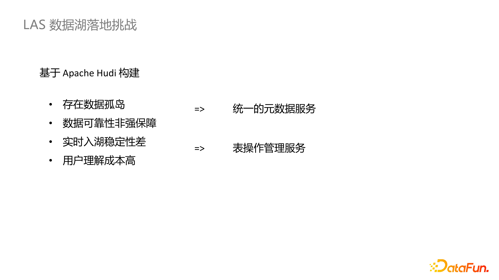

LAS流批一体存储是基于开源的Apache Hudi构建的，在整个落地过程中，我们遇到了一些问题。
Apache Hudi仅支持单表的元数据管理，缺乏统一的全局视图，会存在数据孤岛。Hudi选择通过同步分区或者表信息到hive metastore server的方式提供全局的元数据访问，但是两个系统之间的同步无法保证原子性，会有一致性问题。因此当前缺乏一个全局可靠视图，另外hudi在snapshot的管理上，依赖底层存储系统的视图构建自己的snapshot信息，而不是通过自己的元数据管理。这种机制无法保证底层的存储系统记录的文件信息和每次commit的文件对齐，从而导致下游消费的时候读到赃数据，或者坏文件等问题。
针对数据孤岛和元数据一致性问题，LAS设计统一元数据服务，提供一个全局的可靠视图。另外hudi支持merge on read方式，通过更新数据先写入log文件中，读时再和底层的base文件进行合并，为了保障读取效率，hudi提供compaction功能，定期将log文件和base文件进行合并后写入。在近实时或实时场景下，对于时间非常敏感， 在写入操作后顺序执行compaction会导致产出时间不稳定，影响下游消费。对此社区提供了async compaction功能，将compaction算子和commit拆开，compaction和commit可以在一个application中共享资源，并行执行。对于flink入湖作业来说，增量导入数据所需的资源和存量compact所需的资源很难对齐。往往后者对于资源的要求会更高，但执行频次会更低。并且compaction和增量导入混合到一起，增量导入会因为compaction作业运行不稳定会失败。所以为了节约资源，保障作业的稳定性。需要独立拆分资源供compaction任务的执行。这样就带来一个问题，随着生产任务增长，这些异步作业的管理就是一个新挑战。因此LAS提供表操作管理服务table management service。全托管所以异步任务，包括compaction，clean，clustering等。用户不需感知这里的状态，也不需额外了解这些操作背后的逻辑，仅仅需要关注入湖任务的稳定性。
总结下来，LAS在数据湖存储的服务化上面主要做了两个工作，统一的元数据服务和表操作管理服务。

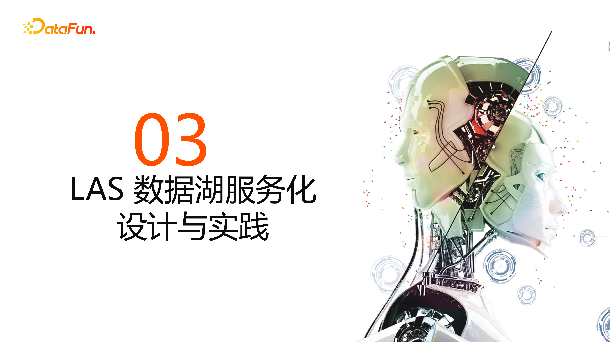

## LAS数据湖服务化设计与实践

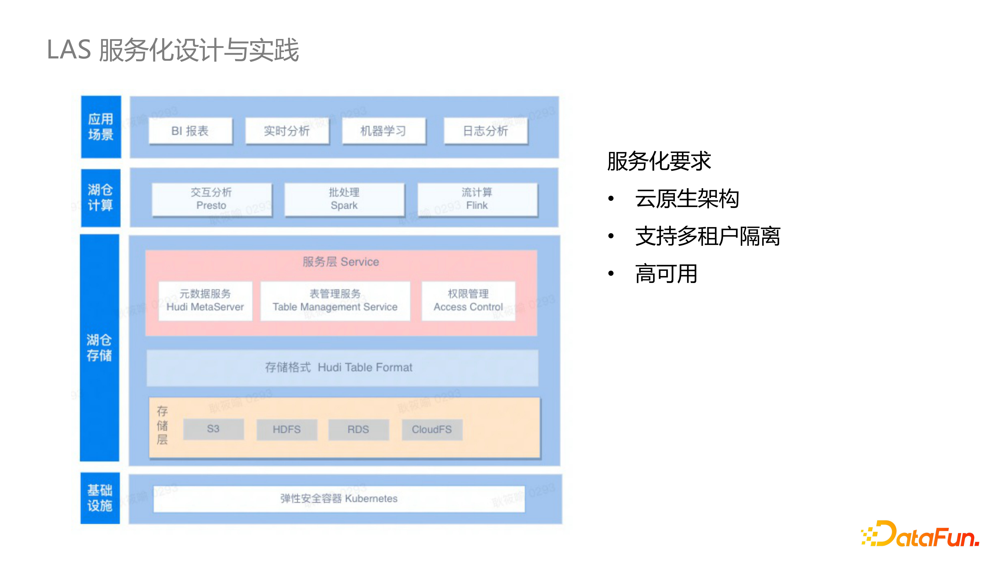

接下来详细介绍这两个服务的实现。
service层在LAS中连接了底层存储的存储格式和上层的查询引擎。LAS作为一个SAAS服务（或者说PAAS服务），它要求服务层的设计需要满足云原生的架构，存算分离，支持多租户隔离以及高可用。service层除了需要解决上文提到的问题外，还需要满足这些目标：

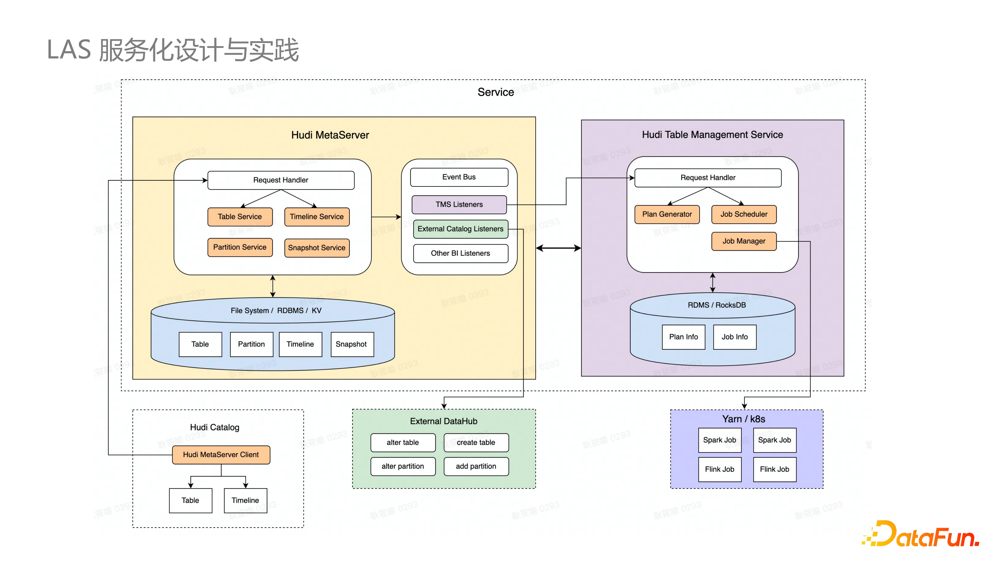

这个是服务层的整体架构，包括元数据管理服务Hudi MetaServer和表操作管理Hudi Table Management Service。两者之间有交互，并且会和一些外部系统比如k8s，yarn，外部的datahub等进行交互。

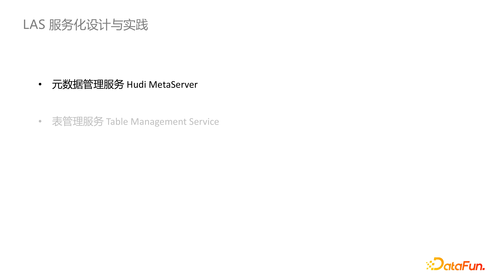

首先我们先看Hudi MetaServer元数据管理服务。

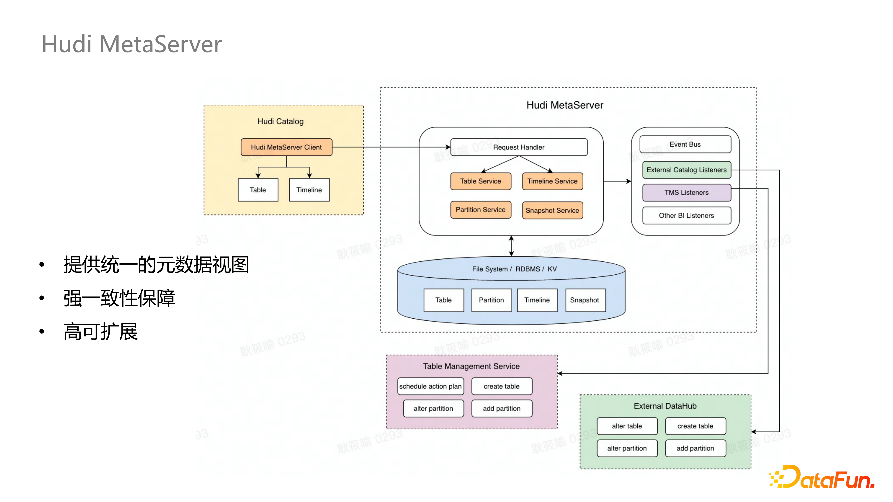

Hudi MetaServer整体结构分为三大模块：
- Hudi Catalog
- 核心功能MetaServer
- Event Bus

其中Hudi Catalog是读表写表client侧对单表访问的抽象，通过MetaServer Client与MetaServer交互。
Event Bus是事件总线，用于将元数据相关的增删改查事件发送给监听者，监听者可以根据事件类型决定对应的执行操作。（比如同步元数据信息到外部的元数据信息系统等）。Table Management service就是其中一个监听者，属于其中一个重要组成部分。
MetaServer整体分为两大块，存储层和服务层。存储层用于存储数据湖的所有元数据，服务层用于接受所有元数据的相关增删改查请求。整个服务层是无状态的，因此支持水平扩展。

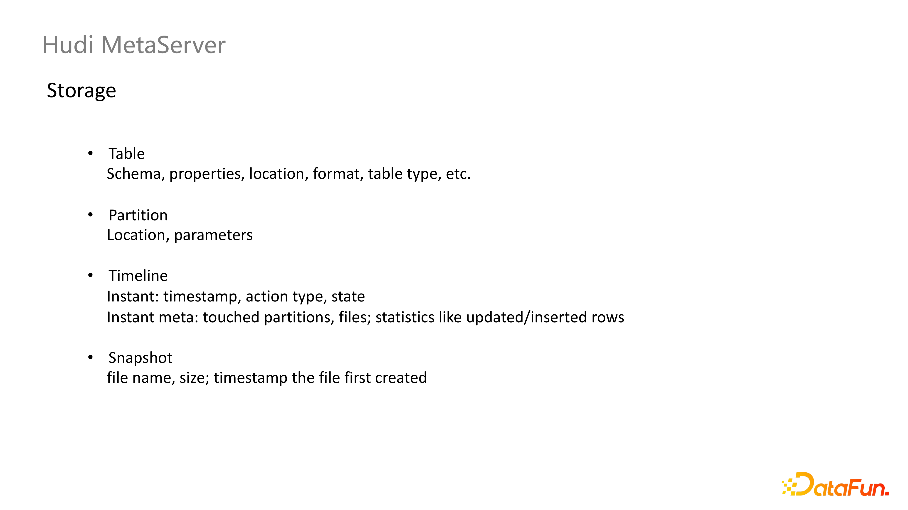

我们先来看一下存储层，存储层的主要内容在于存储了哪些元数据信息：

- 存储层记录了表的元数据信息，比如schema，location等等；
- 分区元数据信息location，parameter等等；
- 时间线信息，这里的时间线信息包括构成时间线的一个个commit，以及commit对应的commit metadata信息，commit meta会记录本次更新修改了哪些分区、文件以及统计信息；
- 最后存储层还会记录snapshot信息，即每次commit的文件信息，包括文件名、大小等等。

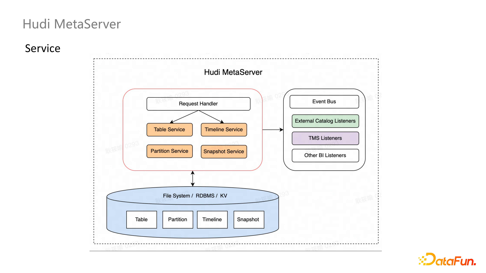

service层按照功能模块划分成：

- Table serivice
- Partition service
- Timeline service
- Snapshot service

用于处理对应的元数据请求。

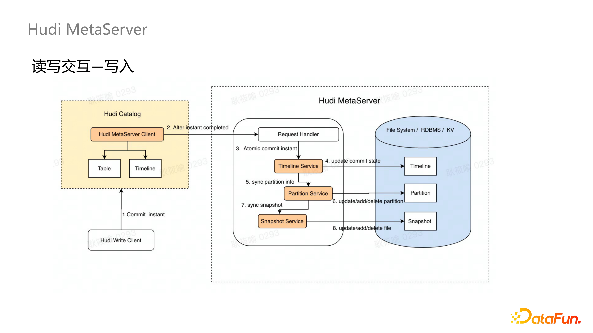

接下来我们看一下hudi的读写过程中怎么与MetaServer交互的。

先看写入部分，当client准备提交一个commit时，它会请求hudi catalog，由hudi catalog与MetaServer进行交互，最后进行提交。MetaServer收到提交请求后会先路由给timeline service进行处理，修改对应commit状态，并且记录本次提交commit 的metadata信息。然后根据commit metadata信息将本次写入修改的分区和文件写入底层存储中，即partition信息的同步和snapshot的同步。

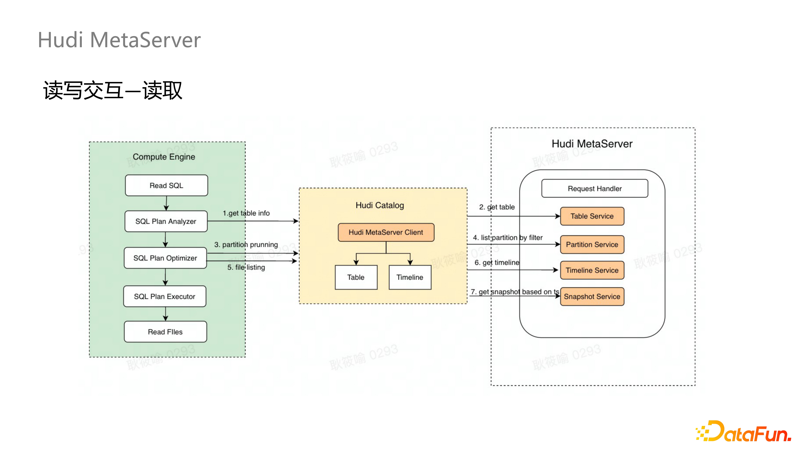

在读取过程中，计算引擎会先解析sql，生成analysis plan。这个时候就访问hudi catalog获取表信息，构建relation，接着经过optimize层执行分区下推等等优化规则。MetaServer会根据client传递的predicate 返回下推后的分区，relation会获取本次需要读取的所有文件信息，MetaServer就会响应这次请求，获取当前最新的snapshot，封装成fast analysis返回，最后由compute engine执行读取操作。

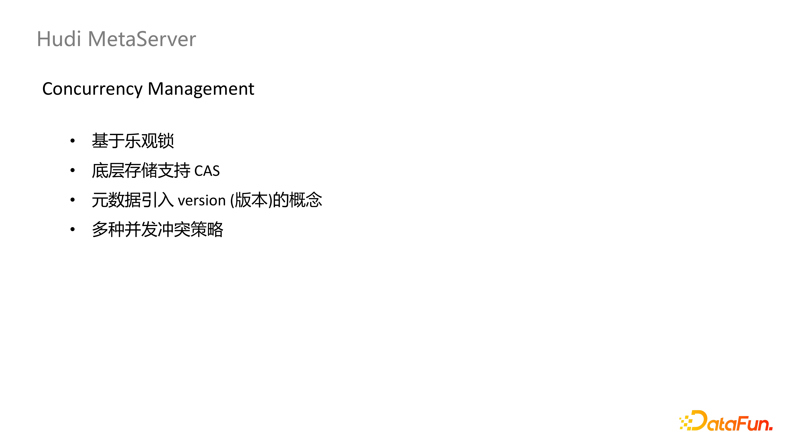

MetaServer的几个核心功能包括schema evolution和并发管理的支持

其中schema evolution本质上就是支持多版本的schema，并且把该schema和某个commit进行关联。（不详细介绍）。

并法管理的核心设计包含四个部分：

- 基于乐观锁
- 底层存储支持CAS
- 在元数据引入版本概念，表示commit提交的先后关系
- 支持多种并发冲突策略，最大化的进行并发写入

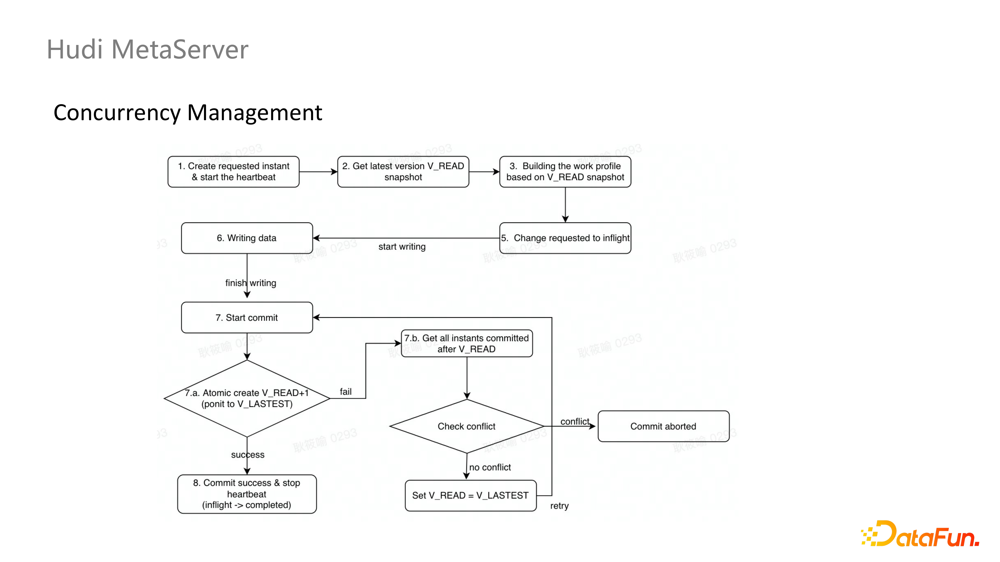

先看一下整个的并发控制流出。
首先写入端会提交一个requested commit，并且从server侧拿到最新的snapshot信息；这个snapshot信息对应一个V_READ的版本号，然后写入端基于snapshot去构建work profile，并且修改commit状态为inflight状态。完成后开始正式写入数据，写入完成后准备提交本次commit。此时service侧会尝试将该commit提交到V_READ+1版本，如果发现提交失败，说明当前最新版本号被改变了，不是V_READ版本，那么需要将V_READ版本到最新的版本之间所有提交commit拿出来，判断已经完成的commit是否与本次提交冲突，如果冲突的话需要放弃本次提交，不冲突的话提交本次commit到最新的version+1上。
整个提交commit到固定的版本过程（图上步骤7）是原子操作。

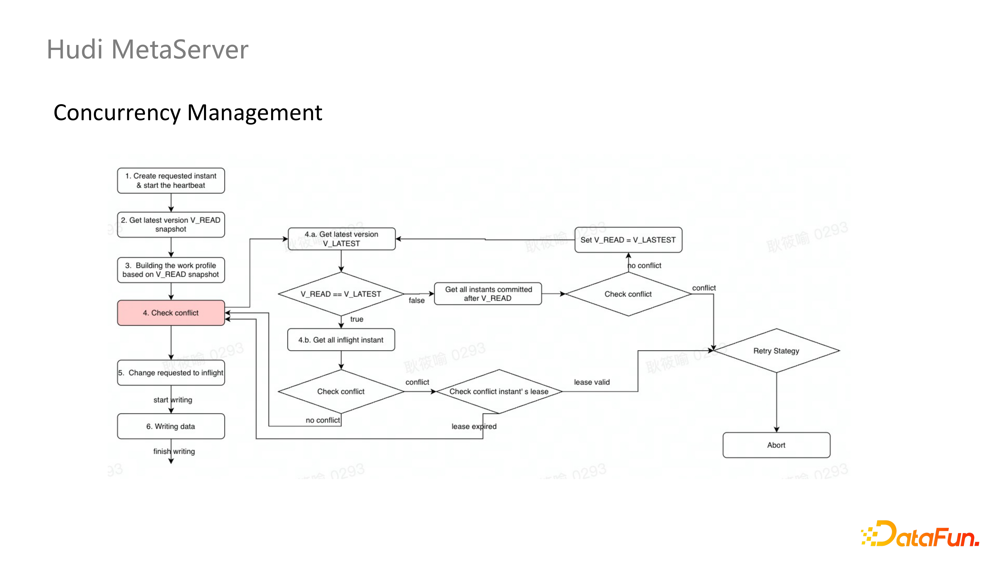

上述整个过程是在commit最后阶段进行并发拦截，那能否及早发现冲突使得写入侧因为冲突放弃本次写入的代价尽可能下。所以我们在commit inflight阶段状态变化过程也增加了冲突检查功能。因为在这个时候，写入侧已经完成了work profile构建，那它就会知道本次commit会写入哪些文件。server侧可以感知到该表所有正在写入的client，所以可以判断本次commit是否和其他正在写入的client是否有冲突，有冲突的话直接拒绝本次commit inflight的转化，这个时候写入侧还没有正式写入数据，代价非常小。

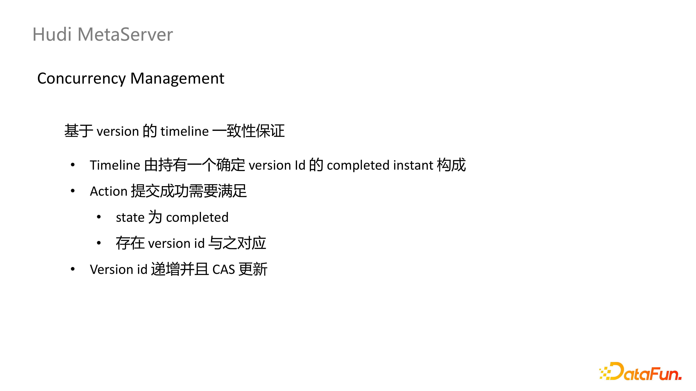

那基于version的timeline怎么做一致性保证，原先的timeline仅仅是由所有completed状态的instant构成，现在的timeline是有一个确定version的completed状态的instant构成。这个instant在提交过程中需要满足两个条件：

1. 状态必须是completed状态。
2. 必须有一个version版本号相对应。

这个version id是单调递增并且支持CAS更新，就不会有一致性问题。

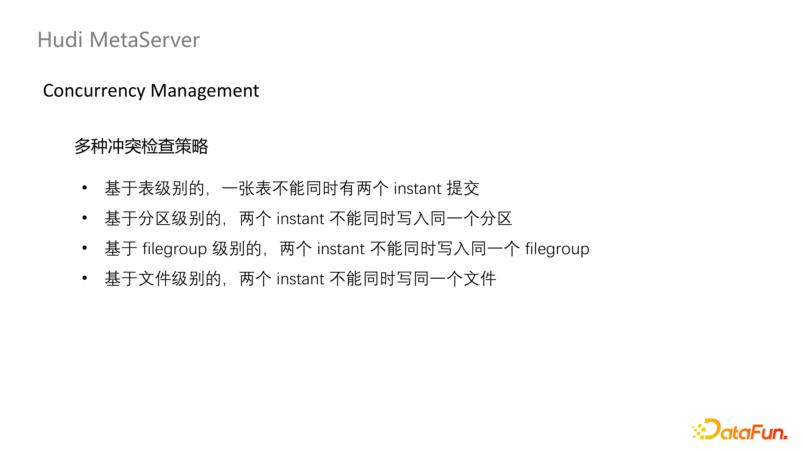

最后介绍冲突检查部分的多种冲突检查策略，我们可以根据业务场景选择不同冲突检查策略，满足业务侧不同的并发写需求，比如

- 基于表级别的，一张表不能同时有两个instant提交，其实就是不支持并发写的冲突检查策略
- 基于分区级别的，两个instant不能同时写入同一个分区
- 基于filegroup级别的，两个instant不能同时写入同一个filegroup
- 基于文件级别的，两个instant不能同时写同一个文件

锁力度越往下是越细粒度的，支持的并发也会更宽一些。

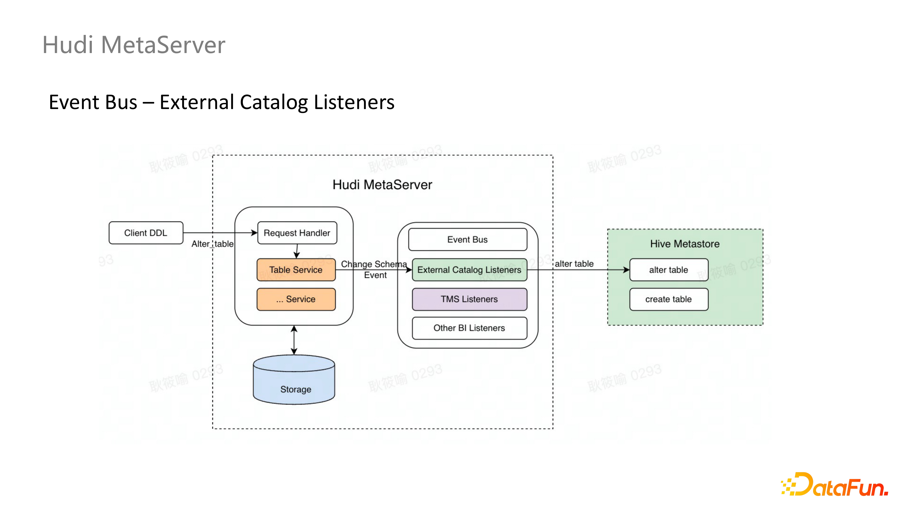

最后介绍MetaServer Event Bus事件总线这个组件。
事件总线是将元数据的增删改封装成一个个事件发送到消息总线中，由各个server监听事件并且根据事件类型进行响应，从而让下游组件感受到元数据的变化。（如平台侧的元数据管理服务，table management service等等）。以external catalog listener为例，假设写入端提交了一个加列的ddl，那么在MetaServer处理完请求后，会将本次的table schema的修改信息封装成一个change schema，（如change schema event）。然后发送到event bus中，然后hive catalog listener在收到事件之后就会调用hive client同步新的schema给hive metastore。

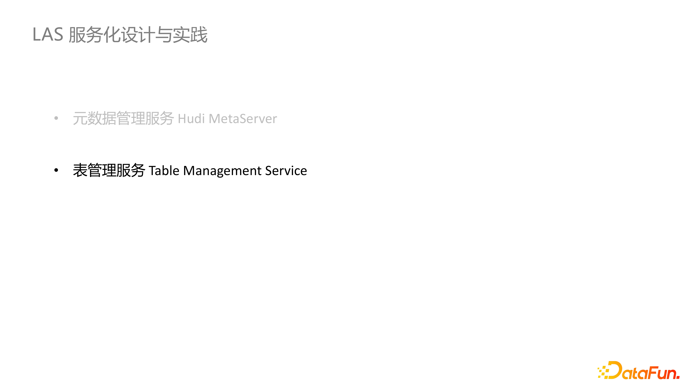

接下来介绍表级别管理服务Table Management Service的详细设计，以及它是如何跟Hudi MetaServer去进行交互的。

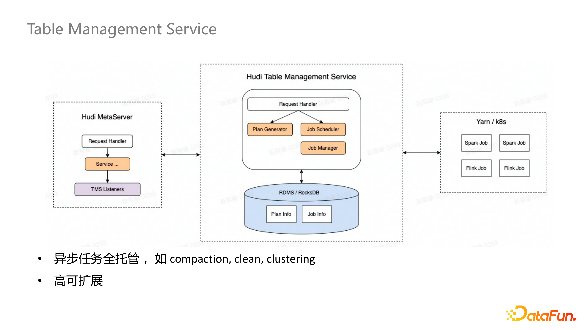

Table Management Service主要解决的是异步任务全托管的问题。然后service由两个部分组成：

- Plan Generator
- Job Manager

Plan Generator主要跟MetaServer交互，主要用于生成action plan，通过监听MetaServer Event触发plan生成。Job Manager主要跟yarn/k8s交互，用于管理任务。它按照功能分为两个部分：

- Job Scheduler
- Job Manager

Job Scheduler用于调度需要被执行的action plan，而Job Manger 用于管理action plan需要对应的执行任务。

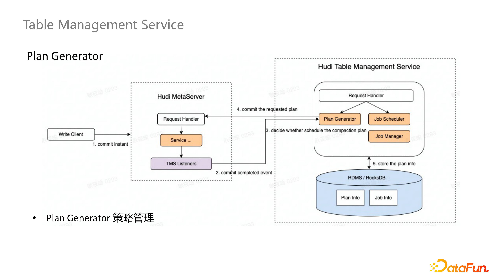

我们先看一下Plan Generator和MetaServer之间的交互逻辑，当Table Management Service监听到MetaServer侧传递的instant commit事件之后，Plan Generator决定是否本次需要生成一个新的action plan。如果需要的话，就向MetaServer提交一个request状态对应异步操作的instant，表示该action 后续需要被执行。提交成功后会记录本次action requested状态的相关信息，比如表名，时间戳，状态等等，然后等待调度执行。
举个例子，比如client端提交一个commit事件之后，plan generator监听到之后它可能会去判断本次commit是否需要调度compaction plan去生成，如果需要的话，它就会创建一个compaction requested的一个时间戳，提交到MetaServer上，提交完成之后，Table Management Service会获取到自己提交完成，然后把这些信息放到自己的存储中，表示这个instant的compaction 需要被执行，然后就会有这个manager再去调度compaction进行执行。
然后Plan Generator决定是否需要生成action plan或者compaction plan在本质上是由策略决定的。以compaction为例，默认是需要等到n个delta commit完成之后才能进行client调度。
然后comapction plan的生成策略也有多种，基于log file size决定filegroup是否需要被compact；或者是直接基于bounded io去决定是否需要compact。比方说这次compact的总的io不能超过500M的策略。这些策略是一开始建表的时候由用户指定的。Table Management Service会从MetaServer的表的元数据信息中获取策略信息。如果用户需要修改策略的话需要通过ddl修改表的相关配置。之所以这么做，而不是通过写入侧去提交策略信息是考虑到并发场景。如果通过写入侧指定策略会出现两个写入端提交的策略不对齐的问题。比分说一个compaction的调度策略是12个delta commit之后触发，而另外一个写入端提交提交的是1个delat commit之后触发，这块就会有不对齐。

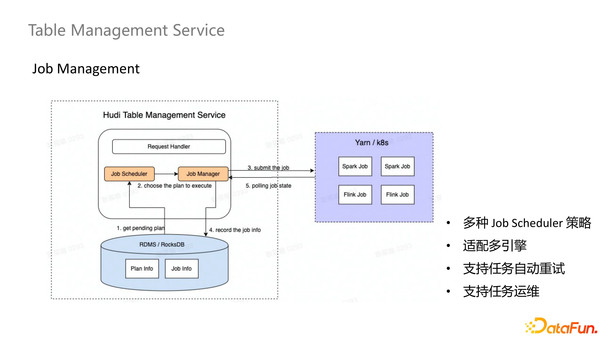

Job Management中的Job scheduler会定期轮询尚未被执行的action instant，就是上文提到的它会提交一个instant request，然后它再分发给Job manager，由job manager启动一个spark或者flink任务执行。然后它会定期轮询作业的执行状态，监控并记录作业的相关信息。其中Job scheduler支持多种调度策略，比如FIFO，或者按照优先级方式选择需要被执行的pending 的action plan。而Job manager的主要职责是适配多种引擎用于任务的执行，并且支持任务的自动重试，支持任务运维所需要的报警信息。

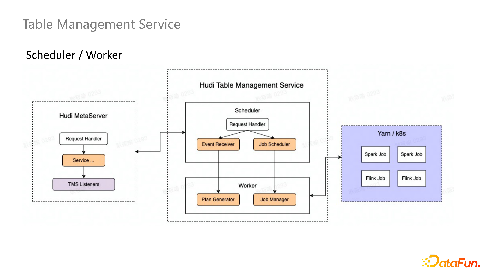

另一个需要提的点，table management service的架构设计。如果说和MetaServer一样，作为一个无状态的服务的话，那么在trigger plan生成选择plan执行的时候会出现并发问题。所以整个服务架构为主从结构，主节点负责接收MetaServer的event，收到event之后，如果决定需要调度plan进行执行的话，会选择对应的worker去生成plan的生成逻辑，然后再由work去负责plan的生成，然后主节点负责任务的调度，会定期的去storage里找到pending的action plan，交给worker去做任务的执行，以及监控报警。

## 未来规划

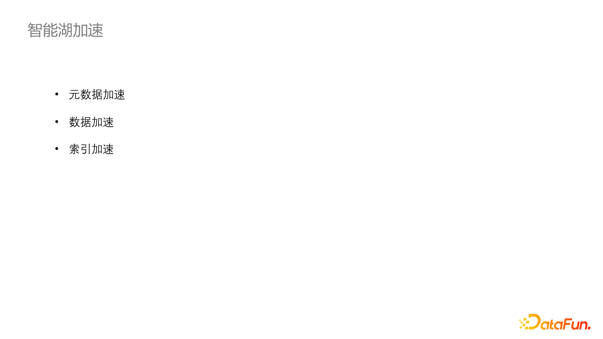

围绕数据湖加速方向工作：

- 元数据加速 （元数据获取加速，构建和获取索引的加速）
- 数据加速 （底层存储数据本身的加速）
- 索引加速 （基于索引的加速查询）

元数据加速和索引获取加速部分会很MetaServer之间做一些结合，MetaServer本身也会做一些cache来加速一些元数据信息的获取。获取数据查询的加速和索引加速部分，会在底层存储之上加一层缓存层，比如alluxio就是一个比较适合的缓存层，可以结合查询sql pattern的一些信息然后去支持智能的缓存策略，来加速整个查询的过程。

## Q&A

Q. 这个路由是怎么做的？会使用统一的优化器，只是用各个引擎的runtime？

A. 底层确实会用各个引擎的runtime，SQL解析层针对统一SQL做优化，生成优化完的规则，（比如一个简单的查询到presto，会直接传递sql过去，因为presto没有类似spark的dataframe封装，针对spark/flink会做dataframe的封装然后发给spark/flink

Q. 如何解决不同引擎SQL语义的一致性？

A. spark和presto的差异不是很大，主要差异在与流和批SQL语义对齐。针对spark/presto我们用ansi sql/hive语义对齐，以这个为标准，让spark/presto向上对齐。对于流批SQL一体，我们以批处理相关逻辑来对齐，或者根据实时或离线场景需求，然后判断按照某个场景来对齐。

Q. LAS支持入湖模版吗？允许整库入湖吗？

A. 目前底层还不支持整库入湖，主要支持单表入湖。需要在上层，面向用户层实现。

Q. hudi catalog如何保证数据的一致性？

A. hudi catalog本质上就是一个MetaServer 的client，所以不太会有一致性问题。出现一致性问题的主要点在因为catalog会存table的元数据信息和timeline的元数据信息。但是所有对timeline的修改（比如提交instant）都会通过catalog，catalog能感知到这次修改，就可以将本次修改提交到MetaServer侧，MetaServer侧就会返回修改成功和失败到给catalog，catalog就能构建跟MetaServer一致的timeline信息。

Q. 是自己实现了hudi元数据表的数据组织吗？

A. 是的，大部分设计会跟社区的实现类似，因为社区实现本质上是基于在表路径下面建了个.hudi/的目录用于存timeline的元数据信息，以及commit metadata，像catalog这样的信息是没有的（指hudi 0.9.0版本之前）。 我们是基于0.6的版本开发。现在新版社区提供了mdt metadata table功能存储snapshot信息，metadata table本质上就是个hudi的mor表，对于底层snapshot的管理metadata table还是依赖hdfs的组织，也没有记录snapshot信息。这块hudi是有缺失的，我们补上这块缺失，增加snapshot管理，在实现上更像iceberg一样存一些manifest的信息。

Q.查询引擎需要缓冲hudi元数据吗？

A. 查询引擎目前对接的就是hudi catalog，依赖hudi catalog的支持，这块我们目前没有做缓存。

Q. 是关于冲突检查级别，是用户选择还是引擎默认？

A. 我们有一个默认的冲突检查策略，是基于分区级别。但是对于业务场景来说（比如多流分批join，有两个job，每个job写部分列数据，这时冲突检查策略就是基于文件/基于列的冲突检查策略）,这个时候就需要建表时特殊指定标志为多流拼接的表，server就会根据表级别的冲突检查策略做冲突检查。

Q. 事件通知模式如何保证事件不丢失？

A. 我们没有做强一致性的保证，但是会定期拉取没对齐的部分，发送给下游监听方。另外我们会记录一些metrics（比如这次事件发送成功与否），如果对一致性敏感的场景可以做一些监控，自我告警。

Q. 是否支持双流驱动的join, 一个包含主键，一个不包含主键？

A. 双流join一般都需要共同的主键才能做到。

Q. 一个典型的sql binlog到hudi的pipeline一般做到的新鲜度是多少，消耗的成本是多少？

A. 目前做到稳定的场景是分钟级别，然后我们在尝试做秒级的数据可见。但是如果做秒级可见的话存在一个问题事务的可见级别不能强保证，可能会读到read uncommit的数据。

Q. 异步compact资源是用户的还是公共资源，如何避免compact和查询并发同时发生带来的对query的影响

A. 首先compact使用的是公共资源不是用户的，我们提供的一个大池子去跑。根据任务优先级，比如p0作业会调度要高优队列上跑。 另外compact执行是完全异步的，不会影响查询也不会影响写入。
