感谢大家这次再到这个线上论坛来听到我们去一起分享关于高性能LLM推理框架的设计与实现。我是目前在商汤科技，主要做大语言模型推理相关的一些工作。之前是负责商汤科技HPC部门的量化工具的研发。

我在这里主要介绍我们在大语言模型推理当中所做的一些工作，以及大语言模型性能优化的一些关键点。

## 目录

一：大语言模型推理介绍
二：大语言模型推理的性能指标
三：大语言模型性能优化的关键点
四：大语言模型推理的硬件

## 一、大语言模型推理介绍

首先对于大语言模型来说，它的推理将跟传统的CNN模型不太一样，它的推理会分成Prefill和Decoding两个阶段的。每一个请求发起后产生的推理过程都会先经历一个Prefill过程，Prefill过程会计算用户所有的输入，并且生成对应的kv缓存。然后再经历若干个Decoding过程，每一个decoding过程，服务器都会生成一个字符，然后把这个新生成的字符放入到KV缓存当中。模型推理就是这样一个迭代的过程。

由于Decoding过程是一个字符一个字符生成的。每一段答案的生成都需要很长的时间，生成很多的字符。所以在大语言模型的推理当中，Decoding阶段的数量是非常多的，占到整个推理过程的90%以上。然后在Prefill过程，虽然这次过程的计算量很大，因为它要一次性的完成用户输入的所有词的计算，但它只是一次性的过程。所以在整个推理阶段当中，它只占不到10%的时间。

## 二、 大语言模型推理的性能指标

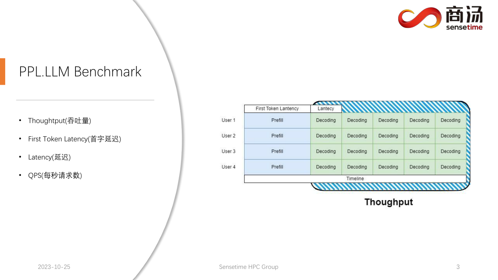
我们需要介绍大语言模型推理当中的四个性能指标。这四个性能指标会从四个不同的方面来衡量一个系统的服务提供能力。

1. 首先是Thoughtput（吞吐量）。我们最先关注的是服务层面，从模型推理层面上看，最先关注的就是吞吐量。吞吐量是指当系统的负载达到最大的时候，在单位时间内，能够执行多少个Decoding，既生成多少个字符。在测试吞吐量的时候，我们会使用这样一种测试方式，我们假设所有的用户都会在同一时刻到来，并且这些用户问的都是一样的问题，这些用户可以同时启动，同时结束，他们生成的文本的长度和输入的文本长度都是一样的。因此我们使用完全相同的输入，组成一个完整的batch。在这种情况下，系统的吞吐量会达到最高。但这种情况是不合实际的，所以这是一个理论的最大值。我们会测量在一秒钟之内，系统能够执行多少个独立的Decoding阶段。

2. 第二个我们关注的指标是First Token Latency（首字延迟）。所谓首字延迟是指当一批用户进入到推理系统之后，用户完成Prefill阶段的过程需要花多长时间。这也是系统生成第一个字符所需的响应时间。我们现在接收到的很多需求都会很关注这个指标，他们希望用户到了我们的系统上之后，输入问题得到第一个字符，即得到回答的时间要小于2秒或者小于3秒。这里我们关注的是Prefill阶段到底所需要花费的时长。

3. 第三个指标是Latency（延迟）。Latency是指每一个Decoding它所需要的时长。它反映的是大语言模型系统在线上处理的过程中，每生成一个字符的间隔是多长时间，也就是生成的过程有多么流畅。大部分情况下，我们会希望生成的延迟小于50毫秒，也就是一秒钟生成20个字符。这时大语言模型的生成是比较流畅的。

4. 最后一个指标是QPS（每秒请求数）。这实际上反映了在线上系统的服务当中，一秒钟能够处理多少个用户的请求。这个东西的测量方式会比较复杂，我们在后面再展开。

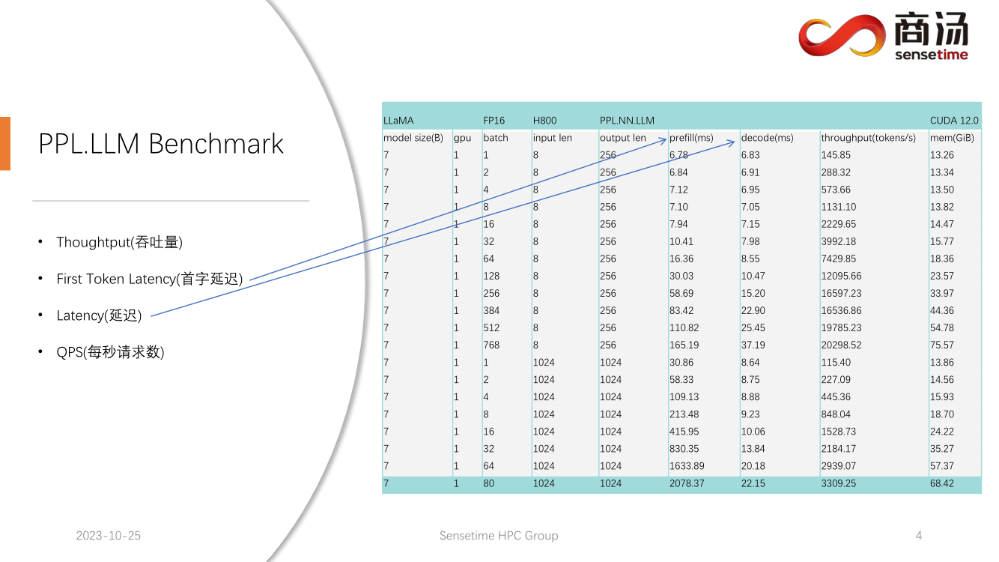

对于First Token Latency和Latency这两个指标，我们都进行了相对完善的测试。这两个指标会因为用户输入的长度不同，会因为batch size的不同而发生非常大的变化。在上表中大家可以看到，对于同样的7B模型，如果用户的输入长度从8变成2048之后，那么Prefill的时间将从6.78毫秒，直到变成2078毫秒，既2秒的时间。如果我有80个用户，每一个用户都输入1,024个词，那么这个时候做Prefill的代价在服务端就要跑2秒左右，这个时间已经超出了我们的限制。但如果我们的用户输入长度都很短，如果用户每次访问只输入8个词，哪怕到了768个用户同时到来的时候，我们的首字延迟也仅仅只有165毫秒左右。与首字延迟最相关的就是用户的输入长度，用户输入的长度越长，那么首字延迟也会越高。用户输入长度如果很短，那么首字延迟在整个大语言模型推理过程中都不会成为瓶颈。

而后面的Decoding延迟，通常来讲对于只要不是千亿级别的模型，Decoding的延迟，都会控制在50毫秒以内。它主要受到的是batch size的影响，batch size越大，推理延迟也会越大一些，但基本上增加的幅度不会很高。

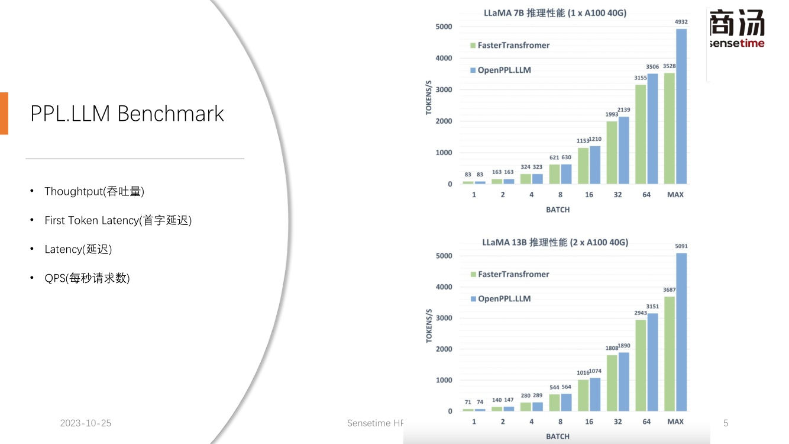
最后是吞吐量这块，吞吐量其实也会受到这两个因素影响。如果用户输入的长度和生成的长度很长，那么系统吞吐量也不会很高。如果用户输入长度和生成长度都不是很长的话，系统吞吐量可以达到一个非常离谱的程度。

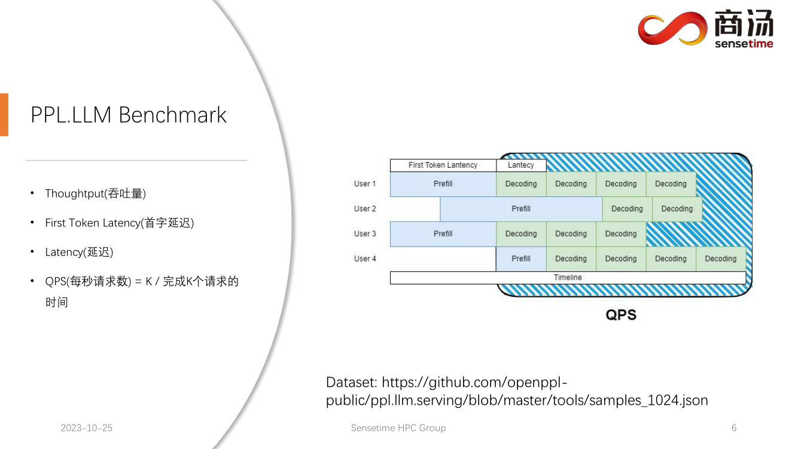
讲完这些之后，我们再讲QPS。QPS是一个非常具体的指标，它表示我们系统中每秒可以处理多少个请求，在进行这个测试的时候，我们会使用实际的数据。（关于这份数据，我们已经做好了采样，并且放在了github上。)QPS的测量跟吞吐量不太一样，因为我们在实际使用大语言模型系统的时候，每一个用户到来的时间是不确定的。有的用户可能早来，有的用户可能晚来，并且每一个用户做完Prefill之后，它的生成长度也是不确定的。有的用户可能生成4个词就退出，有的用户可能要生成20多个词。在Prefill阶段，在实际线上推理当中，因为我们的用户实际生成长度不一样，所以会遇到一个问题。有些用户会提前生成完，有些用户要生成很多长度之后才会结束。那么我们会发现，在这样的生成过程中，有很多地方的GPU会处在空闲。因此在实际的推理过程中，我们的QPS不能够发挥完全的吞吐量优势。我们吞吐量可能很大，但实际的处理能力可能会很差，因为我们在这个处理过程当中充满了无法使用显卡的空洞。所以在QPS指标上，我们会有非常多的具体的优化方案，避免计算的空洞或者无法有效利用显卡的现象存在，从而使得我们的吞吐量能够完全的服务到用户上。

## 三、大语言模型性能优化的关键点

直接来到大语言模型的推理的流程当中，看看我们究竟做了哪些优化，从而使得系统在QPS上，以及在吞吐量上都达到一个比较优秀的情况。首先我再详细介绍大语言模型的推理过程，对于刚才提到的Prefill和Decoding两个操作，每一个请求进来都需要经历。具体我们对这两次操作进行详细拆解。

在Prefill阶段当中我们至少要做四件事情：
1. 第一件事情是我们要把用户的输入进行向量化，tokenize的过程指的是我们要把用户输入的文本转换为向量，相对于prefill整个阶段来说，它大概要占掉10%的时间。这是有代价的。
2. 而后我们就会进行真正的prefill计算，这个时候我们会占掉大概80%的时间。
3. 在进行计算之后我们会进行sampling，这个过程在Pytorch里面一般会用sample、 top p。在大语言模型推理当中会用argmax。总而言之，这是根据模型的结果，生成最后词的这么一个过程。这个过程也会占掉10%的时间。
4. 最后将refill的结果返回给客户，这需要的时间会比较短，大概占比2%到5%的时间。

Decoding阶段是不需要tokenize，每一次做Decoding都会直接从计算开始，在整个Decoding的过程当中也会占掉80%的时间，而后面的sampling，也就是采样生成词的过程，也要占掉10%的时间。但它会有一个detokenize的时间，这个detokenize是指我们生成了一个词之后，这个生成的词是个向量，需要把它解码回文本，这个时间大概会占掉5%，然后这个生成的词最后要返回给用户。

那么看到我们现在的客户来到这里，在进行完Prefill之后，我们会不断地迭代进行Decoding，每一个Decoding阶段结束之后，我们都会把它的结果当场返回给客户。这样的生成过程在大语言模型里面是很常见的，我们也称这样的方式为流式传输。既我们的结果不是生成完了之后，一次性返回给客户的，而是在进行完每一个Decoding阶段之后，实时把结果返回给用户。

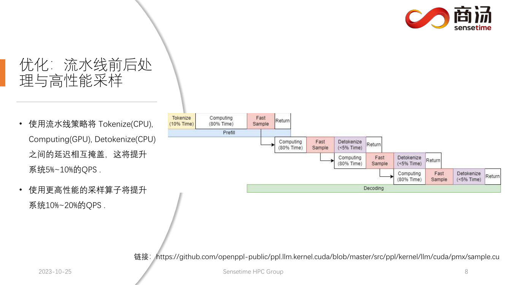
我们在这里启用的第一个优化是流水线优化，流水线优化存在的意义是我们要尽可能的让显卡利用率占满。

我们注意到在大语言模型的推理过程当中，tokenize以及fast sample和detokenize这些过程都跟模型的计算是无关的。那我们可以把整个大语言模型的推理想象成这样一个过程，在执行Prefill的过程当中，当我拿到了fast sample的词向量之后，就可以立刻开始下一个阶段Decoding，不用等到结果返回，因为结果已经在GPU上，而当完成了一次Decoding后，不用等待detokenize的完成，可以立刻开始下一次的Decoding。因为detokenize它是个CPU过程，后面这两个过程，只涉及到用户的结果返回，不太涉及到任何GPU的运算了。并且在执行完采样过程之后，我们已经知道了下一个生成的词是什么，我们已经拿到了所需的所有数据，可以立刻开始下一次运算，不需要再等待后面两个过程的完成。

在PPL.LLM的实现当中我们使用了三个线程或者称为三个线程池：
- 第一个线程池负责执行tokenize过程；
- 第三个线程池负责执行后面的fast sample以及返回结果的过程和detokenize；
- 中间的线程池用来执行computing的过程。

这三个线程池互相异步的把这三部分的延迟相互隔离，从而把这三部分的延迟尽可能的掩蔽掉。这三部分的延迟掩蔽将给系统带来大概10%到20%的系统QPS提升，这是我们所做的第一项优化。

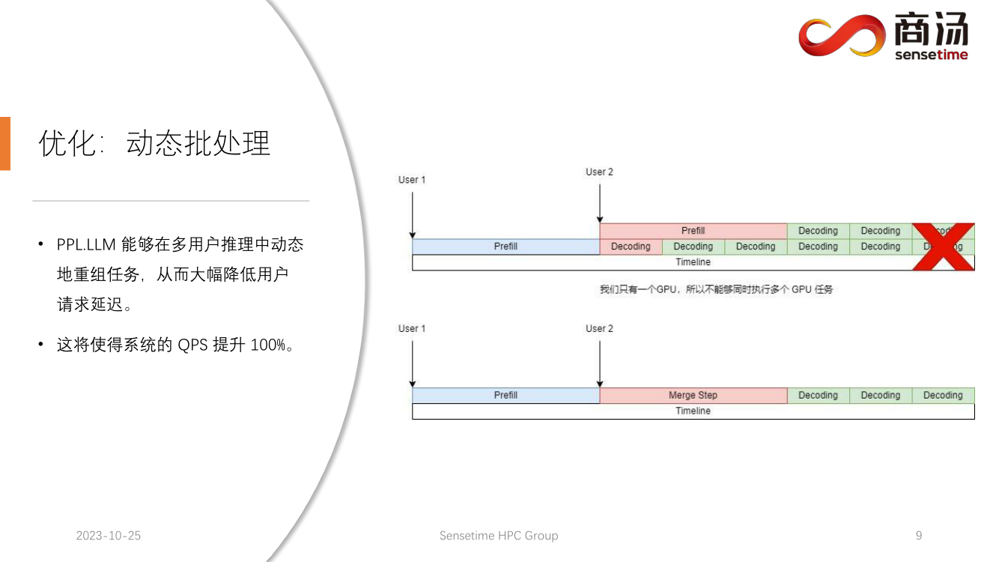

在这之后，PPL.LLM还可以执行一项更有意思的优化，叫做动态批处理。

我们刚才介绍过，在实际的推理过程当中，用户的生成长度不同，并且用户到达的时间也并不一样。那么会存在这样一个情况，如果当前的GPU在推理过程当中，已经有一个请求在线上进行推理，而在推理进行到一半的时候，第二个请求插入进来，这时候会发现，第二个请求的生成过程，跟第一个请求的生成过程相冲突。因为我们只有一个GPU，这个GPU上只能够串形的跑任务，所以不能简单的把它们在GPU上做并行。那我们会做这样一件事情，我们会在第二个请求进入的时间点，把它的Prefill阶段和第一个请求对应的Decoding阶段进行混合，生成一个新的阶段称为Merge Step。在这个Merge Step中，不仅会进行第一个请求的decoding，同时会进行第二个请求的Prefill。这项功能在许多的大语言模型推理系统中都会存在，这项功能的实现使得大语言模型的QPS提升达到了100%。

我具体介绍一下这样的过程是如何实现的。在刚才的例子当中，第一个请求的生成过程进行了一半，意味着它在进行Decoding的时候它会有一个长度为1的输入。而第二个请求是新进入，在进行Prefill的过程当中，它会有一个长度为48的输入。我们会把这两个输入沿着第一个维度相互拼接，拼接完的输入是长度为49，并且hidden dimension是4096的输入。在这长度为49的输入当中第一个词是第一个请求的，剩下的48个词是属于第二个请求的。由于在大模型推理当中，所需要经历的算子，RMSNorm、矩阵乘，和attention等算子，不论是做Decoding还是做Prefill，这些算子的结构都是不变的。那我们拼接完的输入可以直接放入到整个网络中去跑。我们只需要在一个地方加以区分，那就是attention。在attention的过程当中或者在执行self attention算子的过程当中，我们会做一次数据分流，我们会把所有的做Decoding的请求分流成一波，把所有做Prefill的请求分流到另外一波，他们会执行两个不同的运算。所有做Prefill的请求，将会执行Flash Attention。所有做Decoding的用户，将会执行一个非常特殊的算子，叫做Decoding Attention。在分流执行完attention算子之后，这些用户的输入会再一次的被拼接到一起，完成其他算子的计算。这样计算结果是对的，大家不妨可以验算一下。

对于Merge Step，实际上当每个请求到来的时候，我们都会把这个请求跟系统上现在已有的所有请求的输入拼接在一起，完成这次计算，然后继续往下不停的做Decoding，这是动态批处理在大语言模型中的实现。

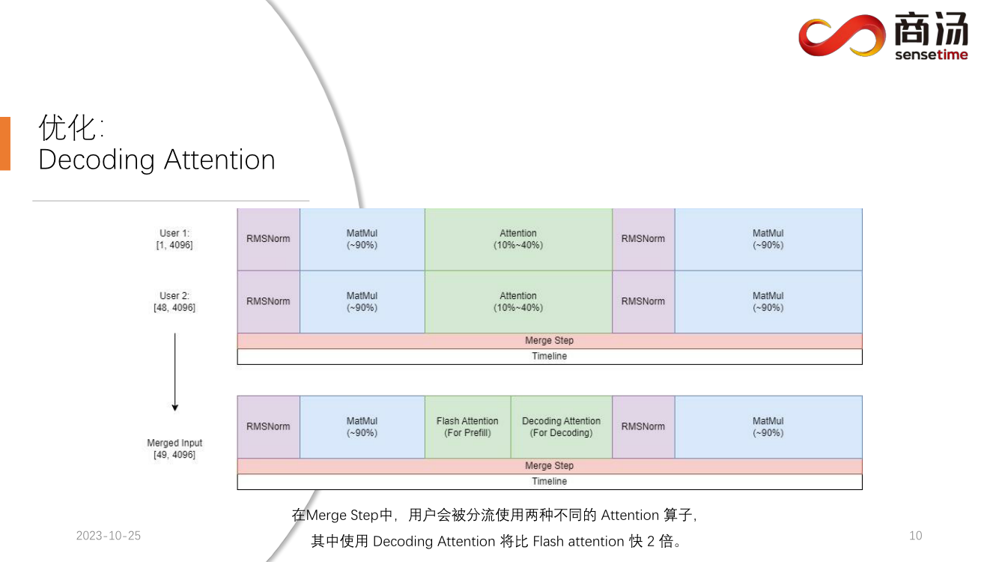

我想详细的介绍一下Decoding Attention算子，它其实会比Flash Attention在处理Decoding任务上要快得多。相对于Flash Attention算子的非常出名，Decoding Attention算子大家可能就没有听说过。

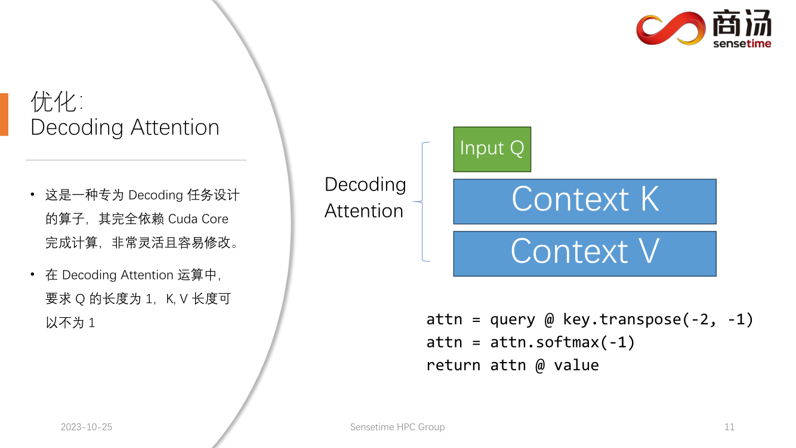

这是一种专门为Decoding任务所设计的算子，它完全依赖Cuda Core，不会依赖Tensor Core完成计算。它非常灵活并且容易修改，但它有一个限制，因为它的特点是在decoding的tensor的运算当中，所以会要求输入的q的长度必须是1，但k和v的长度是可变的。这是Decoding Attention的限制，在这种限制的情况下，我们可以做特定性的优化。

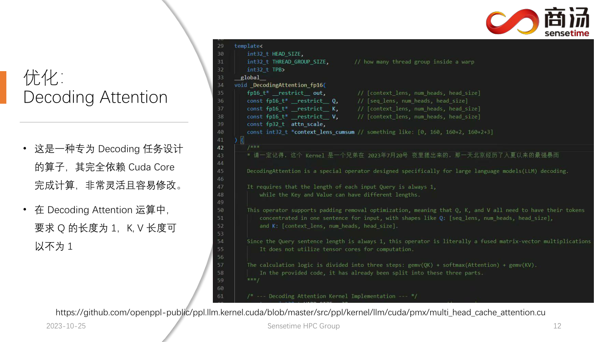
这种特定性的优化导致我们在decoding阶段的attention算子的实现，会比Flash Attention更快。
这个实现目前也已经开源了，大家可以到上图网址上进行访问。

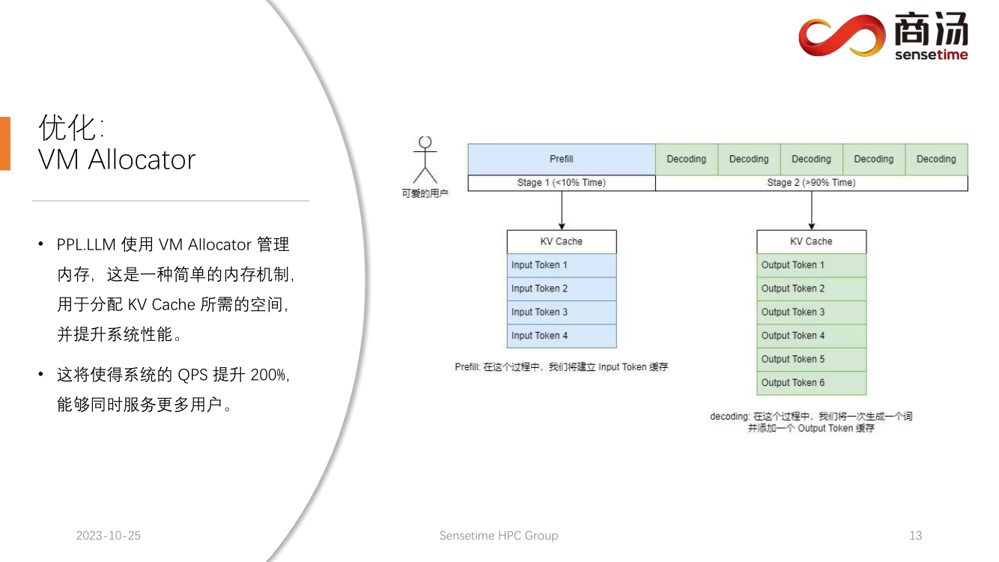
在这些优化之外，我们再介绍另外一项优化，叫做Virtual memory allocator，这项优化对应着Page Attention优化。

这项优化式存在的目的是什么，大家可以通过这样的例子来理解。当请求来到之后，他要进行Prefill阶段，又要进行Decoding阶段。它所有输入的TOKEN会生成一个KV缓存，那么这个KV缓存记录了这个请求所有的历史信息。在Decoding过程当中，这个也会不断的往KV缓存里面插入信息。那么我们的问题就是，我究竟要给这样一个请求分配多长的KV缓存空间，才能满足它完成此次生成任务。如果分的太多的话，显存会有浪费，如果分的太少的话，在decoding阶段，碰到了KV缓存的截止的位置的话，就没有办法继续往下生成。

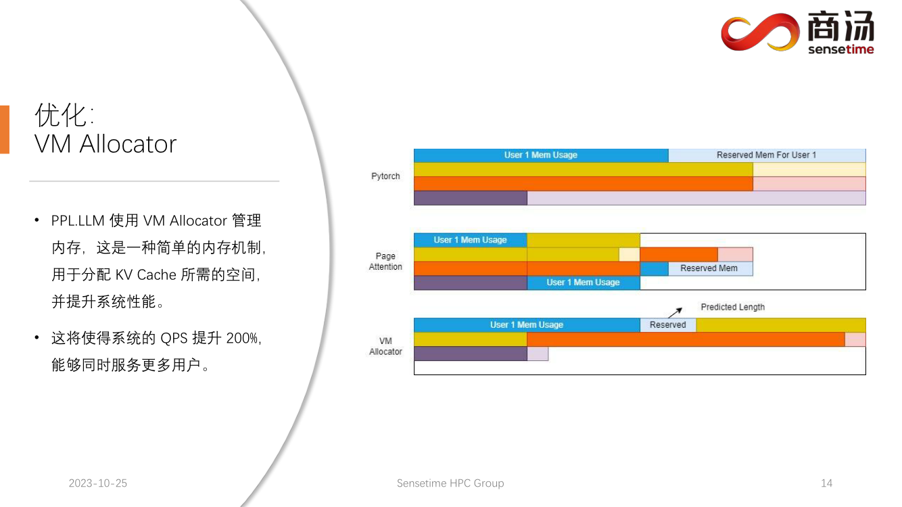
在解决这个问题上，我们看到这样3种方案。

如果大家使用Pytorch，用最原生的方案的话，那么每当一个请求来到之后，这里会为生成
每一个请求预留一片足够长的空间，通常这片空间的长度是2048或者4096，能够保证完成4096个词的生成。但大部分用户，他实际的生成长度不会有那么长，所以有大量的内存空间被浪费掉，这是Pytorch的显存管理方式。

对于Page Attention，它采用另外一种显存管理方式。这种显存管理方式允许我们在生成过程当中不断地为用户追加显存。这种显存管理方式，比较类似于我们在操作系统中的页式存储或者内存分页。当一个请求来到之后，系统会为这个请求分配一小块显存。这一小块显存通常只够生成8个字符，当请求生成了8个字符之后，系统会追加一块显存，可以把结果再写到这块显存里面，同时系统会维护一个显存块和显存块之间的链表，从而使得算子可以正常的进行输出。当请求来到之后，你生成的长度不断变长的时候，他会不断的给用户追加显存块的分配，并且它可以动态的去维护显存块分配的列表，从而使得系统不会存在大量的浪费的资源，不需要为这个请求保留太多的显存空间。

PPL.LLM使用一种称为Virtual Memory的管理机制，这种管理机制非常简单，会给每一个请求预测一个它所需的生成长度，然后每个请求进来之后，都会直接给他分配一个连续的空间，这个连续空间的长度是预测出来的。但是这个事情从理论上看是不太可能实现的，尤其到了线上推理阶段，我们不太可能清楚的知道每个请求究竟要生成多长的内容。因此我们是推荐我们的用户在训练一个模型去做这个事情。因为即使我们采用了Page Attention这样的模式，我们还是会在这个事情上遇到很大的问题。大家可以看到现在Page Attention在运行的过程当中，具体到一个特定的时间点，比如在当前系统上面，已经有了四个请求，系统里面还剩余了1、2、3、4、5、6，6块的显存没有被分配。但在这个情况下，我们依然不能够知道是否会有新的请求进来，我们能否为他继续提供服务。因为当前的这四个请求也没有结束，可能未来还要继续为他们追加新的显存块，而现有系统里只剩下6块了。如果再来一个新的请求，我们无法知道是可以把这个请求插入进来，可能等到最后都生成完的时候，我会发现系统的显存不够用了。所以即使是现在的Page Attention这样的机制，我们还是需要预测每一个用户实际的生成长度。这样才知道我们在具体的一个时间点上能不能接受一个新的用户的输入。这是我们目前所有的推理系统都没有做到的事情，包括PPL目前也没有实现。但Virtual Memory的管理机制，还是可以让我们尽可能的避免闲存被浪费，从而使得系统整体的QPS提升达到200%左右。因为我们把这些空余的显存利用起来，而这些空余的显存实际上是非常的大。对比如果我们采用Pytorch的管理方式的话，显存利用率大概只有35%左右，也就是说80G的显存，可能只能使用30G左右。

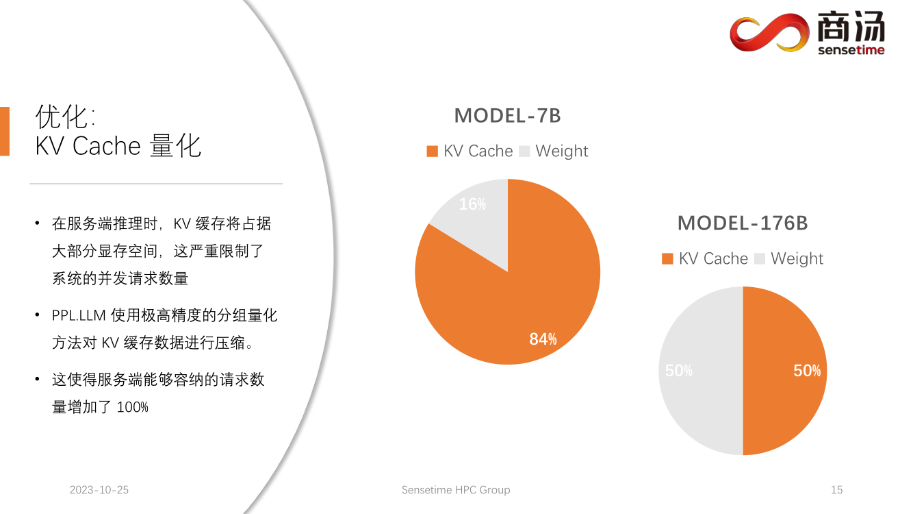
PPL.LLM在做的另外一项优化，就是KV缓存的量化，在服务端推理的过程当中，KV缓存会占据绝大部分的显存空间，这会严重限制了系统的并发请求数量。

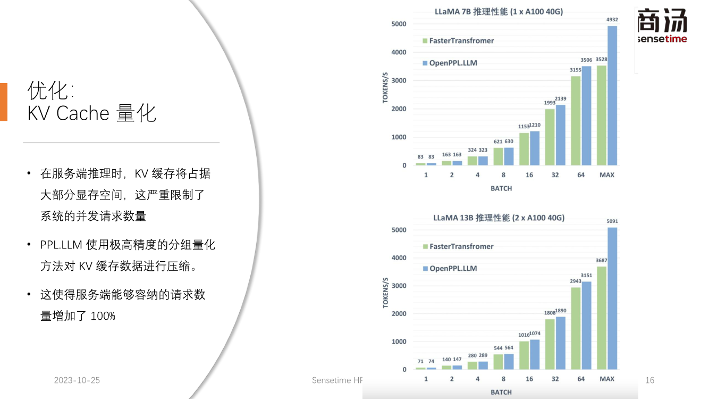

我们可以看到，在服务端，特别是A100、H100这样的大显存的服务器上运行如7B模型这样大语言模型的时候，它的KV缓存将占到84%的显存空间，而对于如176B这样的千亿级大模型，它的KV缓存也将占用50%以上的缓存空间。实际上这个缓存空间会严重的限制模型的并发数量，每一个请求到来后，都需要给它分配很大的显存。这样请求数量就无法提升上去，从而使得QPS以及吞吐量都会都无法提升。

PPL.LLM会使用一种非常特殊的量化方式，分组量化对KV缓存的数据进行压缩。也就是说原来FP16的数据，会尝试把它量化到INT8。这样的话会使得我们的KV缓存的体积缩小50%，并且使得服务端能够容纳的请求数量增加100%。

这也是为什么相比Faster Transformer能够提升大约50%的吞吐量，这实际上是完全得益于KV缓存量化所带来的batch size的提升。

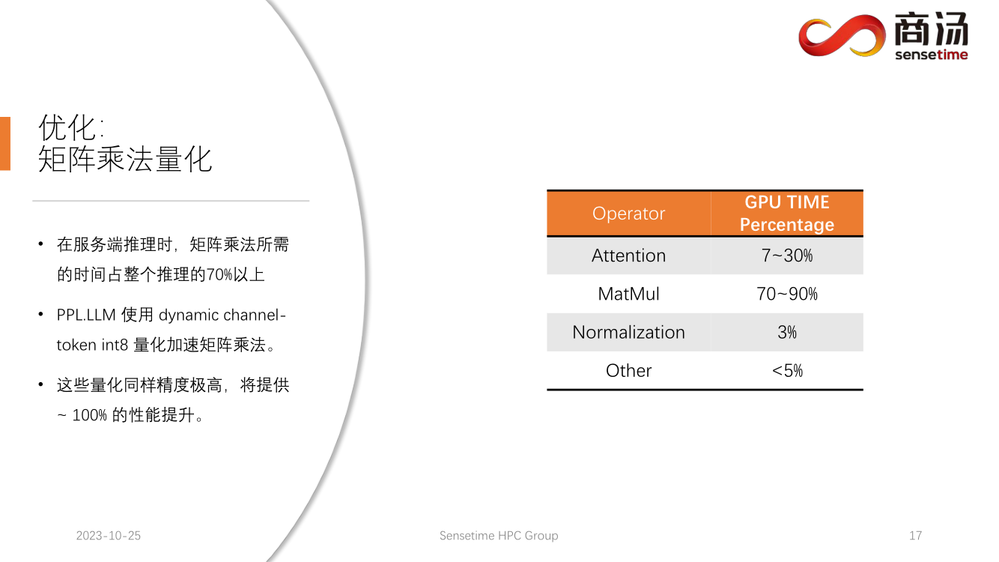
而在KV缓存量化之后，我们会进行更细力度的，即矩阵乘法的量化。在整个服务端推理的过程当中，矩阵乘法占到整个推理时间的70%以上，PPL.LLM会使用一种动态的per-channel/per-token交替的量化，或者说混合的量化方式来加速矩阵乘法。这些量化同样是精度极高的，并且能够提升接近100%的性能。

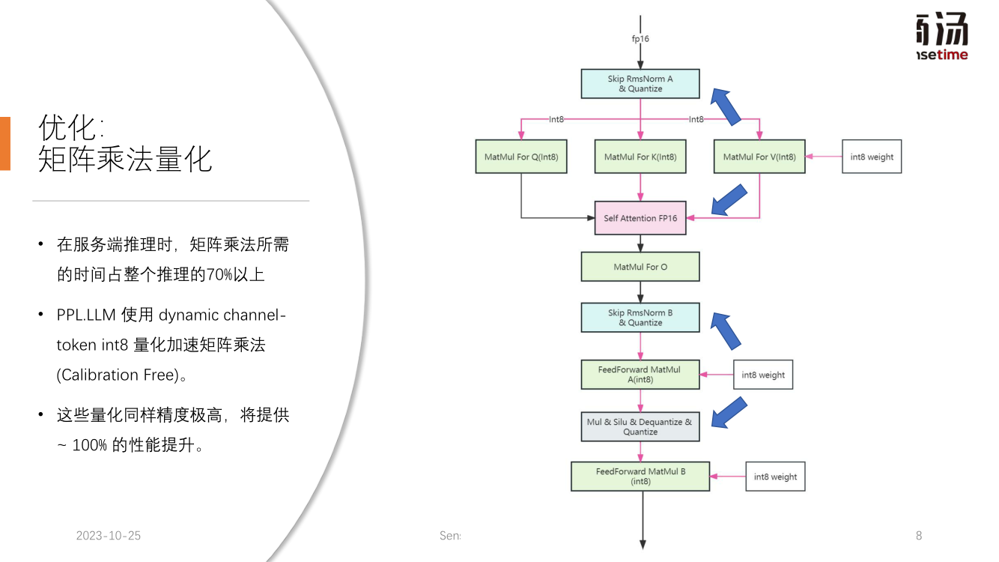
其具体方案是这样的，在整个大语言模型推理过程当中，因为它的模型结构是非常的固定，所以我们的量化方案会做得非常的细致。我们会在RMSNorm算子的基础之上，融合一个量化算子，这个量化算子会在RMSNorm算子的功能基础之上统计它的Token的信息，统计每一个Token的最大最小值，并且沿着Token的维度，把这个数据进行量化。也就是说经过了RMSNorm之后的数据将会从FP16转成INT8，并且这一次量化是全动态的，不需要做calibration。而在后面的QKV矩阵乘当中，这三个矩阵乘都将进行per-channel量化。他们接收的数据是INT8的，同样他们的权重也是INT8的，所以这些矩阵乘可以完整地执行INT8的矩阵乘法。它们的输出将会被Soft Attention接受，但在接受之前会执行一次解量化过程，这次解量化过程将和soft attention算子融合。

而后面的O矩阵乘法是不做量化的，Soft Attention本身的计算过程也不做任何量化。在后续的FeedForward过程当中，这两个矩阵同样的采用一样的方式进行量化，将和上面的RMSNorm进行融合，或者和上面的Silu和Mul这样的激活函数进行融合。它们的解量化算子将和它们下游的算子进行融合。

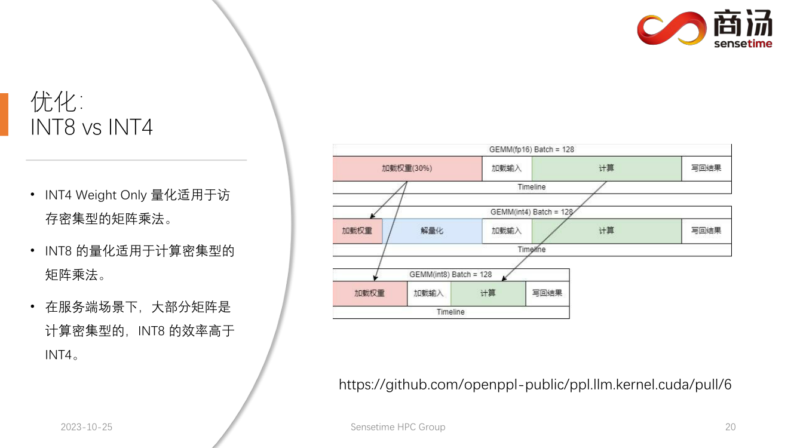
我们对比INT8的量化和INT4的量化的区别，因为目前学界对于大语言模型的量化关注点可能主要集中在INT4上，但是在服务端推理的过程当中，它其实更适合使用INT8的量化。INT4的量化也叫Weight Only的量化，这种量化方式出现的意义在于在大语言模型推理过程当中，当我的batch比较小的时候，在矩阵乘法的计算过程里面，90%的时间都会用来加载权重。因为权重的体积非常的大，而加载输入的时间很短，它们的输入，即activation也非常短，计算的时间也不会很长，写回结果的时间同样不会很长，这意味着这个算子是一个仿存密集型的算子。在这种情况下，我们会选用INT4的量化，前提是batch足够的小，使用INT4的量化每一次加载权重之后，会紧接着进行一个解量化的过程。这次解量化会把权重从INT4解量化成FP16，经历解量化过程之后，后面计算其实跟FP16是完全一样的，也就是说INT4 Weight Only的量化适用于仿存密集性的矩阵乘法，它的计算过程还是由FP16的运算器件去完成的。

如果当batch足够大的时候，达到一个具体的数值，比如64或者128的时候。INT4的Weight Only量化将不会带来任何的性能提升。因为如果batch足够大，那计算时间会被拉得足够的长。并且INT4 Weight Only量化有一个非常不好的点，它的解量化过程所需要的计算量是会随着batch的（GEMM Batch）提升而提升的，随着输入batch的提升，解量化的时间也会越来越长。当batch达到128的时候，解量化所带来的时间损耗和加载权重带来的性能优势，就已经相互抵消了。也就是说当batch达到128之后，INT4的矩阵量化不会比FP16矩阵量化快，性能优势极小。大概在batch等于64的时候，INT4的Weight Only量化只会比FP16的快30%，等到128的时候，大约只会快20%甚至更小。

但对于INT8来说，INT8的量化与INT4量化最不同的一点，是它不需要任何解量化的过程，并且它的计算是可以压缩一倍时间的，那么相对的如果在batch等于128的时候，从FP16量化到INT8，加载权重的时间将会减半，计算的时间也会减半，这会带来完完整整百分之百的加速。

在服务端场景下，特别是因为会有不断的请求涌入，大部分的矩阵乘，都会是计算密集型的。在这种情况下，如果为了追求极限的吞吐量，INT8的效率其实上是高于INT4的。这也是为什么我们目前已经完成的实现里面，在服务端上主推INT8的一个原因。

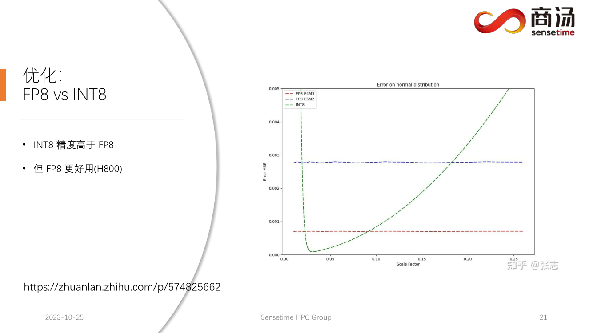
在H100、H800、4090上面，我们可能会执行FP8的量化。FP8这样的数据格式，在nvidia最新的一代的显卡当中被引入。INT8的精度从理论上是要高于FP8的，但是FP8会更好用，性能会更高一些。我们在后续服务端的推理过程的更新当中也会推进FP8的落地。上边的图表的可以看出，FP8的误差相比INT8实际上大概大10倍左右。INT8因为会有一个scale，会有一个量化的尺寸因子。我们可以通过调整尺寸因子，从而降低INT8的量化误差。而FP8的量化误差跟尺寸因子基本上是无关的，它不受尺寸因子的影响，这使得我们基本上不需要对它做任何的calibration。但是它的误差总体来讲是要高于INT8的。

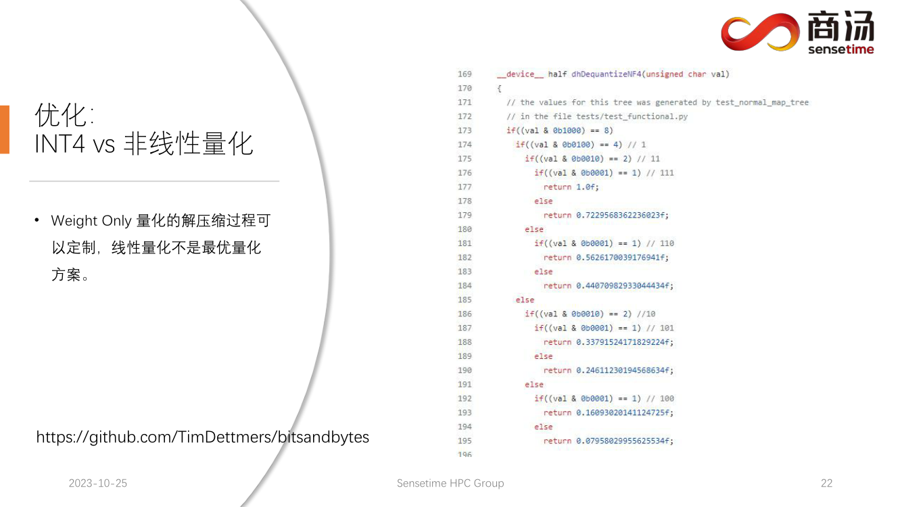
而在INT4里面，PPL.LLM在后续的更新当中，也会更新INT4的矩阵量化。这种Weight Only的矩阵量化主要是为了端侧服务的，为了手机端移动端等等batch固定为1的设备。在这样的量化当中，我们会在后续的更新当中从INT4逐渐转变为非线性量化。所谓非线性量化，是因为在Weight Only的计算过程当中，会存在一个解量化过程，这个解量化过程实际是可定制的，未必是一个线性的解量化过程，其使用其他解量化过程以及量化过程，会使得这一次计算的精度更高。

一个比较典型的例子，就是在一篇论文当中所提到的NF4的量化，这种量化实际上是会通过一种打表的方式进行量化及解量化，它是一种非线性的量化。PPL.LLM的后续更新当中会尝试使用这样的量化完成端侧推理优化。

## 大语言模型推理的硬件

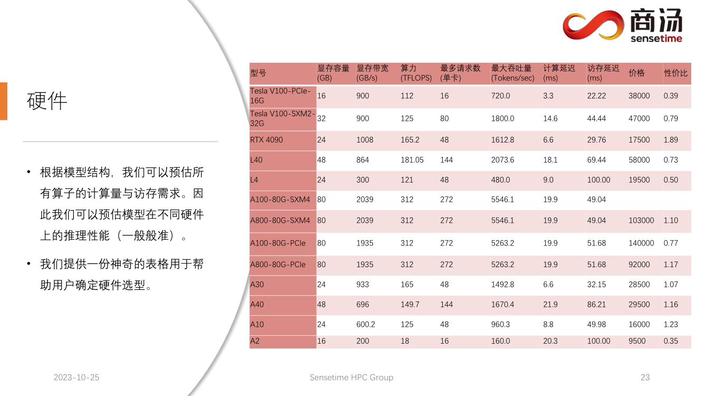

最后，我跟大家讨论的最后一个内容是关于大语言模型处理的硬件。因为模型结构一旦确定，我们会知道它具体的计算量，具体需要多少仿存，需要多少的计算量。同时我们又知道这个每张显卡的它的带宽，它的算力等因素以及它的价格。因为在我们确定了模型的结构以及确定了硬件指标之后，那我们就可以通过这些指标去计算出当在这张显卡上推理大模型的时候，它的最大吞吐量会是多少，它的计算延迟是多少，它的访存访问时间需要多少。我们会通过这样的东西，去算出一个非常具体的表。我们把这个表格公开在后续的资料当中，大家可以访问这个表格，来看到最适合大语言模型推理的显卡，型号有哪些。

对于大语言模型推理来说，因为大部分的算子都是仿存密集型的，仿存的延迟总会比计算延迟要高。因为大语言模型的参数矩阵确实太大了，所以哪怕是在A100/80G上，batch size开到272的时候，它的计算延迟都是较小的，访存延迟反而会更高。大语言模型整个的推理过程都是访存密集型的，所以我们的许多优化都是从访存上进行着手。而进行硬件选择的时候，我们主要的方向就是，选择带宽比较高，显存比较大的设备。从而使得大语言模型在推理时，可以支撑起更多的请求，可以支撑起更快的仿存。相对应的吞吐量也会更高，

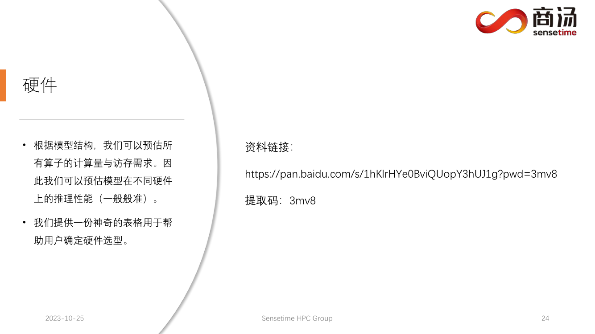

最后我把所有的资料，放在了网盘当中，大家如果有需要的话可以去下载。我们所有的代码已经开源在了github上，如果大家有需要的话也可以随时与我们进行沟通和联系。

## Q & A
Q1:  我想知道在PPL.LLM中有没有优化像这个Flash Attention里边提到的Softmax这种访存的问题呢？
A1:  Decoding Attention这个算子非常特殊，它的Q的长度永远是1，所以它不会像Flash Attention那样面临的Softmax这里有非常非常大的访存量。实际上在Decoding Attention的执行过程当中，它就是完整地执行这次Softmax的过程，他并不需要去像Flash Attention那样更快执行。

Q2: 其实还没有理解这个VM Allocator怎么做的？这个问题可能就是说对这个VM Allocator和Page Attention的一个差别，其实还不是特别清楚。
A2: 其实VM Allocator跟Page Attention都是进行显存管理的一种方式。VM Allocator实际比Page Attention更加的简单一些。VM Allocator实际上就是我们假定了或者说我们会你每个用户来的时候，你都要给一个最大生成长度。实际上跟Pytorch的会比较类似，但不一样的地方是，Pytorch的每一个用户，它的最大生成长度都是一样的，都是2048。 我们是允许你不一样，我们允许你有的用户比如说生成256个，有的用户生成512个。但是你必须要知道这个生成长度是多少，不能够不知道。也就是说这个生成长度是用户给定的。所以说它其实是一个像Pytorch那种方式，但是它给了更额外的一个参数，让用户能够指定这样长度，不用去默认的一个2048的长度。这并不是一个特别好的实现但我们目前没有找到什么特别好的方式，因为Page Attention这样的分配方式会在系统的负载达到极限之后，也就是说在我们这里系统的剩余空间只有这6块的时候，我们不太能够知道能不能接受下一个用户的到来，如果我们接受了下一个用户，当生成过程执行到一半的时候发现显存不够用了，这个这种情况是会存在的，因为我不知道每个用户要生成多长。那这个时候我就会面临一个问题我需要清除一个用户。因为块是动态分配的，这些用户的生成都没有结束，他们在后续也会生产申请新的显存，这在大语言模型推理当中是一个非常严峻的问题。

Q3: INT4的Weight Only量化为什么和batch线性相关，请问这是固定数量吗？
A3: 这是一个好问题，首先这个解量化不是像大家想的那样，只需要把权重从INT4塞回FP16就行了，如果是只做这件事情，那权重有多少就要解多少。但实际不是这样的，因为这是一个融合在矩阵乘法里面的解量化。你不能够在执行矩阵乘法之前，把所有权重解量化出来，放在那然后再去读。这样的话，我们所做的INT4的量化就没有意义了。它是在执行过程当中不停的去解量化，那在这个执行过程当中，实际上因为我们会执行分块的矩阵乘，每一个权重，他所要读写的次数并不是1，不停的会拿过来计算，这个次数实际上跟batch有关。也就是说，区别于之前，很早之前那些优化量化的手段，就是说我会有单独的量化的算子和解量化算子。两个算子的插入，其实这里边的解量化还是说直接融合在算子中的。我们执行的是矩阵乘法，所以这个东西他所要解量化的次数并不是一次。

Q4: KV Cache中的反量化计算，可以被仿存掩盖？
A4: 根据我们的测试是可以被掩盖的，而且其实还远远的有剩余。KV计算中的反量化以及量化都会被融合进self attention算子当中，具体来说就是Decoding Attention。根据我们测试，这个算子应该在10倍的计算量，可能都可以掩盖掉。就是仿存的延迟都掩盖不了它，它主要的瓶颈在于仿存，它计算量还远远达不到可以掩盖掉它仿存的那个程度。所以KV cache当中的反量化计算，对于这个算子来说，基本上是一个很好被掩盖的东西。
