我叫张潇，我们公司叫做矩阵起源。今天我讲的主题是MatrixOne，我们公司目前开发的一个开源的分布式数据库，他从NewSQL到现在新的HTAP架构的整个架构的引进，可能相对来说更稍微抽象一点。

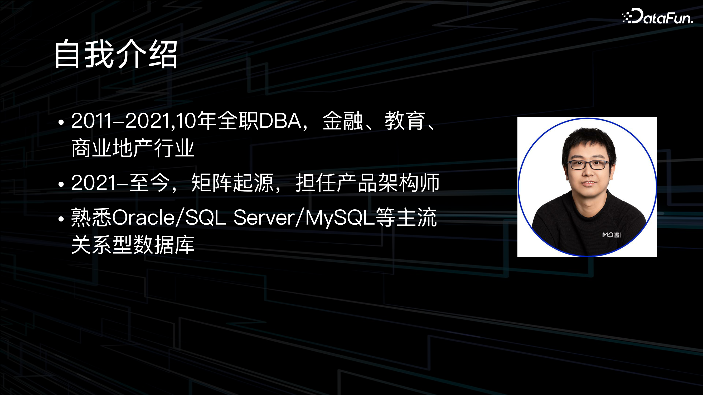

接下来我先介绍一下我自己，我在2011年到2021年这十年的时间里一直是做全职的DBA。在金融，商业地产，还有教育行业都有过相关的从业经历，2021年我入职到矩阵起源做产品架构师，至今已经快两年了。我之前做的数据库可能更多的像Oracle、MySQL、SQLServer，还有像PG、Cassandra这种关系型数据库更多一些，跟现在的工作既有一些交叉，同时又有很多之前没有涉及到的东西。

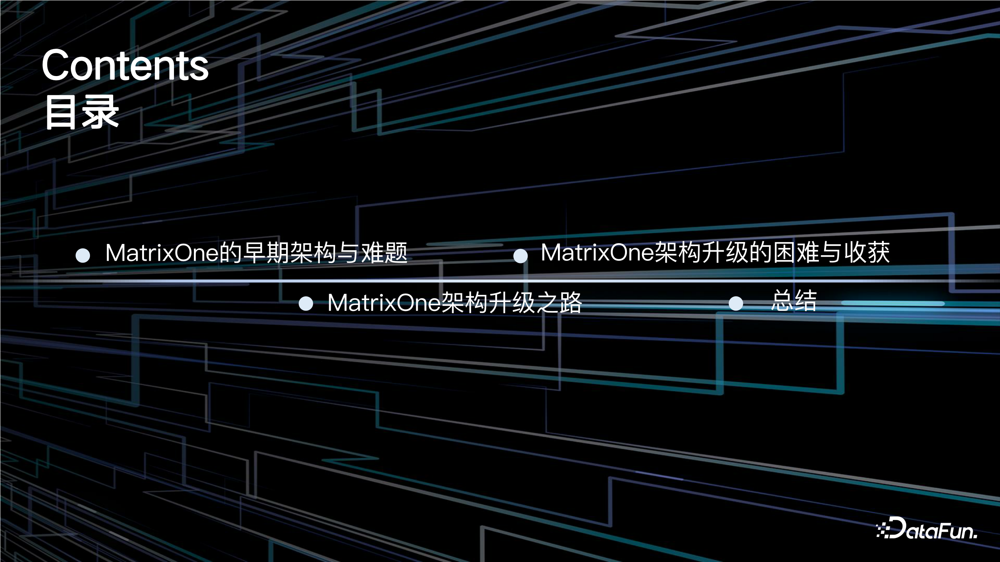

今天我的整个目录是：

一、MatrixOne早期的这个架构和遇到了什么样的难题
二、架构的升级之路。可能会给大家讲一讲，架构升级遇到了哪些东西
三、架构升级过程当中的困难还有收获
四、我还对整我们现在的架构以及升级做一个最后的总结

## 第一部分 MatrixOne早期的架构和难题

我们早期的架构，如果大家在2022年的上半年之前有了解过我们产品的话，会发现我们当时的架构和我们现在
大家拿到宣传页的架构有很大的区别，其实这就是当时我们做架构升级。早期的架构如果让我去总结的话，我的总结是两个词：一个是NewSQL，一个是MPP。

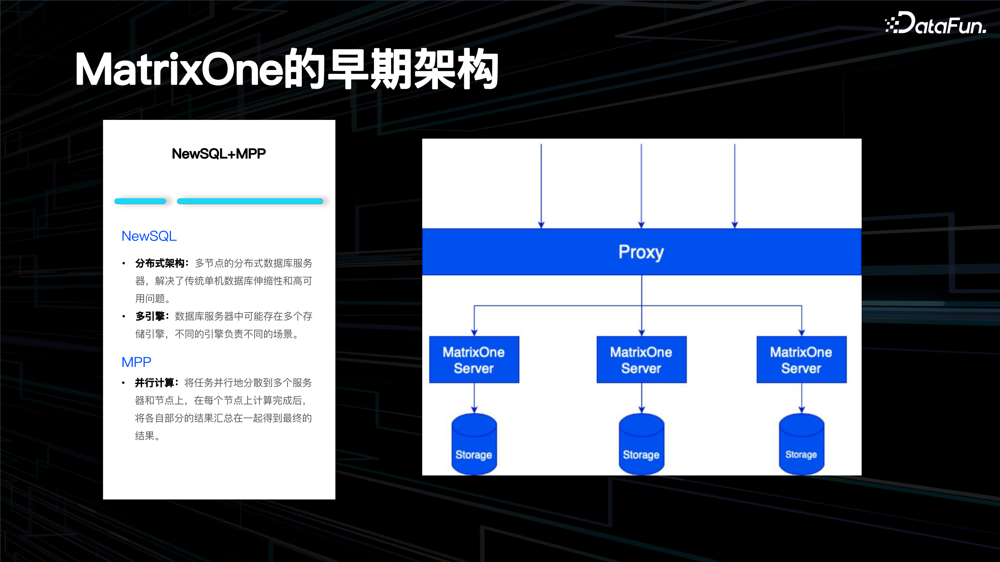

第一点：NewSQL是当年谷歌那几篇论文衍生出来的很多的分布式数据库的一套理论体系。它其中第一个非常重要的就是分布式架构，解决的是传统像不管Oracle、 SQLServer、还是单机版本MySQL，它的高可用以及水平扩展的这种难题。另外一个就是多引擎。其实在当时谷歌发布的很多论文当中提到过了。可能用不同的引擎来做不同的事情，这是当时NewSQL大家认为的比较典型的特点。

第二个：MPP，或者叫大规模并行计算。这个主要的用途就是通过分布式的方式将一些规模比较大的计算任务分布到不同的节点，并且在计算完成之后汇总。充分的利用了分布式架构的算力资源。

我们早年的早期的架构确实也是这个样子，比如大家能看到我们上面可能有一个，负责分发负载均衡的proxy
下面就是我们MatrixOne Server，每一个Server下面有自己的存储。实际上是一个存算不分离的这么一个架构，
每个节点看似是对等。当然这里面还有自己的问题。

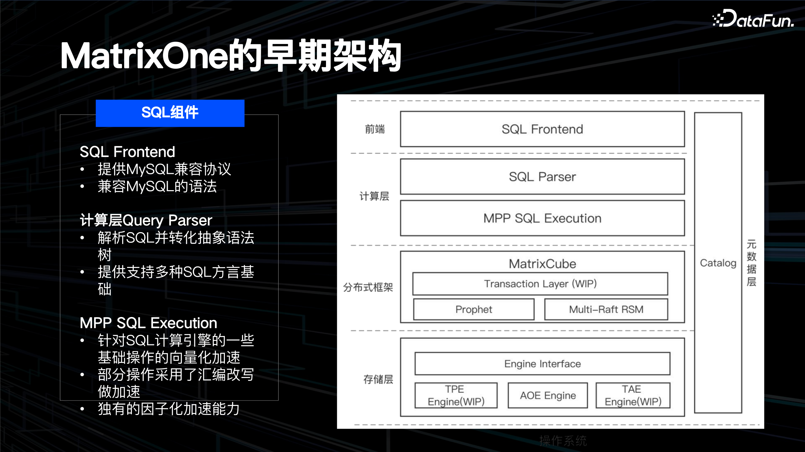

我们再看一下整个这个组件的详解。

最上面这一层我们叫SQL前端，SQL前端它干嘛呢，它是为了兼容MySQL的语法协议，还有它的语法，就是我们用不管是用MySQL client，还是JDBC都可以直接连。

计算层是在一个是传统的这个SQL Parser，不管我们是做语法树的这个解析还是用来支持多方言的这种SQL。都有它自己的用途，

最下面就是我们自己写的MPP SQL执行器。我们当时整个研发的同事们当时对他的设想是

- 第一针对这个基础引擎做一些向量化的加速；
- 第二我们部分操作甚至是用汇编语言做了改写；
- 第三我们当时使用了一个比较独到的因子化加速的能力。

所以最早如果大家看我们2021年的性能测试报告的话能看到还是有一个相当不错的性能表现。但是后面为什么会舍弃掉这个东西，待会我给大家去讲。

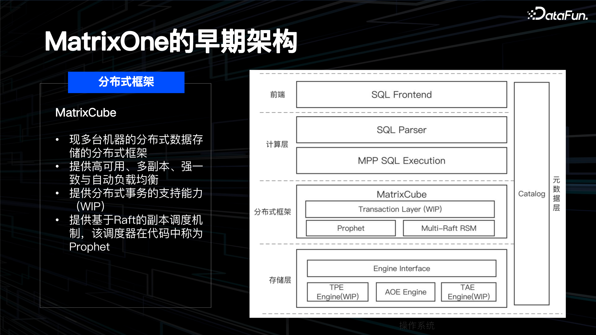

而大家看到的是一个分布式框架这一层，我们叫做MatrixCube，是我们当时分布式组的同事做的一个开源的项目。其实当时也做了好多年，他提供的是一个整个对于多台机器的分布式存储框架。像高可用多副本，这个负载均衡强力制这种基础能力都有。而且当时设想是要用它来为对这个Matrix计算，提供分布式事务的支持能力。大家如果说做过这个分布式系统的开发的话，也会发现这个分布式事务的实现是一个非常让人头疼的事情。直到现在我们公司现在新一版的时候，在分布事务上，我们还在投入很多的研发人力和时间，争取想要把这个东西攻克。再一点就是在里面是有Raft协议的，而且中间会有一个调度器叫做Prophet。 Raft本身大家也都知道它是一个有leader节点的一个分布式的协议。

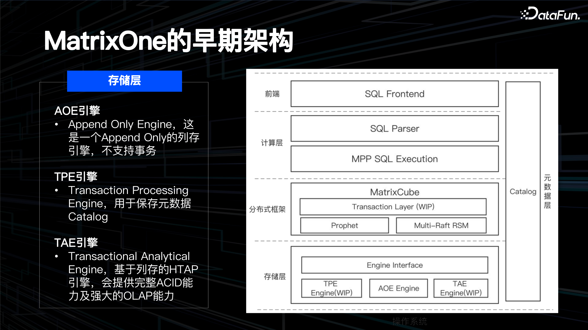

最下面是我们的计算层和存储层。存储层除了引擎接口之外，我们有三个引擎。

最中间的这个叫AOE、AOE是一个不支持事务，你可以往里写数据，但是对于这个这个事务、去重等等，它基本上是不支持的。最左边的我们叫TPE，TPE是用来保存元数据catalog，像大家能看到这个catalog，只是其实它是贯穿于从前端，到底下存储层，它是一个非常繁忙的引擎。而最右边叫做TAE，TAE是一个典型的列式存储。能够提供完整的ACID，同时我们希望它能够去支持比较大规模的OLAP能力。所以早年我们看到的一个问题是三个存储运行，这也是后来我们为什么从架构层面整个进行重构的一个原因。

这整个引擎详解的早起架构早期架构呢我给大家解释完了。那么接下来我来讲一讲这个引擎他的问题在哪里，以及我们为什么要对他做整个升级重构。

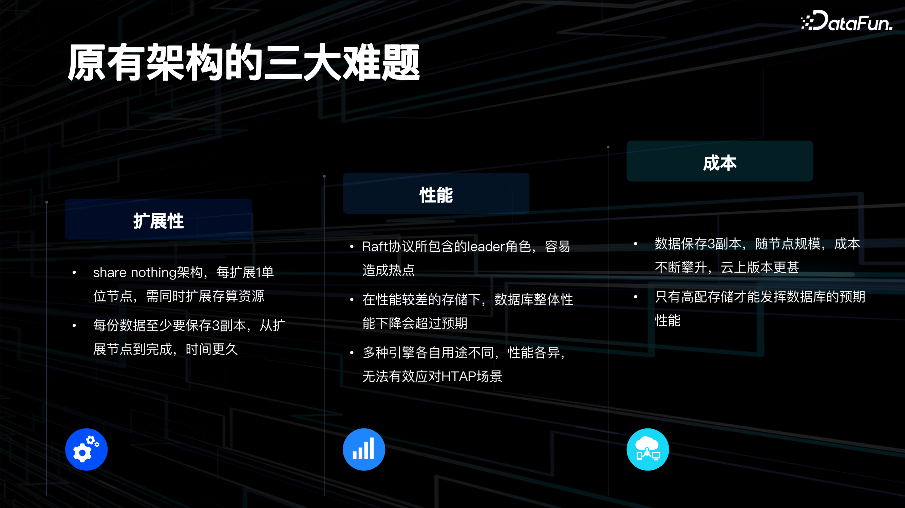

扩展性：

- 这是我们刚刚才我给大家看的是一个存算不分离的架构。这个架构它在扩展性上有一个什么问题，每扩展一个单位的节点，就要去扩展相应的存和算两种资源，存算不分家。
- 而且因为我们数据是以3副本的形式保存，意味着我们只要一个节点加进去，它想要真正接管计算任务的时候要先把整个存储先完成同步。其实节点扩展它需要的时间就预热的时间非常长。比如说我们大概有1TB的数据，那可能我们要先等着1TB数据的3副本完成在这个节点上同步，才能去开始提供所有的计算负载。

性能：

- 因为Raft协议它一定是有一个leader就像刚才我说的，那么这里面leader节点容易成为热点，很多的调度任务都从他这里走。
- 在性能比较差的存储下，整体性能下降其实会超过预期。这句话的意思是，比如我们用SSD做的这个benchmark测试的时候，我们预计它的性能比如说是10，那么我们最早预想HDD我们能跑到5或者6，但是实际情况是我们在HDD上可能跑出来的结果只有3或者4，这成为了一个性能上的瓶颈。
- 刚才给大家看的三个存储引擎，TPE、 AOE、TAE三个引擎，用途不同而且性能还不一样，有的时候经常会出现某一个业务场景三个引擎当中的一个成为了整个性能的桎梏。我没有办法继续往前推，最后这就是最短的这个板，成为了我们性能的瓶颈。

成本：

- 我们当时最早是用3副本存储，节点规模越大，线性提升的成本负担就越重，到了公有云上，比如说有的公有云还提供了一个高可用的方案，那就成了壳子套壳子，就不是线型而是指数级增长了。可能我要用3个节点的时候，数据库里存了9副本。然后在公有云又可能做了一个3层冗余那就是27层。这到了后面客户所承担的成本负担，实在是太重了。

- 还有就是只有高配存储才能发挥出预期，这个就是我们大家所说的性能较差的存储架构发挥不出来我们想要给到的性能特性的时候，那只能不断的通过增加存储成本的方式来实现一个比较好的最佳实践。

## MatrixOne架构升级之路

面对这些问题，从2022年的3月开始，由我们CTO田丰博士作为牵头人，对整个架构做了一个重新的升级。其实我们是从0.5开始做这个事情，0.1到0.4 大家更多的时候也是在一个探索的过程，我们到底该怎么做，这是一个不断思考不断试错的一个过程。所以到了0.5的时候，我们终于意识到这个架构走不下去了。

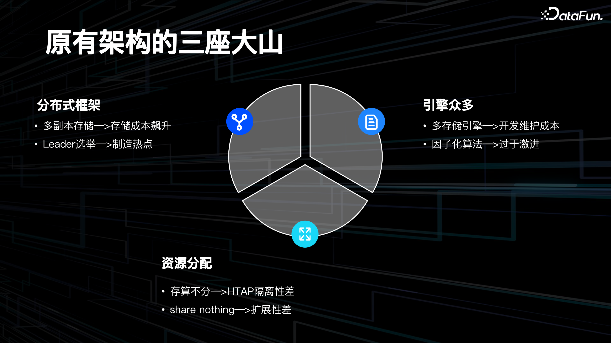

那么如何实现呢，首先先分析一下为什么原有的架构走不下去了，实际上我们当时总结三座大山。

第一座是分布式框架：

- 这个分布式框架，多副本存储带来的是成本存储的飙升；

- leader选举，人为制造了热点；

第二座是我们的引擎实在是太多了，三个存储引擎彼此之间的代码复用率非常低。

- 比如说我在上面写一个新的功能，甚至代码的维护量可能差不多约等于3倍。
- 还有就是我们所说的因子化算法有点过于激进，意味着除了我们那位主开就他能够对这个算法，包括这个计算引擎做出一些驾驭的话，其他的同事能参与度非常低，只能做一些辅助，加一个功能都会非常的困难。所以这个引擎当时也成为了我们不得不去剃掉的一个原因。

第三座是资源分配。

- 一开始我们说存算不分，那实际上我们再去做各种资源配比的时候，可能会出现的是不同业务场景，它的隔离性就非常差。
- 再一个就是这种share-nothing的架构，意味着扩展性非常差。必须同时扩展存和算两种资源。

所以在我们总结了这3个根本的原因之后，开始做这个架构升级。

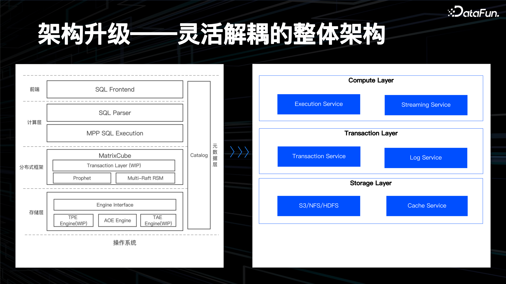

最左边大家可以看一下，一层套一层、一层叠一层，像个千层高一样。各层和各层之间又是强依赖的关系，所以第一步就要先把整个各层彻底的打散，做一个更加灵活解耦的整体的架构。

最后我们整理出来是一个是存储层单独做了一层，可以使用的是各种存储，不论对象存储FS、 HDFS。然后把所有的cache服务放在存储层来做，

最上面就是计算层。所有的跟MPP以上的不管是前端也好Parser也好，还是说执行器也好，最后全都放到计算层。

中间层是我们开发了一个新的层，叫做事务层。事务层可以看做为log service，其实大家熟悉的传统关系数据库中的Redo或者PG里的WAL日志，差不多跟我们log service有的功能上是非常类似的。而我们还有一个事务节点DN，它是专门用来做事务服务，因为我们是一个分布式数据库。就涉及到分布式的这个事务裁决，包括去重，还有这个落盘这些这些任务。所以最终选择开发一个单独的事务层来专门处理这些东西。

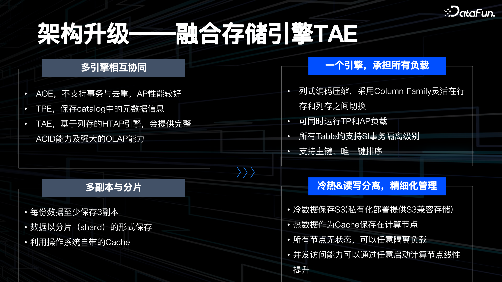

之前我们说的三个存储引擎肯定不可能全留，我们想了半天最后觉得还是留下TAE最合适，就是TPE它是一个行存，AOE它又是一个不能够去重，不能够支持事务的层级。TAE它的好处是，它能够提供基于列存的TP引擎，而且它能够做到完整的事务的原子性，一致性，隔离性和数据一致性，完整的OLAP能力。所以它成为了我们认为最适合用于新架构的这样一个引擎，剩下两个引擎把一些可能有些功能想办法融到TAE里，剩下两个就全都去掉。所以最终我们看到的是TAE，它是用列式的编码来存用column family，可以在行和列之间做一个切换，这个在column family那我会有一张图给大家看到。这样做的好处是一个可以同时运行TP和AP的负载，因为这两个其实对于有的时候对于TP和AP我们经常说行存更适合TP，列存更适合AP，现在做完这样一个转换之后，行和列就都能够兼顾到了。再一个就是所有的表都能够实现表级别的快照事务隔离，这是我们现在已经实现的快照隔离。当然现在还在做的叫做2c，就是读已提交，大家平时在数据库当中打交到最多的那个会在我们下一个迭代的时候发布，像主键、唯一键排序、外键索引也会在这个引擎里面一起实现。就是之前AOE和这个TPE做不了的事情，我们在TAE上都会让它用一个引擎去完成。

还有就是多副本和分片，因为之前我们说过，数据要保存三副本，而且每个副本它在数据库里面是以分片的形式保存，用操作系统自带的cache来完成冷热数据的管理。但是我们现在这个新架构就有一个新的要求，就是冷热数据尽量分离，读写请求分离，实现一个对存储的精细化管理。所以最后我们选择了AWS的S3对象存储，还有甚至私有化的话，跟S3的协议兼容的对象存储。热数据就保存在计算节点的存缓存cache上，所有的节点也都实现了无状态。并发能力可以通过比如说我们现在对于TP业务现在可能要求更多的会话的时候，那我们多启动几个计算节点。如果说AP我们需要更多的计算的话，那么我们可以尝试着将计算节点进行扩容。彼此之间三个层级不需要再过度的依赖。

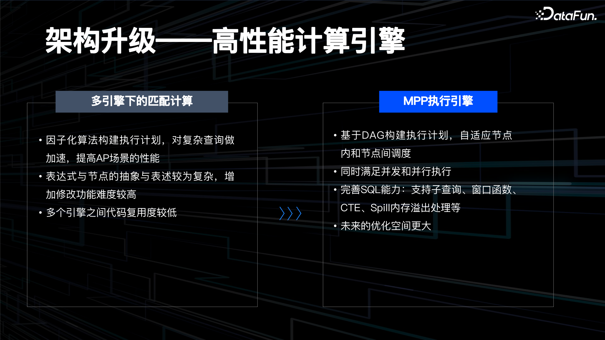

然后最后我们就是说从分布式存储完成之后，就是计算层。计算层的话之前是因子化算法构建执行计划，做复杂的加速查询，主要是针对AP性能的提高。但是它的问题也是表达式和节点的抽象仪表述太复杂了，不管是增加功能还是说去修改什么东西难度非常的高。而且就像我所说的，多个引擎之间的代码复用率太低，导致了不管我去做什么事情的工作量都是两三倍的增长。所以最后弄了一个新的我们叫MPP执行计划，基于DAG来构建执行计划。能够实现节点内和节点之间的调度，待会会介绍我们节点之间的这个调度是怎么做的。然后同时能够满足并行和并发两种请求，因为我们都知道并行是AP，并发是TP，通常大家会这么去处理。而且SQL能力得到了完善，像之前可能只支持的非常不太好的像子查询、窗口函数、CTE，还有像内存溢出等等现在都具备了这个能力。现在除了spill内存溢出可能还在开发中，剩下的几个子查询、窗口函数、CTE现在都已经实现了。这样的好处是在未来的优化空间更大，就是不管是我们的主开还是说其他的计算组的成员都可以对他做优化加新功能。现在我们从0.5之后都有一个比较深刻的体会，我们不管是做什么其实都在这个代码优化上，比以前节省了很多的人力。

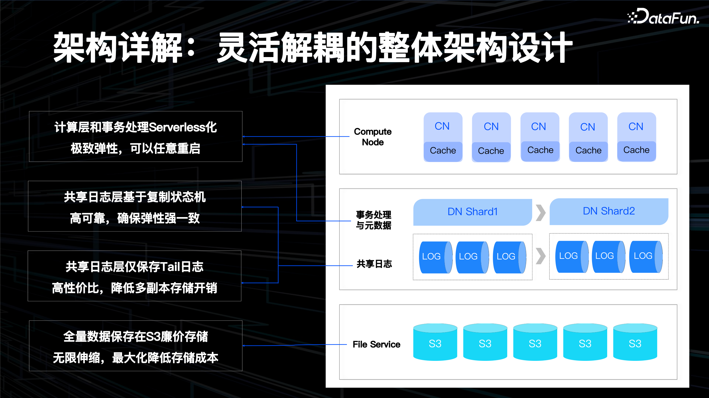

最后给大家来就是做完这么多的设计之后，我们来看一下现在总体的架构是什么样子。

首先最下面我们叫做File Service，这是我们一个分布式的同事写的一个统一的文件读写的一个服务接口，它能够从S3对象存储去读数据，并且把这些数据推给像不管是日志，还是计算节点或者是事务节点等等。而且事务节点和计算节点的日志又可以通过它去写S3。就是所有的节点只需要跟这个File Service打交道，就能够完成对存储的读写。然后全量的存储都可以保存在S3上，尤其是公有云版的S3大家应该多少有点体会，就是它的成本非常的低。再一个公有云版的S3，我们可以认为它是无限伸缩。容量只要你肯交费，要多少有多少。然后在上面的事务层，我们有两个DN节点这专门去负责管理日志服务和元数据。平时的他会在里面缓存元数据，做一些事务裁决，并且会指挥log service的日志服务来落盘写数据。它自己就是通过三副本的方式来保证从日志级别上的高可用，而且这里面还有一个叫Logtail的东西。下面会详细解释道Logtail和现在的落盘的数据之间是如何共同完成我们数据写的过程，

最上面就是我们所有Severless的计算节点，我们叫CN节点。计算节点它是完全无状态的，每个计算节点有自己的cache，好处是比如说我现在计算的负载比较高那就多起几个CN。如果说可能现在业务比较低的话，到了一些像大家过年了没有什么业务的时候，那干脆把节点全都宕机，节省一些成本。

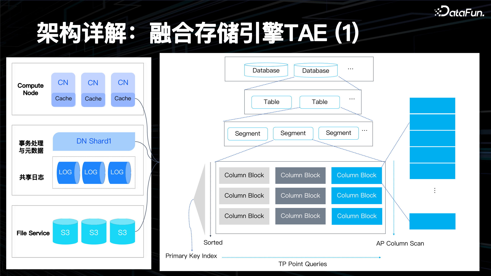

而存储的话，存储层现在TAE我们是完全实现了列存级别的。大家可看到从数据库到表，再到segment，再往下是一列一列，而且我们列的单位是列级别的block，或者说块。比如一次读的时候，他会从一个列里面去读大概多少行作为一个block，推给上面的计算节点或者日志节点。

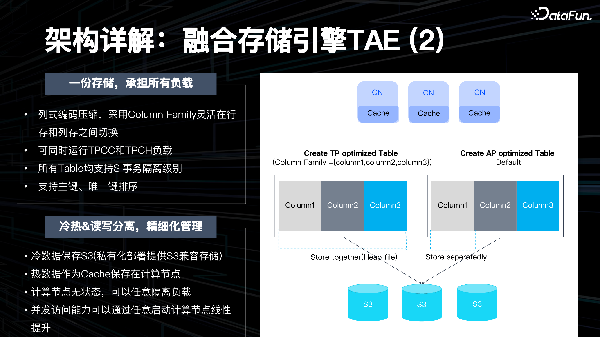

可能大家比较关心的就是我们如何在AP和TP之间找到一个平衡点，现在默认建一张表，那都是列，就大家能看到的是右边的这个。但是如果想某一些某一些表强化一下它的行存的性能怎么办，我建一个叫做column family，就对某一些行做一些特殊的优化，那么在对这一些可能需要频繁在上面做索引，或者需要更新的列，通过column family列的方式能够大幅的提升他的TP性能，最终就是只需要存一个副本。但是我在有些表上做好一些优化之后，就可以实现行存和列存可以在各自性能上的这种优势。当然这个column family现在还正在开发当中，可能会在未来的一两个版本迭代之后，会有一个最初的版本给大家来用。

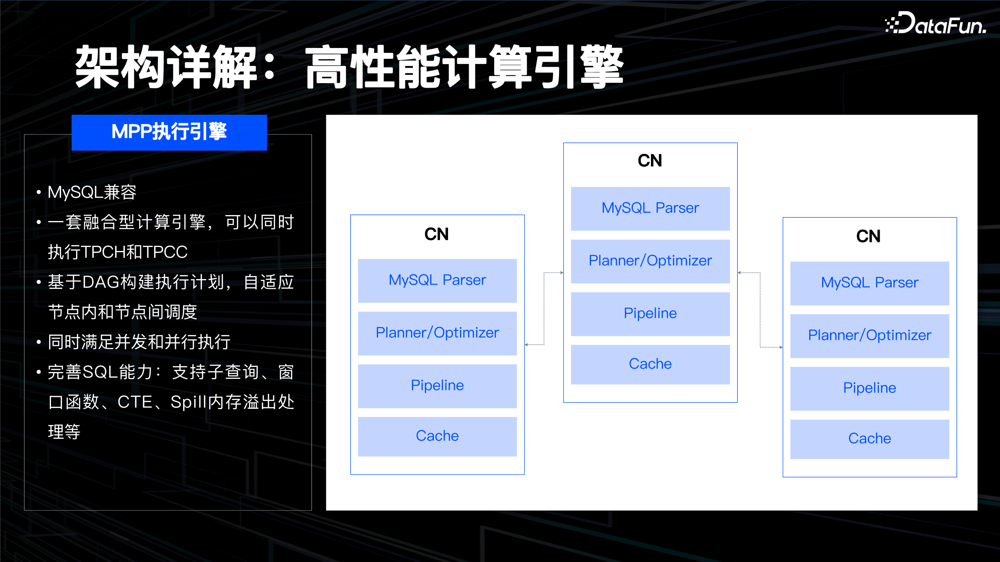

而计算的话，就像我说的，我们现在实现了节点之间的调度。大家能看到，所有的计算节点之间都有个双箭头，就是我们每个计算节点比如说我现在是从最左边的计算节点进来，我需要去做一个数据的查询，但是我发现他的cache里面没有我想要的数据会怎么办，他会遍历所有的其他计算节点去找哪一个节点有自己想要的数据。有的话他直接在那个节点里面把计算任务完成，再把这个结果返回到最初的接受请求的节点。这样的好处是最大限度的利用了不同节点之间缓存不同的热数据。对于一些常用的查询，可能是一个非常大的性能的提升。而且现在我们计算节点，除了缓存以外上面还有一个自己写的pipeline，将很多的SQL请求拆解成为物理执行计划来进行执行。上面是目前正在开发的一个优化器，而最上面就是我们一直在上一个迭代的代码复用最多的MySQL级别的Parser。能够对语法做一些解析，同时还能够去做一些方言上的支持。比如说我们现在也在做一些对PG的语法和方言的支持，其实都是用MySQL Parser来做的。

## MatrixOne架构升级的困难与收获

做了这么多之后，现在大家可能比较好奇的是整个过程当中我们遇到了哪些难题，又是怎么解决的。因为前面的架构和后面的架构差异，不论是整个架构的差异，还是每个组件的功能都有非常大的变化。

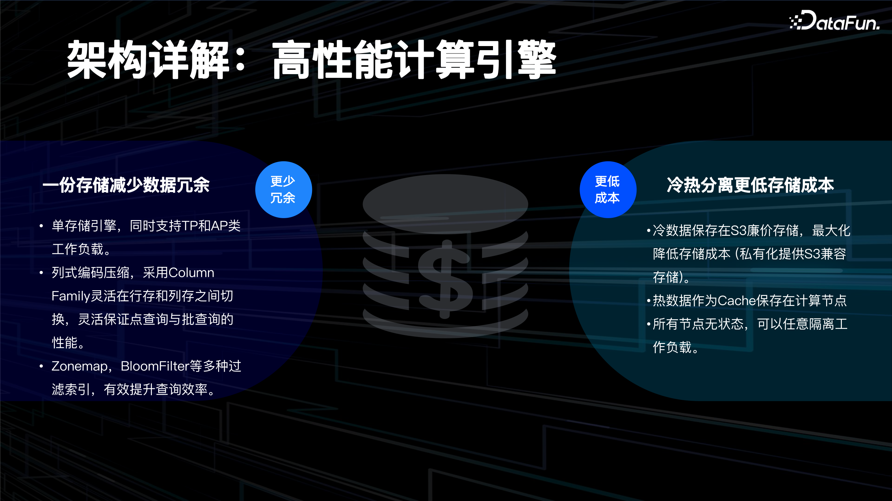

首先面对的几个难题：

第一个难题是如何寻找一个能够对高性能计算引擎匹配的存储，存储。两个核心的需求：

- 一个是更少的冗余；
- 一个是更低的使用成本。

最后经过我们很多的论证之后发现，AWS的S3对象存储其实能够完美的匹配我们这两个核心的需求。比如说我们现在整个单副本，在AWA基本上是一点几个副本。差不多就多了多了20%的冗余，其实这个成本比起我们之前的三副本，他的整个冗余度是大幅下降的，成本上可能从之前的两三倍变成了一点几倍。还能保证一定程度上的数据冗余.。而且在使用上来说，现在匹配S3的各种接口，各种方式开发都已经慢慢的成熟起来，还有S3自带的冷热分离，在我们使用上一方面将冷数据放在S3里面降低的成本，热数据放到这个计算节点上，就基本上完成了用更低的成本来实现冷热数据分离的事情。现在大家如果说去试用一下我们的东西，有些冷数据作为S3放对象，存储热数据用块式的话，这个性能的差异其实是非常明显的。

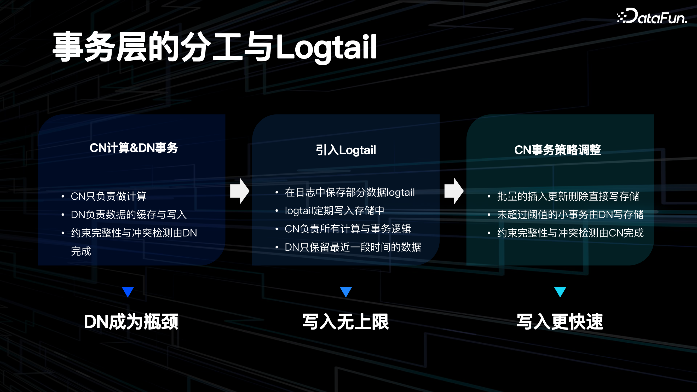

第二个难题就是我们在事务层是如何做分工，因为分布式数据库的分布式事务始终是一个非常大的难点，一开始我们希望我们的CN，即计算节点只负责计算，所有的事务ID生成，事务裁决，还有一致性隔离性，包括数据的读写全都由DN来完成，就是我们的事务节点来完成。然后所有的这个冲突检测，还有约束完整性也都由DN来完成。但是我们做到后面就发现一个问题，就是DN会成为瓶颈。因为我们平时启动的事务节点的数量其实是远远少于计算节点的数量，如果事务节点起的多了，在事务裁决上多个事物节点之间同步又会出现问题。所以当时DN成为了一个瓶颈。于是我们做的第一件事情，引入一个概念叫做Logtail。因为大家如果平时对数据库的写流程有一定了解的朋友会知道我们怎么写，首先把数据这个操作写到日志里，然后再落盘去写。这样的好处是如果我们这时候在写的过程当中发生宕机了，我只需要回放日志，就可以保证数据最终还是可以落盘的。所以我们选择了引入一个叫做Logtail的东西，我们先把数据写到日志里叫做logtail，然后Logtail它会定期的把这部分数据写入到S3对象存储。就不需要频繁的去写，相当于攒一波往里推的这么一个机制。这样的好处就是我们在写的时候，不再局限于整个DN的写的性能。DN只需要攒够一大批一起往里写一次。当DN不怎么忙的时候，他可以选择在自己不怎么忙的时候把他写进去。忙的话那当然可能全都缓存在logtail里，这样的话CN只需要负责所有的事物和事物逻辑，还有计算。DN既保留最近一段的数据，同时又负责日志服务，这样的话其实把DN一定程度上解放出来，使得写入动作的上限基本上是被打破了。但是还面临一个问题，就是事务量非常大的时候怎么样保证写的性能。当时我们选择一个新的策略，如果说我们是批量写入一大批数据，比如说一下子写入几百兆的数据的时候，我们不再通过日志，而是直接往对象S3里写。只是告诉日志服务我要通过什么样的操作，在哪个文件里写什么东西。而那些比较小的事务，比如只是更新一两行数据，或者插入一个新数据，仍然还是走原来的从计算节点到事务节点再到对象存储这么一个过程。并且现在我们将约束完整性和冲突检测，都放在了CN来做。就一定程度上让我们的事务DN节点更加的灵活，整个的负载更轻。这样的好处是写入性能比之前明显的提升了。比如说我们现在如果没有开批量写入直接插入S3的话，可能几百兆数据我们要写几十秒。但是现在的话可能大概一两秒就能写完。整个的提升大概是提升了一个数量级。

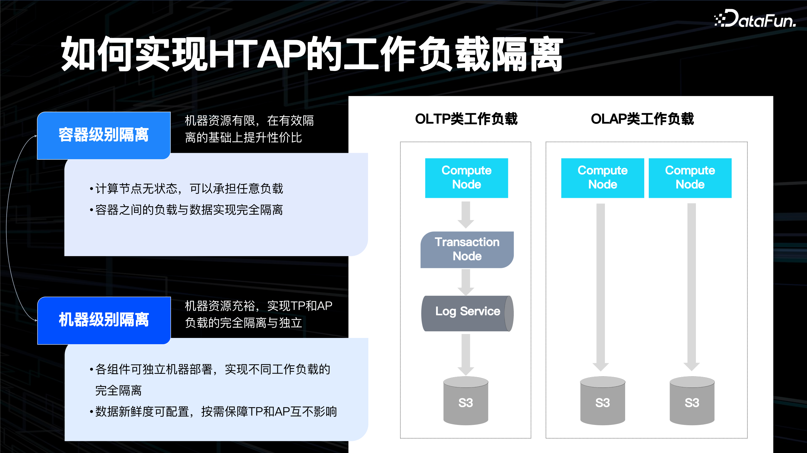

现在还面临一个问题，就是我们如何实现不同业务类型的负载工作。工作负载的隔离，大家可以看一下，我们按照现在的架构，如果说OLTP级别它是怎么做，首先计算节点先放先把数据推给事务节点，事务节点再通过日志写到S3里。如果是OLAP负载。那可能就是直接从S3里面去读数据来进行计算就可以了。我们现在选择的方式是用不同的CN节点来跑不同的东西。比如说我们现在成立第一个CN组，它只跑TP业务，第二个CN组，它只跑AP业务，实现计算节点之间的隔离。当然如果觉得我的系统比较重要，预算比较充裕，那可选择用机器做服务器级别的隔离，用物理机来部署不同的计算节点。如果你想用低成本的机器跑，我们也提供了容器级别的隔离，容器级别可以实现数据和负载的完全隔离。

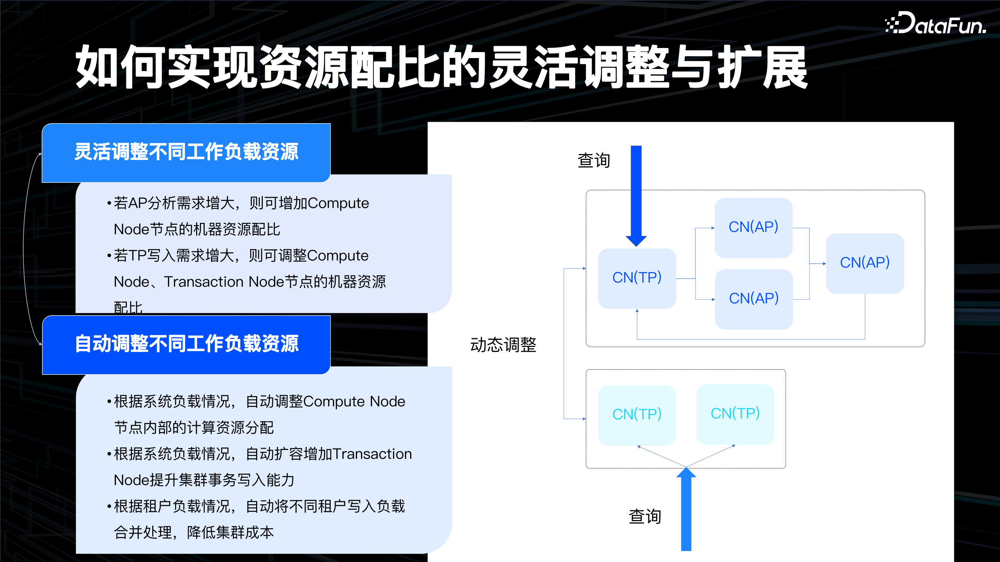

所以最终我们通过这个问题，最后把它做成了一个什么样子呢。大家可以看这张图，我们现在给先做了一个新的概念叫先label，就是标签化。比如说我们现在看到这里面有三个是打了AP的标签，一个打了TP的标签。那一个会话进来的时候，优化器会先去判断它是一个AP请求还是TP请求。TP请求那就进TP的计算节点，AP的话那就进AP的计算节点。这样的好处就是不会出现两种业务上的资源公用。比如哪边现在业务更高的时候，我就选择对哪一边分配更多的资源。当然未来我们还会有个设想，就是希望能够实现自动的负载均衡。比如通过优化器，通过某一段时间的统计信息，我们来判断最近可能TP业务更多一些，那就自动扩容一些TP的计算节点。AP的更多的话就自动扩容一些AP的节点。目前公测的0.8版，主要提供给用户的是手动的通过配置标签的方式，让用户把自己的不同类型的负载打到不同的计算节点上来实现。就是这么的一个实现方式。

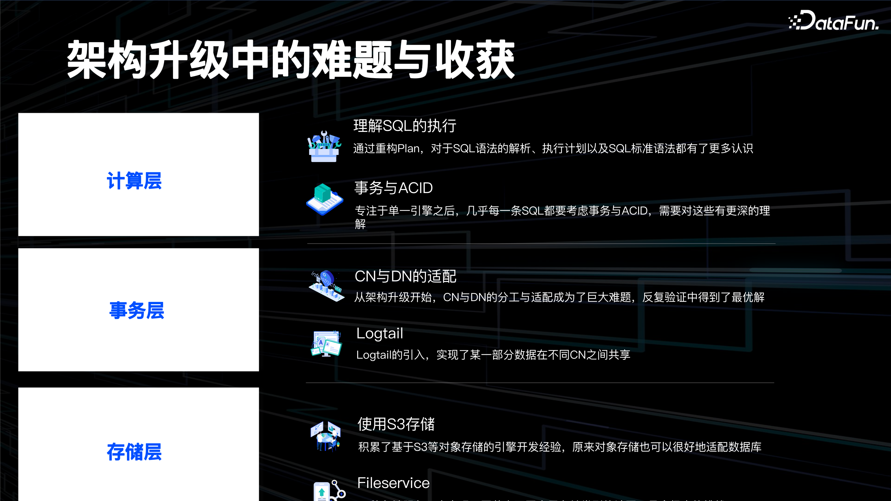

整个升级过程其实也是个很痛苦的阶段，那段时间我也跟我们很多的研发同事做了一些语言上的交流，还有像技术上的一些复盘。后来我就问他们，在整个升级过程当中，你们都有什么样的收获你们，对现在的产品又有什么样的新的了解。我们很多同事，对整个执行计划做的重构，包括像这个语法的解析执行计划，还有现在甚至连SQL语言标准，大家都有了新的认知。

从头到尾我们相当于将整个的一条SQL从客户端进入服务器再到完成执行整个过程我们做了重构。很多同事之前对这些东西了解其实是还浮于表面，但是经过这次整个系统升级之后，他们对这种这些东西的理解加深了很多。现在我们大家再去讨论各种执行计划，讨论开销包括语法语义的事情的时候大家可以聊的很深入。甚至SQL标准，当时我们公司还出钱，大概几千美元买了SQL标准的字典。我建议大家平时有空的时候一定要去翻看标准是怎么定义的，这样有助于你们更好的去理解每一条语句它背后所支撑的逻辑。

还有就是这个事务和acid，因为之前我们是多引擎，有的引擎的同事开发的时候他就不需要考虑事务的acid。现在不一样了，现在每一条你都要考虑事务的四个特性。那这个时候对于整个事务的理解，大家可能更多的是对不同的隔离级别怎么做，锁服务要怎么搞，为什么会有今天这样的情况。

然后在开发事务层的时候，就是CN和DN的适配，我们当时是从去年9月一直到11月，两个月的时间里面在解决这个东西。作为分布式事务到底该怎么分工，既能够保证完成事务的acid，同时又能够保证让系统的架构和系统的负载，不会出现明显的短板和弱点。所以在当时大家反复验证了将近两个月，最终的结果就是引入logtail。并且CN和DN一个只负责元数据，另外一个负责计算和逻辑以及去重。最后我们还发现logtail还有个什么好处，因为它是放在DN里，它可以实现不同的计算节点对这一部分数据的共享，不需要再从对象存储里直接load。

存储层大家积累了两样东西，一个是S3对象存储，积累了对S3对象存储的开发经验。因为之前我们很多同事可能没有做过公有云的开发，但是在开发这段时间里面，对对象存储的使用有了相当大的进步，还有就是我们现在自己的file service文件服务基本上开发完以后，大家很多的时候在使用不同类型的存储的时候，不再需要考虑很多接口要怎么写。兼容性怎么样，性能怎么样，统一交给file service去实现。

## 04 总结

最后我来给大家做一个总结，就是我们整个系统架构升从2022年的4月一直到11月，差不多半年左右的时间大概
做了哪些东西是值得去给可能给大家去借鉴或者也许会给大家带来一些不一样的思考。

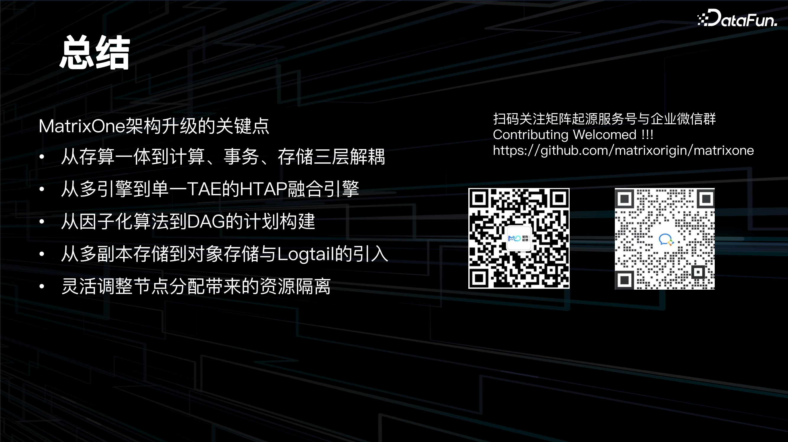

第一点：存算一体的分布式架构它有它自己的好处，但是它也有它自己的问题，容易制造热点。可能再加上成本等等这些问题。而我们完成了三层的解耦之后，每一个层级可以自行的进行扩缩容，不再依赖于其他层面。这种灵活解耦的架构，其实在不同的业务需求上，确实可以得到不同的最佳实践。比如说有些业务，可能需要更多的计算资源，可以直接加计算资源。而像以前的不管是集中数据库还是存算不分的数据库，都面临只要扩容，存和算都要区分。

第二点：多引擎到单引擎，因为多引擎之前给大家说过，多引擎一个是要维护的代码量以及可能你要考虑每个引擎的特性之间怎么样去搭配。但是单引擎现在只需要考虑的是一个单引擎是怎么做这个事情。对于大家的工作量，包括整个HTAP的设计，其实都觉得比多引擎可能具备更节省人力的一个用处。

第三点：因子化算法到DAG ，有些东西确确实实是很好。但是我们不仅要仰望天空更要脚踏实地，在当下的话在没有那么多人才储备的情况下或者说对于有些还不够成熟的东西，不足以支撑起我们未来的产品发展的情况之下，那选择一些更实际，更有效，让更多人能够参与的方式去构建执行计划，可能才是我们最终的归宿。

第四点：还有就是从多副本存储到对象存储logtail的引入，之前的多副本存储带来的成本问题可能在对于一些对成本比较敏感的客户那里是一个天坑。现在我们对象存储和logtail引入之后，实际上存储的成本降到了原来的1/3左右，对于以后可能数据量越来越大的用户来说，他未来对于成本的焦虑会大幅的下滑。

第五点：灵活调整节点带来的资源隔离，一方面就是我们所说的存算分离。就像水多加面，面多加水更加灵活的资源配比。再一个通过用标签的方式，将一些请求强制隔离到不同的节点上，避免出现不同业务类型对资源征用。

这是我们的一个企业服务号，平时我们有很多的文章。包括我们内部同事写的一些干货和我们对外部的一些新的进展，还有某些客户给我们的反馈，都会在里面有。右面是我们的企业微信群，可以扫码进群。

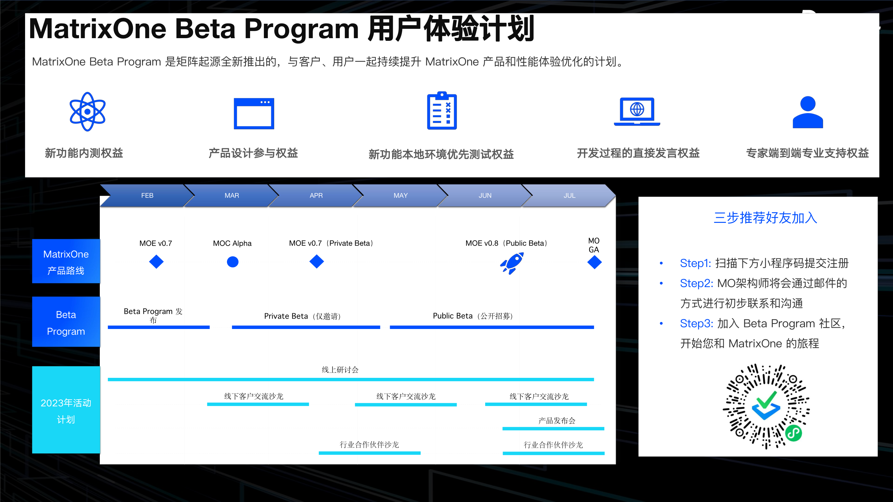

最后我再介绍一下我们公司现在有一个叫做Beta program的用户体验计划。这是我们目前为一些即将有合作意向的客户提供的一个专属的计划。您参与的好处有，一个是新功能我们可以第一时间交给您去用；并且可能有些比较匹配您业务的场景我们会做一些定制；还有您甚至可以直接参与到我们整个产品的设计当中。比如说您们当前有什么痛点，可以直接找到我们，我们会告诉你，这个东西可能怎么解决。如果当前我们没有这个功能，可能会优先以您的需求来作为蓝本去设计。然后再比如说您在使用我们的这个产品的时候遇到了各种问题，您可以直接找到我们研发团队，很资深的工程师。那他们会告诉你可能这些东西大概怎么用，会有一些指导。

现在我们是属于0.8版本叫做Beta program阶段，我们会在第三季度发布正式版。我们现在也提供了公有云版，公有云版现在也是在公开招募阶段。如果对我们的这公有云感兴趣，也可以申请使用。目前我们使用的是serviceless计划，可以在上面跑一些像TBC是或者说TBCC这种比较常见的benchmark。如果你有一些基于像MySQL开发的一些应用程序，你可以在我们上面做一些测试。就只要扫一下大家右下角的这个二维码就会有用户体验计划参与。

今天有关我们整个产品架构的升级分享，我就讲到这里了。

## Q & A

Q.：后期有没有计划接入更多的存储引擎，除了S3之外，比如说像minio，或者是HDFS之类的引擎？

A： 确实是有，我们现在私有化的场景就是以minio作为私有化部署的方案，当然整个对象存储也会越来越多。
如果说在minio比较成熟以后，我们也会选择更多的存储对象来支持。现阶段的私有化，我们标准版本就是私有化是minio。公有云版本就是S3或者是阿里云的OSS。

Q：您这边就是如果说对企业级的用户会不会有那种定制化的支持。比如对于解决方案的设计，对于企业级的应用方案的设计，以及运维的一些设计等等。

A：会有，首先我们现在企业客户会有一个付费用户，会有一个单独运维工具。这个运维工具对于我们整个不管是集群也好，还是私有管控也好都会有更好的使用。然后如果您对于，比如说自己行业内的应用程序怎么在我们这做落地最佳实践。我们确实现在也有这方面的同事一直在做这个事情，比如说你想做一些定制化的开发，或者是一些应用程序的优化。我们也会有技术的同事去帮您去做这个事情。

Q：就是目前我们的这个合作的企业中，大概都是哪些行业的。

A：现在一个是以制造业为主的一些企业，比如像麦斯，麦斯客户他们会把我们的数据库，嵌入到他们的这个产品里面去做一些应用。还有一些就是BI类的比如说像帆软、宏友，他们这些BI客户也在尝试着把我们的数据库作为MPP层去推给他们的用户来使用。再还有一些像公有云有一些中小企业客户，会直接把他们的应用程序部在公有云上，使用我们公有云版的数据库。现在是这样一个情况，也还在不断的拓展。我估计等到1.0的时候，我们的客户的应该不论是行业还是说场景都会更多。

Q：DN事务成为瓶颈引入logtail写着无上限，这个怎么理解。因为我看了下这个logtail的话，DN是本地存储，怎么跟存储层不在一起。

A：平时我们所有的DN，可能是和写数据打交道是最多的。如果我们比如说只要写一条就要直接落盘的话，其实这个落盘的频率非常高，DN它作为一个节点，可能这时候就会成一个高负载的节点，他要发起很多写入动作。引入logtail之后，我们很多的数据，先由DN缓存到自己的logtail上，等到他攒够了一批之后，他再统一写一次，其实对他整个的负载程度就没有那么高了。这是其中之一。第二就是我们现在的设计上，可能是CN的数量是远远多于DN的数量。所以经常会出现高并发的情况之下，可能我会有好几个CN同时往一个DN里写。所以这个时候DN的带宽和处理能力有可能就会成为一个瓶颈。所以我们尽量想的是把DN的工作负载降到最低，来实现写入性能的不断提升。

Q：为什么我们设计成就是单独的存储，就是在直接在DN上面的话挂存储，就是logtail不放在统一的那个存储层？

A：logtaill我们给它配的是比较好的存储，它直接在里面缓存的时候，往里写的性能其实是比S3要更好的。相当于起到一个中转作用，这是第一个好处。第二个就是logtail它存在DN里面的话，我不同的CN只要这个数据它没有落盘没有被truncate之前，所有的CN都可以共享。比如说恰好就需要logtail数据的时候，我直接从logtail里读不需要再走入S3。其实一定程度上也就是对CN也做了一个加速。

Q：是冷热与读写分离，咱们现在怎么体现冷热跟读写分离呢？

A：冷热首先冷热数据一个是S3他自己提供了一个冷热数据分离的机制。他可能读取速度会比冷数据稍微快一些。然后其次我们在每一个节点上，不管是DN还是CN，也放了自己的缓冲区。就允许用户把一些就常用的数据以内存的方式放在自己内存里，如果自己还有一些除了内存以外，在每个节点上再配一块高性能盘，再缓存一些数据，其实也可以做。实际上冷热数据他实现了多机分离。

Q：读写分离怎么理解？

A：比如说读的时候可能只需要去从内存开始里面去读，不需要涉及到去写。就是比如说现在有一个请求进来了，那么我可以直接从这他的cache里面去找，找到对应的cache直接就可以读。然后CN继续可以负责只负载去写，节点之间可以实现自自适应调度。然后再就是这种标签，基于不同的标签的情况之下，有的可能TP只负责写AP只负责读。就是这部分资源是这部分资源是完成隔离了，专款专用的使用方式。当然以后等到我们优化器逐渐的强大之后，可能还会有在一个节点内部，划出某一部分区域只负责给读，一部分只给写。这个可能还需要一段时间才能开发出来。

Q：问题就是更少的冗余。因为分布式一般还是走三副本，如果说是更少冗余1.5副本他怎么保证数据高可用？

A：就是对象存储它可能是一点几个级别的冗余。然后通过S3和minio，它可能自带了一些检测机制，比如说他发现某某一部分数据可能坏了，不可用了。他一定会用自己的方式去把冗余的数据再重新拉起来。目前我们就公有云上做了一些测试，还没有出现过公有云上的冗余导致结果不一致。

Q：工作负载隔离跟容器级别的隔离和机器级别的隔离

A：如果说你想要比如机器级别的隔离，那我可以选择比如3个logo service放在3个不同的物理服务器上，然后DN可能放在一个节点上，然后每个CN可能再放到不同的物理机上，这是一种隔离方式。
还有一种容器级别，我可能就选择3台服务器，每个log service放到一起放到各自其容器放到三个不同的服务器上
其他的CN节点我也打散了，以容器的方式在不同的物理服务器上启动。

Q：对于HTAP的数据库，其实性能是最关注的。S3的是对象存储，咱们存储不是有其实有有三种类型：一个是快、一个是文件、一个是对象存储。对象存储其实是最慢的存储。那怎么去解决性能问题？

A：针对对象存储，现在我们也在开发有关对象存储我们叫pre fetch。比如说对象存储当中的一些块，如果说开启了这个功能之后，他可能会预先的把一些块先缓存到计算节点的cache上。这样的话在使用的时候，它会跟基基于以前优化器的统计信息，包括一些元数据或者表结构，执行计划，提前先load进来。这样在使用这部分的时候，其实一定程度上可以提前做一些加速功能。目前按照我们CTO的设想是以后，冷数据跟热数据之间的数据差会比我们想象的要小。比如说差一两秒，将来如果真的这个pre fetch做好了，会变成一个比较理想的状态。