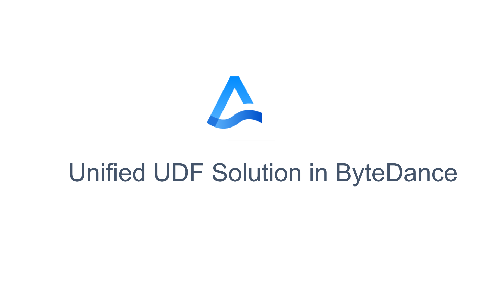

## 字节的统一UDF方案

目录：

1. 在字节内部平台UDF的支持
2. 在云产品上如何做的UDF统一支持
3. 贡献到prestodb开源社区的相关内容

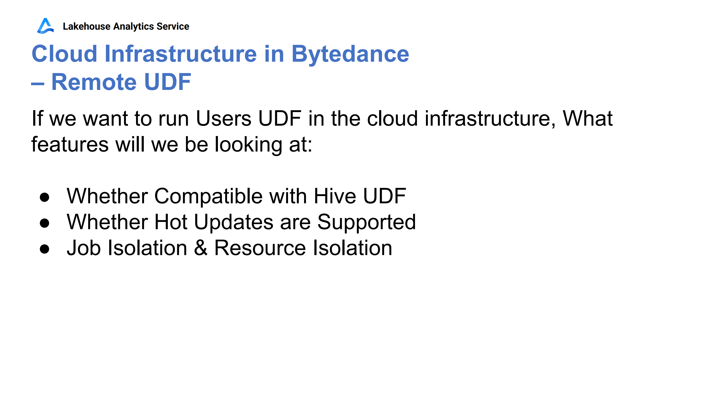

### 第一部分：云产品上统一UDF的实现（Lakehouse Analytics Service火山引擎上支持多引擎多租户的湖仓一体服务）

关于云平台的话，从用户视角看，用户如果希望在云平台上使用自己的UDF会特别关心以下功能：

1. 是否兼容hive的UDF，（比如SQL UDF是比较好的兼容手段）。对于小公司，在实际业务使用中，面临上云最大的困难是如何降低成本，直接把hive UDF迁移到云平台上使用。
2. 能否支持UDF jar包的热更新。从比较小的角度来讲，像presto这种常驻服务，如果实现一个UDF jar包的动态加载的话，现在是必须要重启preto服务，整个成本会比较高，对用户的体验和SLA会有比较高的影响。 从更高产品角度而言，如果想要实现UDF jar包更新，更好的方式是提供类似crud功能的产品，用户可以进行多版本UDF jar包的管理，可以选择相应的版本快速应用，快速生效。
3. 隔离相关，包括作业隔离和资源隔离。UDF本质上都是用户自己写的代码，用户的代码是否安全，是否存在隐藏漏洞，可以被外部利用攻击用户数据，这些是没法事先可知。所以必须要在内核和网络级别上对用户作业进行隔离，从而达到保证用户数据安全性问题。同时还引申出另一个问题，即资源隔离问题。比如一个presto UDF 太复杂了，占了整个presto资源，导致其他作业执行的很慢。这种情况下其实不仅是一个安全性问题，而是资源规划问题。 所以在产品中能够有效的限制资源是很有必要的。

当然介绍的这些点不光是云上环境需要的，其实在我们厂内也是很急需的。

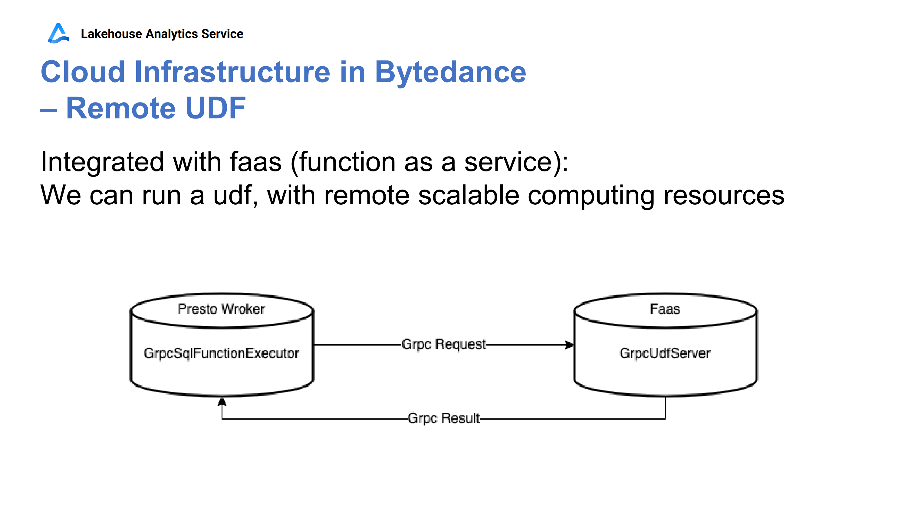

基于这整个思路，我们使用和完善了一套remote UDF的方案。

在远端是通过FAAS服务，提供一套通过镜像进行多版本管理UDF jar包function的管理能力，这个FAAS本身是个serverless服务，能够提供理论上无限可拓展的计算资源，这样可以帮助用户进行复杂算子的更高并行度计算，同时因为在不同的机器上，天然实现了资源隔离，本身在FAAS层面也会做到足够的内核隔离和网络隔离。 

在客户端，提供了基于Grpc方式进行相应接口的调用。如上图所示， 整个remote方案本质上能够把UDF的调用接口给抽象出来，在我们实际使用过程中可以做到一套UDF能够在多个引擎适配，只需适配相应的rpc接口即可。

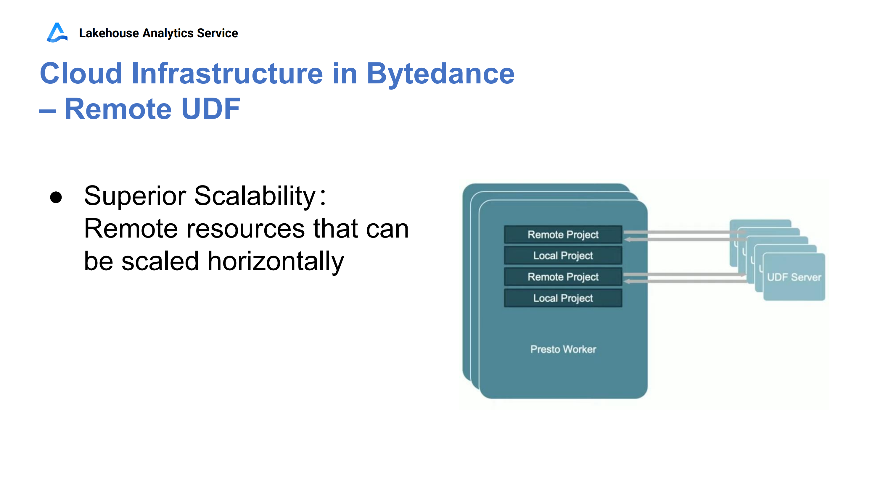

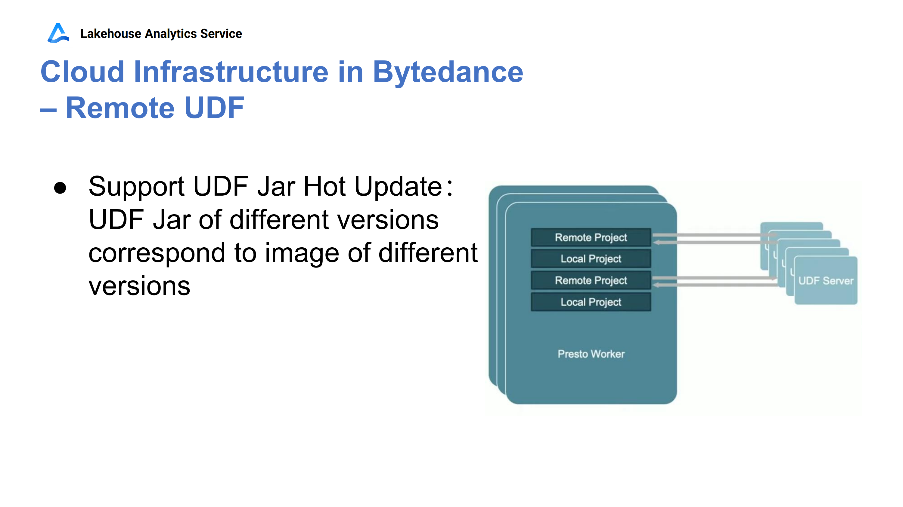

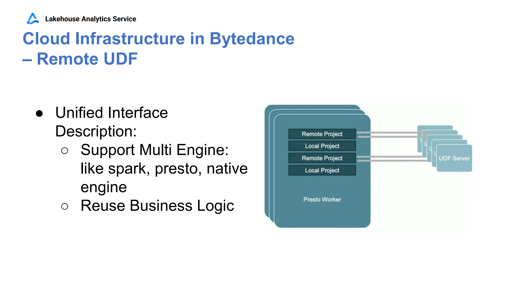

Remote UDF基于这种架构的特点和优势：

1. 更好的安全性，远端变成独立的沙箱，能够很好的实现内核和网络的完全隔离。同时因为这是一个远端资源，可以通过控制每一个容器的数量，限制资源使用，防止用户expensive operator的过多使用，影响presto集群的整体稳定性；
2. 提供水平可拓展的资源能力，基于这个能力，用户的算子在相对复杂情况下，可以利用远端这种可拓展的资源提供对于复杂算子更好的支持， 这样某个在单机节点上因为性能损耗的原因难以快速跑出的复杂算子，在远端因为计算资源水平扩缩容，可以保证执行。
3. UDF jar包的热更新，对应的管理方式是把不同UDF jar包的版本映射到不同的实际镜像当中。关于UDF server是一个server跑函数还是多个函数， 这完全取决于remote端的实现。在我们产品中，因为要做到隔离性，一个UDF jar包会对应一套镜像，这套镜像就是实际的容器服务，不同租户对应不同的服务，基于这个镜像进行水平的扩缩容。这个本身不是由presto engine side层决定，针对不同情形会有不同的实现。

4. 最后一点也是比较重要一点，remote UDF能够对外提供统一的接口描述，这样的好处是：
   - 可以同时支持多引擎，在调用端不管是spark还是presto，甚至像现在比较火的native engine（c++语言实现），在调用UDF时也不用考虑是否需要用JNI来wrap一套UDF，只需远端实现同一个Grpc接口即可。  同样在UDF server端也可以用任意语言实现，比如java甚至是python等，只需有相应的容器支持即可。
   - 基于这种方便的迁移性和便利性，remote UDF能够提供很好的复用业务逻辑的能力。

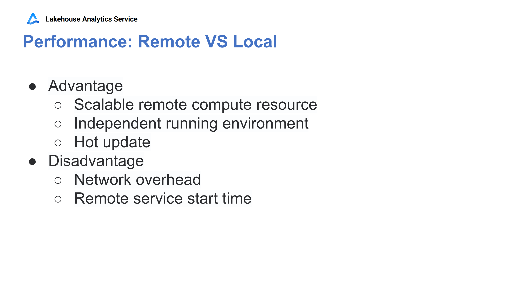

Remote UDF算是比较新的概念，跟大家平时用的local在实现上差距比较大，大家可能比较关心实际使用remote的性能如何，以及还有哪些优点和缺点：

优点：（在上面已经比较多的提到）

1. 独立的环境；
2. 热更新；
3. 远端理论可无限拓展的资源。

但是它会有一些额外的代价：

1. Network的overhead；
2. 远端启用UDF server是需要基于镜像启动，会产生镜像启动时间。

基于这两个问题的解决方案：

1. 关于网络的开销，本质上是计算量和网络量的cost的平衡，在本地可以通过merge配置的大小来降低单次请求量所消耗的网络开销。
2.  同时进行镜像的预热，事先预留好一定的资源， 保证服务的快速响应。

基本上通过这些保证，能够做到remote性能与local相当，同时在某些复杂算子情况上，（比如expensive计算）是具有更好的优势，因为它在远端资源可以水平扩缩容。

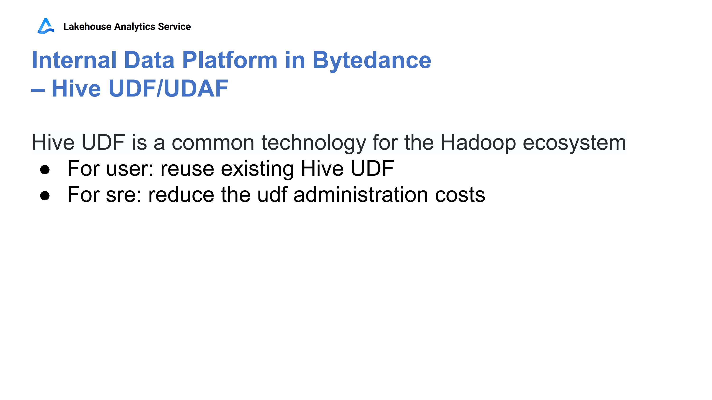

### 第二部分：字节内部平台的实现

我们内部产品支持了local的hive UDF和UDAF，能够在presto支持hive的UDF/UDAF的话，会有很多好处：

- 对于实际开发人员和用户，可以复用hive的UDF，以很低的成本，直接切换引擎，在presto执行SQL。

- 对于数据平台的同学们，可以比较方便的管理UDF的jar包，减少不必要的成本。

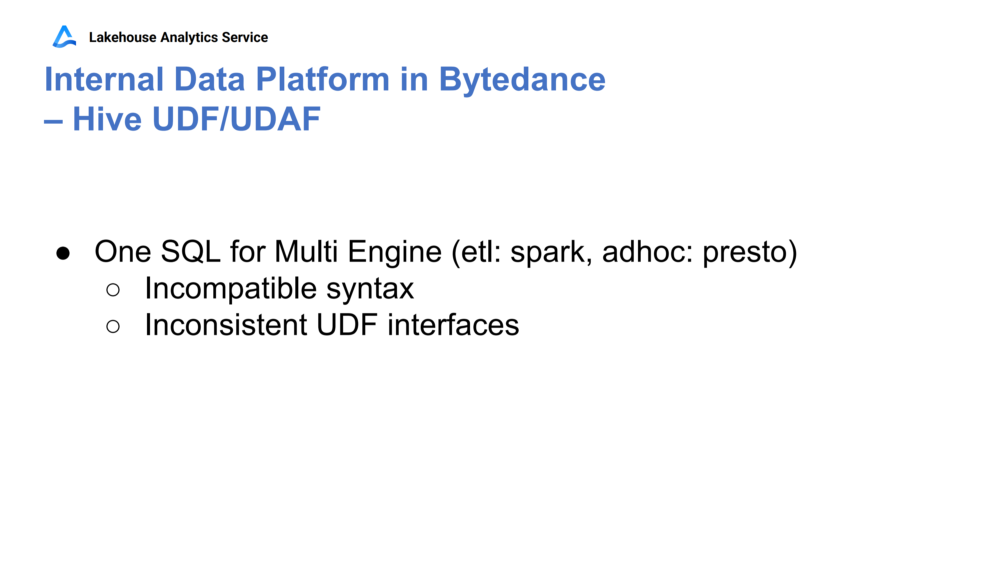

对于很多公司，最初引进presto的时候可能主要考虑presto作为比较优秀的交互式查询引擎，在ad-hoc场景会有比较大的优势。 如果能够对外提供完整的sql语义，后端可以自己选择在etl场景跑spark， 在ad-hoc场景跑presto。但是实际在推广过程中会遇到下面两个比较明显的问题：

1. 如何保证语义一致；
2. 如何保证UDF的一致；

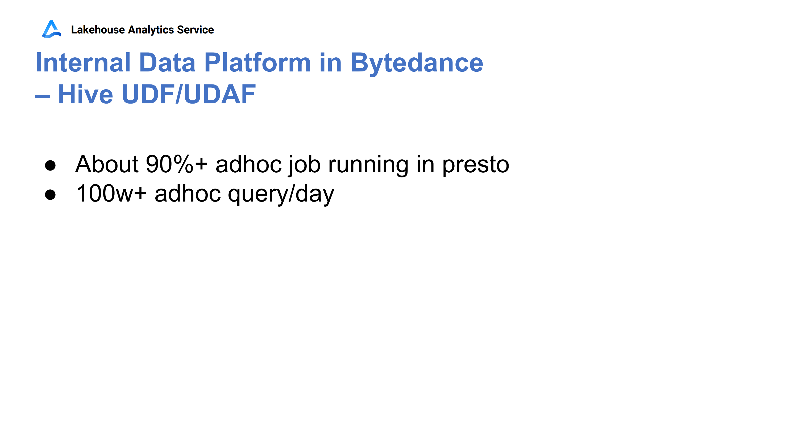

首先对于第一个问题，如何保证语义一致，有很多SQL改写平台，能够逐步保证语法层面的一致。  但是UDF的一致层面改动影响比较大，不太可能让用户重新写一套。 我们推广SQL的自动路由的初衷是想让用户无感知，并且推动用户一套SQL可以在多个引擎运行。 如果不能做到一致性兼容的话，即使推广了remote UDF功能， 用户还是需要直连presto或者spark。基于这些初衷，我们在presto上支持了在local模式下执行hive的UDF/UDAF。

现在在ad-hoc场景下超过90%的sql都是跑在presto上，而且没有用户是直连任何引擎来执行SQL，完全由统一的SQL语言来保证这件事情，每天达到100w+的ad-hoc的查询量。

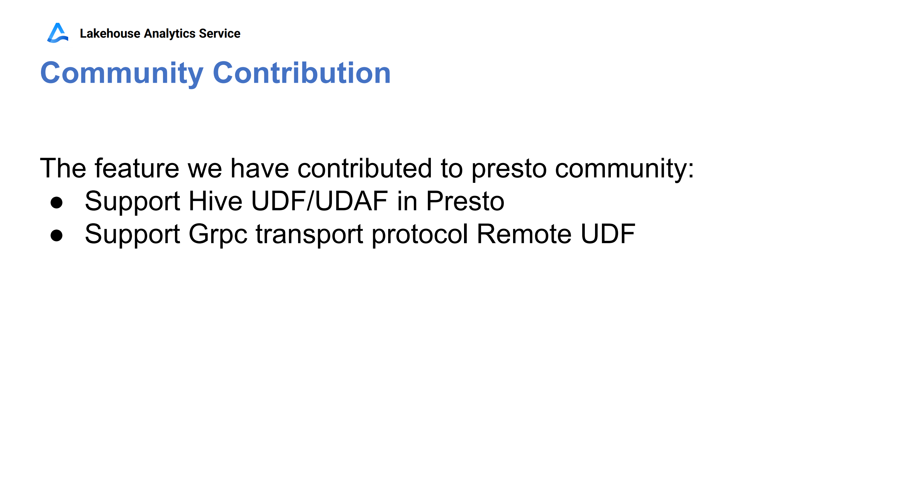

###  第三部分：向社区做的贡献

不仅是云产品还有公司内部的技术贡献到开源社区，主要包括两部分：

1. 在prestodb代码库下支持hive UDF/UDAF
2. 在remote UDF框架下面支持通过Grpc协议的调用

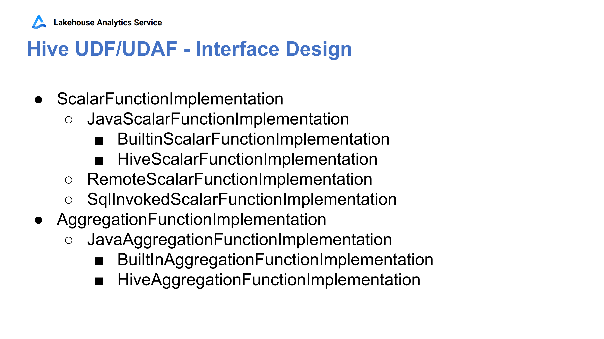

再介绍下接口层面的东西：

主要实现RemoteScalarFunctionImplemention这一块一块，在此基础上，为了支持hive UDF/UDAF，还引入了一个新接口JavaScalarFunctionImplementation。这样我们把presto自带的UDF和hive的UDF做了两个子实现，映射到java的UDF下面，在接口层面保证presto能够支持hive UDF/UDAF。

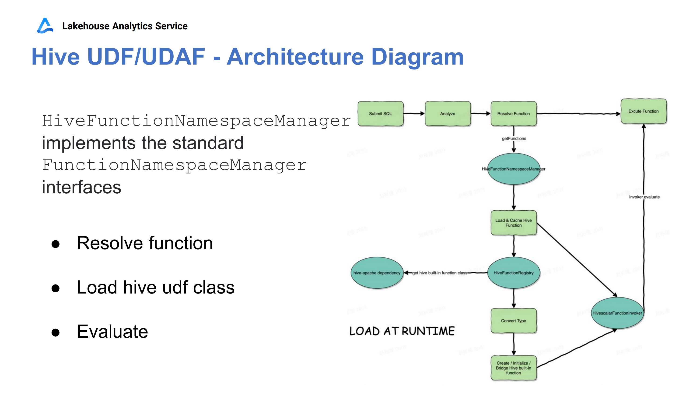

从实现架构来看， 整体如上图所示，构建了一套基于hive的FunctionNamespaceManager， 会在Resolve Function阶段加载相应的hive UDF类，并且把hive UDF的数据类型跟presto的数据类型进行映射和wrap， 最后执行。

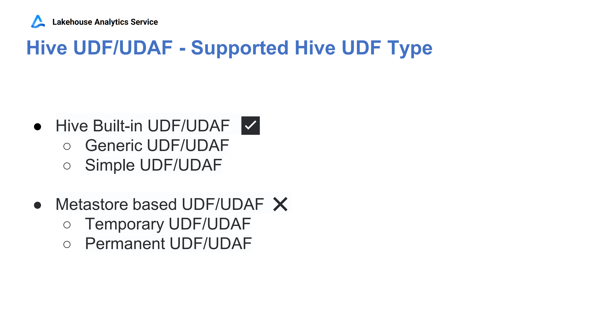

当前已经提交到prestodb开源社区的部分：

支持了hive内置的UDF/UDAF，既支持Generic的UDF/UDAF，也支持Simple的UDF/UDAF。之前有些UDF社区方案是对UDF的支持有很多限制，我们贡献到社区的这套方案对built-in是比较完整的支持。

现在还不支持基于metastore 的UDF和UDAF，包括临时UDF/UDAF和永久UDF/UDAF ，会在后续的向社区贡献的规划中做推动。

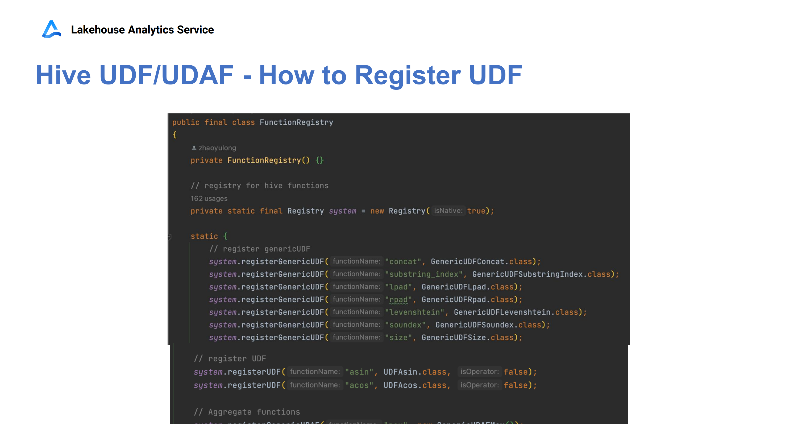

这里简单介绍一下，在prestodb里如何使用hive的UDF和UDAF。 

1. 注册UDF/UDAF：因为当前只支持built-in的UDF，因此还需要到代码里（FunctionRegistry）里进行注册， 如果注册GenericUDF的话，调用相关registryGenericUDF的function，如果是注册SimpleUdf的话，则是调用registryUDF的类，就可以完成需要的UDF/UDAF的注册。
2. 启用方面：整体启用是比较简单的。参考下面的代码

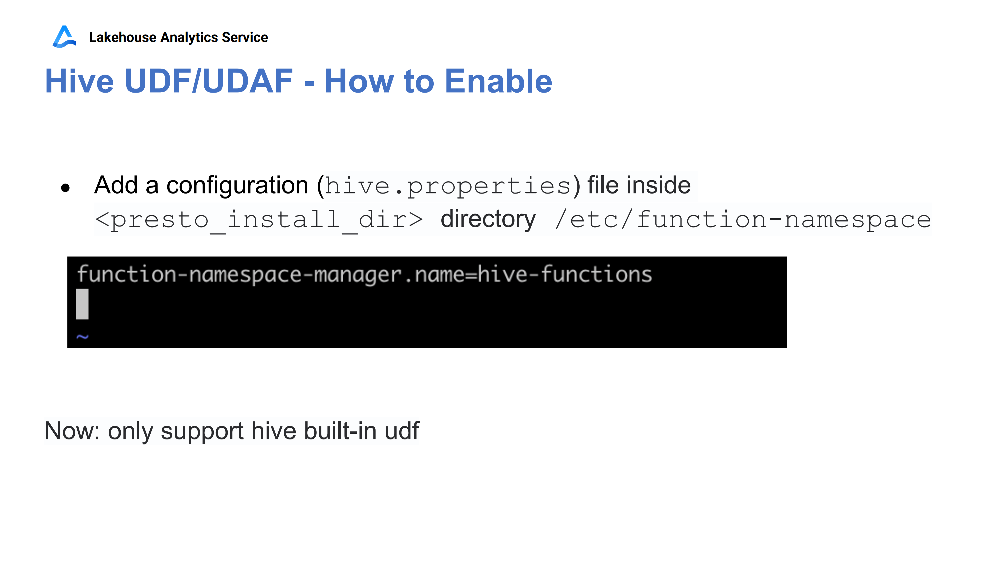

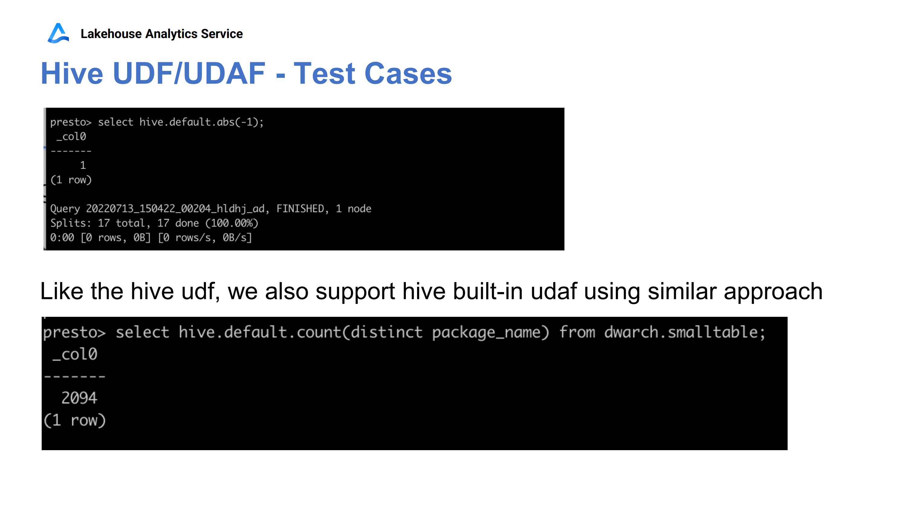

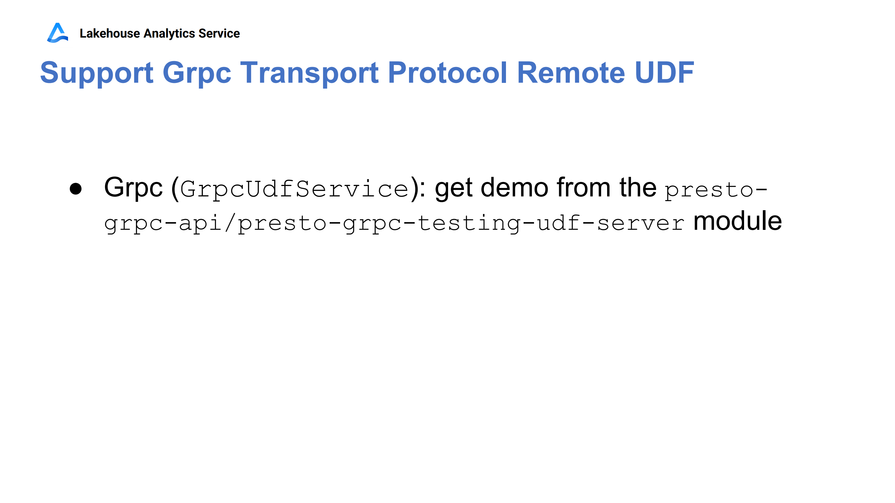

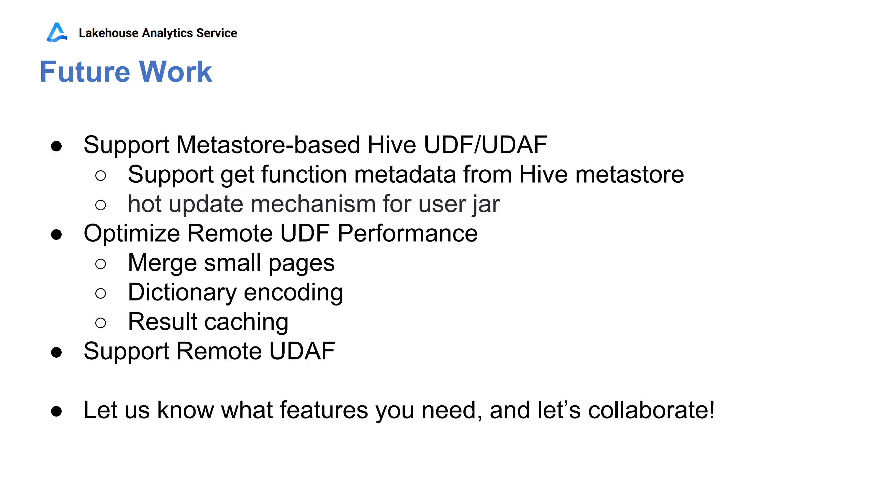

### 未来工作：

1. 尝试支持基于metastore的udf/udaf，主要是包括两部分：
   - 支持能够从metastore拉取元数据
   - 支持udf jar包的动态更新，热加载机制

2. 关于remote相关的更新，尝试在presto site engine做一些优化：
   - 比如做small pages的merge
   - dictionary的encoding 
   - 一些结果缓存

3. 支持remote UDAF等。

### Q&A：

Q：贡献的prestodb的hive UDF的 一部分， hive的支持函数？

A：参考上文如何注册，大家把需要的函数直接在functionRegistry上添加即可。

Q：spark支持remote UDF是开源实现的吗？

A：没有开源实现，因为presto和spark共同支持remote UDF的function完全是facebook内部的实现， 但是其实spark要支持remote UDF是非常容易的，完全可以在plugins时候，访问metadata source，presto remote UDF如何实现的话，spark可以直接把jar包拿下来，因为也是scala implementions，如果是java的UDF的话是比较容易实现的。主要难点是在怎么做好preload，predistribute。这样避免在冷启动的时候导致启动比较慢

Q：内部使用remote的场景多吗？

A：相对来讲，内部使用remote的场景会偏少一点， 某些用户的UDF计算比较复杂的话，使用remote场景是比较有效，可以解决本地资源不足。 在facebook的内部使用remote场景会比较多，降低用户写函数的门槛，另外很多用户想要的业务逻辑需要访问自己的backend service，或者是fetch 安全相关的function也会做成remote，基本上在presto engine内部的话，需要access remote service基本是不可操作的，跑到remote上即可

