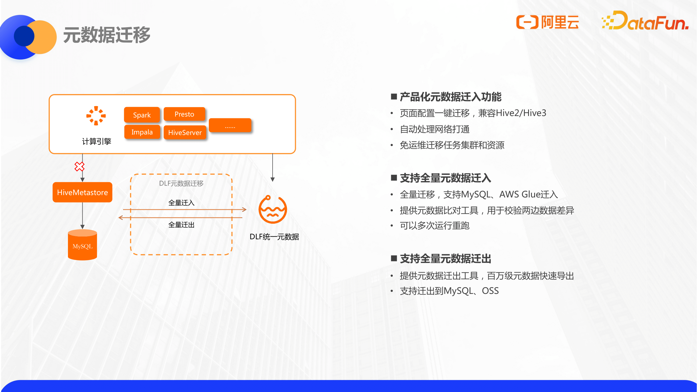

大家好我是范佚轮，来自于阿里云。目前是负责阿里云数据湖构建这款产品的研发。今天分享的主题是数据湖统一元数据与存储管理
随着数据湖的发展和日渐增长的需求，对数据湖进行统一元数据和存储管理也显得日趋重要。

主要介绍阿里云的数据湖架构，以及元数据的存储分层相关的优化和实践。具体目录为：
1. 云上数据糊架构
2. 数据糊统一元数据
3. 数据糊管理与存储优化
4. 数据糊格式管理与优化

### 云上数据湖架构

首先谈一下数据湖相关的概念和架构。

对于数据湖概念的定义不同的云产商会有不同的定义。但是从关键词上来看，基本上都是围绕这几个特性和目标：

1. 统一存储，即数据湖是一个统一的中心化的数据存储；
2. 可以用来放一些原始数据的；
3. 支持多种格式，包括结构化的数据和非结构化数据。

首先第一点统一存储，主要是为了解决这个数据孤岛的问题。因为传统的数据库或者是数据仓库在设计上是存算一体的，也就是在不同的查询引擎之间，数据是需要经过清洗和同步。这样不管是在存储空间上，还是效率上，都存在一定的浪费。在数据湖上，它使用存算分离的查询引擎，典型的比如hadoop生态的hive和spark。再加上开放的存储格式，如parquet、orc等，来实现使用不同的引擎同时可以查询同一个数据的功能。这就是我们早期数据湖的架构。

然后另一点在存储实现上，数据湖通常会使用扩展性比较高的，廉价的存储。比如HDFS，或者云上的OSS、S3等对象存储。这样的话大家可以把更多的原始数据，非结构话数据直接放入，避免原始数据的丢失。

最后为了能够读取这些原始数据，计算引擎通常支持类似schema on read的方式，采取事后建模的高灵活性的解析方式。那对数据格式就没有很强的约束，因为这种灵活性，也带来了一些弊端，即缺少了一些功能。比如他的高度开放性，导致对安全和权限的管理对比数仓是有所差距的。另外在事务性上，因为开放存储，并发写入的场景尤其是流式写入的场景，事务上对ACID的要求会更高。

这也是我们这些数据湖格式诞生的一个重要原因。

那有没有一种办法使我们既能够利用上数据湖这些优势，也能让数据湖拥有数仓的功能特性呢？

前两年databrick提出了Lakehouse湖仓一体概念，要让数据湖能够实现更多数仓的企业级能力，即要像使用数仓一样使用这个数据湖。
Lakehouse概念是在数据库的基础之上的，添加了几层内容。
1. 首先在存储上层，他其实是做了一个元数据的统一，即matedata统一。对上层提供统一的元数据结构化SQL的接口，让不同的应用，可以使用相同的元数据访问数据。
2. 另外在性能上，支持cache，来解决数据湖读取性能。
3. 另外很重要的点，是数据湖格式的事务层。因为目前很火热的数据湖格式，delta lake、hudi和iceberg。使得我们现在提到数据湖场景，基本就跟这几个数据湖格式划成等号了。虽然这有些夸张，但也足以证明它们在数据湖架构中的重要地位。
4. 最后在底层的数据湖存储的实现上，相比于HDFS，目前在云上也有使用对象存储作为数据湖存储的趋势。因为云上对象存储的扩展性相比于自建HDFS要高很多。不管是在成本上，还是在可用性上其实都是会高一些。所以说我们提到数据湖存储目前很多也是在解决云上对象存储的问题。

前面提到的是数据湖的概念和它的架构，与之对应的我们阿里云云上做的类似的产品功能来帮助用户使用数据湖架构。

首先我们云上的大数据引擎都是可以进行数据湖分析的比如常见的EMR的Spark和Hive、Presto、StarRocks这些引擎。同样阿里云自研的引擎，maxcompute和hologres也都是可以进行湖上数据分析的。也就是说我们指的是OSS上的数据分析，都可以根据合适的场景来选择引擎。

另一方面这些引擎为了能够无缝的对接湖上的结构化数据，DLF提供了统一的元数据和湖上的权限管理，作为整个lakehouse架构里的元数据管理层。这一块我会在接下来重点介绍一下我们的DLF（data lake formation）产品。

最后在存储层上，云上的对象存储OSS是天生适合做数据湖存储的，并且成本不高。同时现在OSS也支持兼容HDFS接口的产品，OSS-HDFS，是完全支持HDFS接口的，更适合对接一些老版本的大数据引擎。

这就是我们阿里云在云上数据湖架构的实践。

我们在构造数据湖架构的时候可能会遇到一些问题和挑战，尤其是在元数据管理和湖上存储管理这几个方面。因此我们推出阿里云上的DLF产品，用来专门解决这些问题。

DLF的核心能力是提供一个全托管的统一元数据服务，因为数据都已经放在数据湖上了，元数据就需要一个中心化的管理才能实现多个引擎的无缝对接，这体现了元数据服务在数据湖里的重要性。这样的话不同引擎读写同一份数据是围绕统一的schema去做操作的，而不是每个引擎都要单独建外表。

同时围绕元数据，我们提供对数据的细粒度的权限管控。

另外我们也都提供了数据湖上的一些存储管理的功能。

### 数据湖统一元数据

首先先介绍我们第一个重要能力，数据湖上的统一元数据。

在开源大数据体系里，我们知道从早期的map-reduce到类似SQL查询语言hive的诞生出来之后，Hive逐渐成为了开源数仓的事实标准，围绕着hive的元数据hive metastore 也成为了对接开源数仓的元数据标准。从此以后其实各个引擎，包括spark、presto等都是支持对接hive metastore，围绕hive metastore做元数据管理。所以目前来讲，大家自建元数据，也基本上是用这么一套实现。

Hive metastore其实是一个常驻的无状态的服务，它可以部署一个或者多个实例。大数据引擎通过thrift协议连接hive metastore进行元数据的读写。

然后hive metastore的元数据本身是需要存储到数据库上，通常大家会用这个mysql作为hive metastore元数据的底层存储。   

这就形成了通常来讲的开源大数据常见的元数据体系。

不过我们使用hive metastore去管理元数据也存在一些问题和挑战。

首先在功能层面上他是没有做多版本的，他不能追溯之前的元数据版本。然后包括一些acid的特性和LOC这些接口是和hive引擎绑定的，在湖上多引擎的场景下，是没有办法利用到它的一些功能的。

另外它暴露的接口是thrfit的协议，如果你的自己服务需要对接，或者自研了引擎要去对接会相对麻烦一些。然后有的时候你可能还需要直接连mysql去读一些元数据，但这也是一个比较好的一个方法。

最后的问题就是他存在性能瓶颈，存在单点问题和运维成本，尤其是在元数据量比较大的客户，这是一个比较常见的问题。因为单点的hive metastore，还有metastore后端连接的mysql接口都可能会成为瓶颈，需要一些性能调优的工作。

具体来讲，我这里列了几个日常碰见的一些真实的客户问题。

在hive metastore使用的过程当中，首先第一个是jdbc连接的问题，因为hive metastore需要连接后端的数据库，通过jdbc连的时候可能会遇到一些错误，比如说有的时候我们查询元数据的所有请求都突然变慢了。这个时候我们第一时间想到要检查一下mysql的状态，看一下mysql监控是否有慢SQL。因为如果分区数总量很大的话，mysql表数量可能会达到上千万，会导致查询比较慢，这个时候，需要做一些数据清理，删除一些分区来缓解这个问题。另外在自建的数据管理系统或者外部系统中，通常不会用thrift协议去调用hive的metastore server，而是直连JDBC，这样连接数多的话，也可能会带来一些额外的压力。

在内存方面，hive metastore server的内存也存在oom的风险。因为有些操作，比如list partition，会加载全部分区对象。如果有人写了一个糟糕的查询，比如在一个很大的分区表上，没有加分区查询条件，就可能会拿到上百万的分区。最后导致整个hive metastore内存出现full gc或者oom的情况，一旦hive metastore出问题，整个集群的作业都会受到影响。

然后列举几个我们遇到过的StackoverflowError的情况。如果你drop partition的分区数量很多的话，在hive metastore的内部实现是递归的，可能会堆栈溢出报错，直接执行不了。

最后就是超时问题，因为HMS的客户端是没有分页的设计，全量返回的。所以在拉取元数据的时候，可能会出现超时的情况，这也是一个风险点。

这些就是我们在使用HMS时候遇到的一些问题。

在云上，我们的DLF（data lake formation）提供了全托管的元数据服务，我们采用的是完全不同的架构，来解决上面大部分问题和痛点。

首先来看作为一个云产品，我们是通过标准的open api暴露接口，api提供了兼容hive2和 hive3的metastore接口的client。这个client是可以直接替换掉引擎的hive metastore client实现类的。这样原本访问hive元数据的地方可以直接替换为访问我们客户端的实现类，实现了无缝对接。

另外除了开源体系的引擎以外，我们也对接了阿里云上的其他大数据引擎，包括Max Compute、Hologres、Flink等等。云上其他大数据引擎也可以利用我们统一元数据来进行元数据管理。这样的话真正做到了统一catalog，用一个引擎写入，其他引擎读取。比如用Flink入湖，入完之后可以直接使用SPARK查，查完之后也可以使用Hologres等等做OLAP分析，可以直接采用同一个元数据来进行分析。

我们元数据服务底层实现是用阿里云的表格存储，不像HMS使用mysql，mysql的扩展性还是差一些的。底层用的表格存储也是阿里云的一种服务，面向海量数据有非常强的伸缩能力，扩展性很高。所以不用担心分区数过大带来的一些扩展性问题。

因为我们整个也是一个全托管的服务，对使用方提供SLA，保证高可用，前面提到的运维问题也可以避免。

总结一下，我们的统一元数据一方面因为是全托管，会减少很多元数据的运维成本，另一方面，是真正对接云上多引擎的。

具体再补充一些关于元数据实现本身的细节。

首先我们元数据的客户端是兼容hive metastore 的行为。我们实现了hive metastore的接口，可以直接去对接hive生态相关的大数据引擎。然后hive metastore它内部的有些行为，比如说在创建partition的时候，可能会统计table size等等这些动作，我们都会保留在这个客户端里，所以不用担心有些接受性问题。

另外的话，客户端会做一些性能优化，包括异常重试，并发读取，分页查询等。啊之类的请求提议？？？？？ 我们也会做一些性能的压缩。

在服务内部，除了刚才提到的存储层的高扩展性以外，我们也通过一些自动的分区索引，再做一些分区过滤的性能提升。

总体来讲在元数据的性能上，我们在一些小表上可能跟RDS有些差距，但是不太明显。在大分区表上，比如单表有300万分区的场景下，我们的查询的性能会有比较明显的优势。比如说300万分区表，在分区全部命中的条件下，list partition by filter在我们的元数据可以在0.5秒内返回，如果说RDS的话因为他的分区值可能没有索引，是需要花5秒左右时间才能返回的。

在元数据的功能上我再举几个例子：

- 一个是元数据多版本，我们会记住元数据的所有的每一次更新的前后状态，可以看到什么时间点加了什么字段，是谁修改的。
- 我们有比较好的回溯机制，实现元数据审计（这个Hive也有）。
- 元数据检索，我们的元数据本身会把内容同步到ES搜索引擎里，对外暴露。可以通过字段搜表，也可以做全局搜索。

谈到元数据实现相关的话，我们再看一下权限相关的一些问题。

如果我们要在开源大数据场景，做到用户级别的权限控制，通常有这么几种方案。

hive本身提供的认证能力，storage-based authorization和sql-standard-based authorization。但是hive的实现其实都是跟hive引擎绑定的。我们通常用其他引擎是无法使用到它的功能的，基本上也没有人真正在用。

大家通常是用Ranger去做权限管理，ranger是一个通用的多引擎方案，它可以对sql进行权限管理，也可以对文件系统做权限管理。它的原理是从ldap同步用户信息，提供UI供用户配置权限。在大数据引擎这一侧，可以添加各种插件，通过插件来实现权限的拦截和检查。ranger是目前一个可行的方案，只不过一方面他虽然可以对接开源引擎，但是在公有云上面对我们自研的大数据引擎，是没法支持对接的。另一方面虽然它包括了如Spark sql等着类插件，但是官方的支持并不好，更多还是需要自研一些插件，或者找第三方插件，整体部署起来就没有那么简单。

在权限这一块，DLF统一元数据提供了鉴权的能力。

我们的权限默认是没有开启的，因为不一定所有用户都需要，但是用户可以是按catalog级别进行开关。catalog是基于database之上的一层管理模型，如果基于catalog设置权限之后，管理员就可以在我们的控制台进行具体的授权。包括database、table、column、function这些粒度都可以进行授权。也可以设置不同action的权限，可以只给某一个人对某个table设置select权限，而不设置insert的权限。同时我们也支持RBAC，可以把权限包在role里，统一赋权给一堆用户，这些基本的能力都是具备的。

在鉴权环节的实现上，我们提供了两个层面的鉴权，第一层面是元数据的API，我想要查看table或者create table，这种动作我们会在服务端鉴权。 因为我们的云服务会直接去鉴权，发送请求的用户角色是否有相应动作的权限，如果没有的话就会进行拦截。另外因为有些SQL操作在元数据层面感知不到，比如说元数据可能就是查一张表，但是并不知道是在往里写数据还是在读数据，这个时候和ranger类似，我们也提供了引擎的插件，可以放在spark、hive上做一些拦截器。和ranger类似，他也会在内部去检查代理用户到底有没有select权限，没有的话去做拦截。这两层的鉴权模型，适用于不同的场景。

再介绍一个额外的功能，就是元数据本身在云上也好，或者说是自建的mysql的元数据也好。如果想要迁移的话，是需要一个迁移的过程。为了方便这个过程，我们在产品上做了元数据迁移，在控制台上就可以做数据迁移。

简单来讲我们会去连远端的mysql数据库，如果这个数据库在阿里云VPC内，会自动打通网络，通过JDBC直接拉取元数据，转换成我们云上的DLF元数据，这是直接产品化的。除了导入需求，可能还会有导出需求，包括两边元数据对比的需求。这些我们也提供现成的工具直接使用。

在元数据迁移方面，不管是导入导出还是其他方面的需求，我们都保持开放性，不需要担心元数据被绑定等一些问题。

除了元数据迁移模式，可能在有些场景下还需要做元数据抽取，快速构建出湖上的元数据。

元数据抽取它适合于这样的场景，比如说我们数据湖上已经有一些数据文件了，这个数据文件可能是从其他数仓拷贝过来的，或者是一些零散的CSV数据集文件等等。这个时候我们没有对应表的元数据，就需要用ddl语句自己去建表，再做查询，会比较麻烦，也容易出错。尤其是对于像json这种半结构化的嵌套类型，更难去写建表语句。这种情况下使用我们这个元数据抽取功能就比较方便，可以直接把元数据给推断出来。用户只需要填写OSS路径，我们会根据他的路径格式自动扫描下面的表，包括分区值，创建好之后，我们就会写入到这个元数据里进行直接查询了。包括CSV、json、parquet 、orc等各种格式，也包括湖格式都是可以识别出来。另一方面因为我们做格式推断，需要扫描所有数据，会比较耗时，于是我们采用快速采样的方式。。

### 数据湖存储管理与优化

刚才提到元数据相关的一些内容，接下来介绍我们在数据湖存储分流方面做的一些管理和优化。

首先先介绍一下元仓，我们除了元数据服务本身之外，也做了一个元数据仓库。

元仓是我们在元数据存储之外做的一个在线的元数据的数据仓库。因为我们的元数据存储本身是在线服务，需要比较高的读写事务保障的。有些后台分析，包括一些聚合查询是不适合在这里做的，于是我们做了一个实时的元数据仓库。元仓底层是基于Max compute和Hologres实现的，它会收集元数据的变更信息，也会收集计算引擎的查询和写入的信息，包括存储上的信息都会实时收集到。这样的话，我们就形成围绕database的table partition做的指标库，即data profile指标。拿到这些指标后，我们会把这些指标通过标准的API暴露出来。一方面可以在控制台上可以做统计分析，包括对接我们的一些云产品，如dataworks之类的，做一些数据展示和预估。另一方面这些指标可以用来做存储生命周期的优化和管理。

接下来举例介绍一下Data Profile指标的几个实现：

首先提到这个表和分区的大小，这是一个比较基础的属性。通常来讲其实表和分区大小是写在元数据，就是Hive元数据的table properly里面。他本身就定义了计算引擎，会在创建表或者分区的时候写入。但是不同引擎写入的标准key会不一样，比如hive是叫total size，spark是有spark开头的属性值。另外的话，这些写入也是需要一些参数去开启的，不开启是不会进行写入。所以在实际情况中我们会发现元数据本身存储的表大小是不准确的。

在元仓里，因为我们默认大部分数据湖是使用OSS的，我们会通过OSS的底层存储来获取表分区的大小，这样可以最大限度保证数据的准确性。因为OSS提供了一个t+1更新的存储清单，我们这个元仓有点像LAMBDA架构，会t+1更新存储清单的表和分区的存储大小。另外对于实时表和分区的变更，我们也会监听到，再实时的从OSS那边拿到最新的大小去做更新。也就是通过存量加增量的流程去获取表分区的大小，拿到大小之后，会每天产出一些分析报表，比如表的存储排名，文件大小占比等等。因此我们可以看到哪些表，哪些分区的存储占用比较大，去做相应的优化。

上面是一个比较完整的湖上管理视图。

另外再介绍两个关键指标：

第一个是表和分区的访问频次，通过访问频次可以鉴别那些仍然在用但访问不频繁的表。这些表可以在oss底层置为低频存储，可以照常读取，同时节省一些成本。在原理上我们通过使用引擎的hook来实现对访问频次的获取。我们解析SQL的plan，拿到它读取的表和分区，拿到这些信息之后提交到元数据服务里去做一些记录。最后把访问频次指标统计出来。

第二个指标是最后访问时间，包括表和分区的最后访问时间。它可以用来识别这个表和分区是否还有人在访问。为了保证指标的准确性，最后访问时间是通过OSS底层的访问日志获取的。因为这样的话不管通过任何引擎任何途径读这里面的数据，访问时间都会获取到。最后对于没有人使用的表分区，就可以考虑做归档或者删除。

结合这几个指标，更有利于我们做库表分区的生命周期管理，湖上生命周期管理也是一个重点。因为数仓是有存储分层的概念，但在数据湖上是没有一个比较完整的管理能力。我们目前就在做这方面相关的事情。

首先我们使用的标准型OSS对象存储是提供了存储分层能力的，也可以按需设置成低频归档，冷归档这些层次。设置好了归档之后，会对数据访问方式有影响，但是它的存储成本会大幅降低。

用户首先可以在我们这边设置一些规则，包括基于分区的值，包括分区的创建时间，包括上面提到的访问频次等等指标，配置规则设定预值，比如多长时间没人访问或者说30天内访问频次低于几次。后台就会定期把符合这些条件的分区的整个目录做归档，或置为低频等等。这样的话，现在这个表和分区的生命周期管理对于存储成本优化是一个比较好的事情。

另外归档和冷归档做了之后是不能直接访问的，是需要一个解冻的流程。如果用户有一天需要访问已经归档的数据，是可以在我们这边一键解冻的，整个目录就可以直接使用课，而不需要像OSS那样那样逐个文件进行操作。这种存储优化，存储生命周期管理对于存储量比较高的数据湖用户来说会是一个比较好的实践。

### 数据湖格式管理与优化

最后介绍一下在湖格式层面，我们做的一些事情吧。

对于提到的几种常见湖格式hudi、iceberg，它们有几个特点，为了实现ACID，它的底层数据文件更新，copy on write之后，读取的都是新版本的数据文件，但是老版本的数据还会保留在存储侧，时间一长就会产生问题，即需要清理历史版本的数据文件。另一方面频繁流式的写入会产生很多小文件，通常来说大家是可以使用命令手动清理的，或者结合在streamming任务当中，配置一些参数，比如说多少commit清理一次，但是这对流式写入本身的性能会产生影响。针对这种情况，业内很多公司都使用额外部署table service的方式，不影响流式写入，另起一个批作业去清理和优化。

DLF相当于把这种table service做在了云服务里面，这样的话使用DLF湖格式的用户，可以直接在控制台上配置规则，比如说基于版本号更新多少次就做一次清理这样的事情。这样的话，我们第二后台就会跑任务做vacuum或者optimize命令，整个过程也是全托管的，用户不用关心背后使用的资源。

介绍一下实现原理，我们刚才提到元仓是会维护很多元数据的变化和引擎消息的，也会感知到哪些湖格式表发生了写入和变化。每一次表的写入，就会触发我们规则引擎去做一次判断是否满足条件，如果满足条件就会触发动作的执行。目前我们对delta lake已经有比较完整的支持了，对hudi的支持也在进行当中。这是一个比较新的模块。

具体再介绍一下我们湖格式管理的几种优化策略。

第一种也是最常见的，基于版本间隔，清理清理历史文件或者合并小文件。比如说写入了20个commit之后就会自动触发这个整个表的清理，或者小文件合并。这个预值是可以随用户级别或者作业级别做配置的。然后我们内部会把这些合并的任务放在一个队列里，这样前一个合并任务还没有跑完，我们是不会跑下一个合并的任务，避免并发执行，产生写冲突现象。

第二种合并规则是我们在客户实践过程当中觉得比较实用的，就是基于时间分区自动合并上一个分区的小文件。因为我们在流式写入的场景下，通常我们会按时间顺序去命名分区值，然后每写入一个新分区就代表上一个分区写入停止了。在这个时候，一旦我们发现有新分区创建，其实是可以去对上一个分区做一些优化和合并的动作。这样的话上一个分区后续的查询性能就能得到保证，同时这种做法也能最大程度避免合并任务和写入流任务的写冲突。当然为了实现这个方案，我们也是内部做了时间格式的支持，自动处理了很多分区值的时间格式。这样的话，我们就可以自动识别这些时间分区哪个分区是最新的，哪个分区是上一分区。

这两个策略是比较典型的，还有一些其他策略我就不展开了。

我这边分享的内容主要是这些，主要还是介绍我们阿里云上数据湖的产品架构，还有元数据和存储优化相关的事情。

### Q&A

Q1 DLF元数据的管理，跟databricks推的unity catalog有什么区别

DLF元数据管理有点类似于hive metastore的这么一个
升级呃databricks推的unity catalog呢
它其实是跟呃它的那个引擎
它的那个databricks的spark的绑定比较多，它是基于databricks的引擎去做很多事情。
我们对单个引擎的集成没有unity catalog那么的完整，但是更focus在云上的统一元数据，也就是说同一份元数据可以被云上各种各样的引擎，包括自研的、开源的引擎，然后统一的进行读写。
总结：我们对云上统一的数据这个角度做的比较多，针对多引擎的打通，对针对某一个引擎内部去做集成的没有那么深入。

Q2: DLF的OPEN API是开源的吗？
首先我们是一个这个全托管的云产品，内部的实现是是做成云服务。
然后我们会提供标准的api，用户可以通过这种阿里云sdk对api的调用和使用。
然后我们的元数据client，适配hive client。同时client本身也是开源的，内部的元数据服务是在云上实现的。

Q3: DLF针对小文件治理，计算资源等控制。

这点是跟湖格式相关的小文件合并的问题。
目前因为我们的湖格式的小文件治理产品还是在一个公测阶段，还没有进行真正的计费。
但是底层的资源是我们内部提供的，不是使用用户的资源的。我们内部是会做一些针对单租户的，最大的使用量的限制的。目前计费策略还没有明确的推出。这个可能后续等到足够完善之后会去做这个事情。

Q4： 现在的hive  hook解析HSQ的SQL，matestore的listen的监听DTR这些吗

现在我们实现的还有listener，还有hook能够监听matestore里面的listener里面的DDL可以监听到嗯

首先DLF元数据本身，因为刚才提到了我们也有元仓。其实内部是会监听到这个所有的元数据变更的，同时我们也会基于引擎的hook去监听到我们表查询的这些信息的，维护到DLF元仓里面。因为我们的实现是没有metastore的，用户可以在DLF的data Profile的api进行获取。如果说想自己实现一个metastore的listener，像以前的hive metastore一样，这个是不支持的。但是可以基于我们云上的API去获取元信息。

