# 数据湖查询引擎架构和实践

导读：今天简单的分享金山云在数据湖查询引擎上的实践，以及实践当中遇到的问题和相应的解决方案。

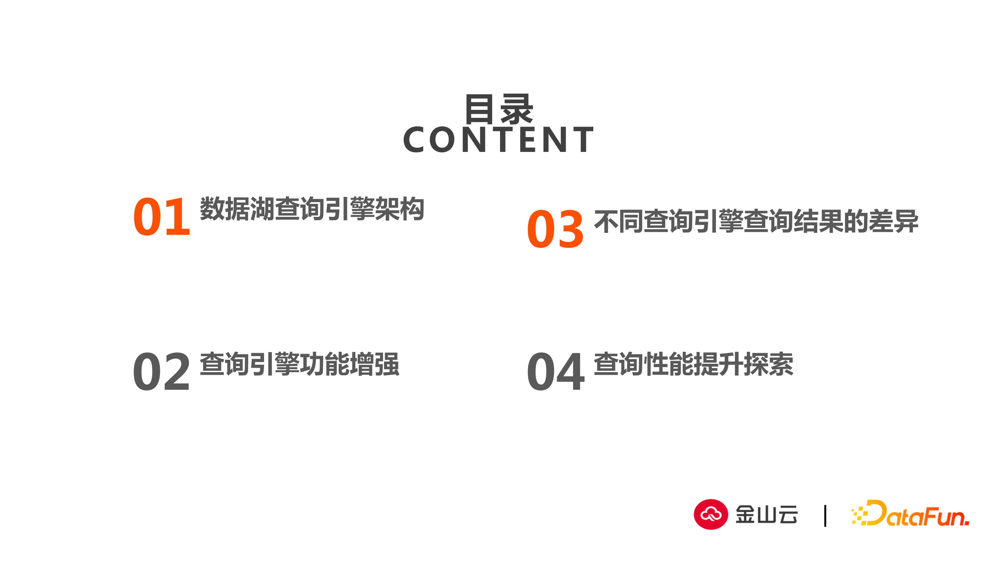总体分四个部分来分享：

1. 查询引擎架构简单介绍
2. 针对查询引擎功能增强和安全方面增强的实践
3. 面对不同查询引擎带来的查询结果差异，分享一些具体案例
4. 针对查询性能提升方面的探索

## 01 数据湖查询引擎架构

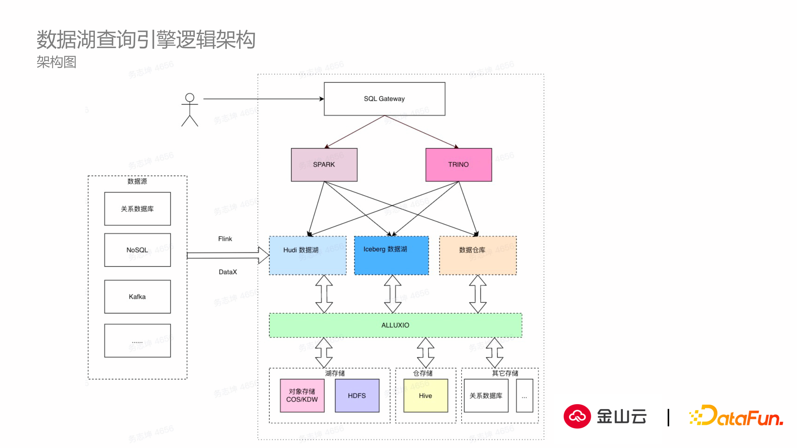

#### 数据湖查询引擎逻辑架构

查询引擎架构：根据用户具体使用场景，集成了Spark和Trino两种查询引擎。底层对接了两种数据湖和各种数据仓库，另外还集成了市面上常用的数据库，底层存储方面有常用的HDFS存储，以及市面上常用COS/S3等对象存储，包括hive和关系型数据库，中间运用alluxio做数据缓存来提升查询引擎效率。

如果只是简单的对开源组件集成并不能体现出整个查询引擎的优势，因此我们还做了很多集成上的事情。

在最顶层提供SQL gateway。因为用户执行查询的目有很多类型，如数据服务类型的高速查询， 奕如在此架构上做ETL工作，或者数据分析等。有的SQL运行时间会很短，有的运行时间会很长，如数据分析场景SQL运行时间就会达到十几分钟甚至更长时间。在这些场景下，我们对外统一提供查询引擎，对内根据各种SQL特性选择更适合的计算引擎来执行用户提交的查询任务。在此基础上，Gateway一方面需要处理SQL解析和分析，另一方面需要做负载均衡相关的事情，从而使整个查询引擎对外表现出来是整体透明，用户无感知的状态。 

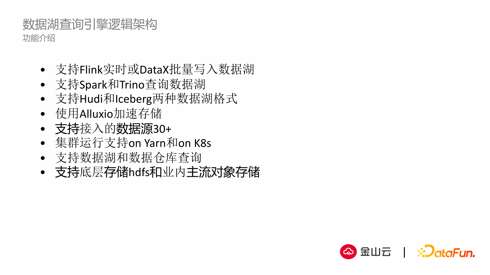

功能介绍：

- 整个架构是支持了Flink和Datax批量写入数据湖；

- 同时支持Spark和Trino两种查询引擎；

- 同时支持两种湖（hudi/iceberg）的数据结构；
- 同时接入alluxio做数据缓存，提升热点数据查询效率；

- 同时对于接入的数据源，除了湖仓两种数据源外，还接入普通的数据源如JDBC，es，mongo等nosql的数据源，共达到30多种；

- 集群运行在两种模式下，yarn环境和k8s环境，用户可以根据具体的部署形态灵活调整。

## 02 查询引擎功能增强

如果只是简单的把这些模块进行堆砌，显然是无法满足用户场景，对此除了对架构上的扩展外，我们也对开源组件也做了相应改进，使是查询引擎功能有所增强。

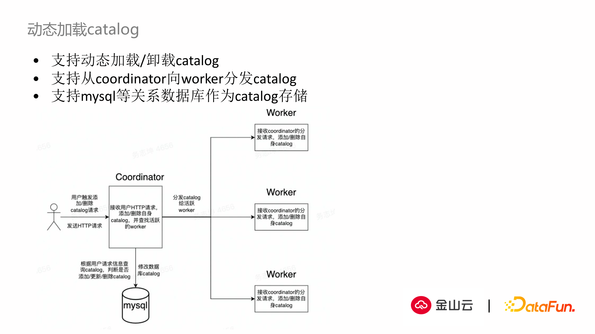

#### 1. 动态加载catalog

当前Trino引擎的社区版本是不支持动态加载和卸载数据源，如果我们需要添加或者去除数据源，集群需要重启。或许我们可以采取主备两个集群相互切换方式，间接地实现动态加载数据源功能，但是这样相应增加了部署和维护的成本。因此我们在Trino的开源版本实现了动态加载/卸载catalog，如上示例图所示：

用户侧通过http请求动态触发添加或者删除某个数据源，Trino coordinator拿到信息后分发到集群各个worker节点，worker节点会实时响应请求，把自身的catalog数据进行对应的添加或者删除，同时catalog信息存入数据库或者数据文件中。虽然当前开源的版本也正在解决动态提交catalog的问题，但是目前开源版本的功能还没有正式公开，另外该功能只支持稳健的动态加载，不支持把catalog数据存储到关系型数据中。因此我们基于此做了增强，不管是关系型数据库，还是配置文件甚至是redis都可以用于存储catalog的变更，即实现数据源的动态增加和减少。

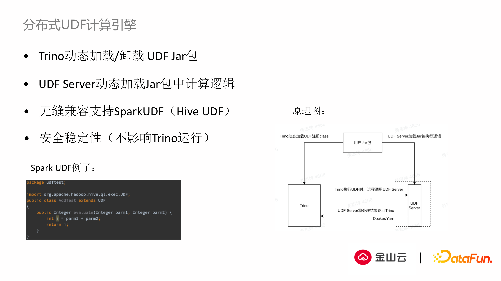

#### 2. 用户自定义函数方面

Trino目前已经支持用户自定义UDF的功能，但是如果直接开放该功能给用户使用，就很难限制用户写的UDF的代码规范，代码可能会存在内存泄漏等各种问题。如果这些问题没有提前暴露出来，而是直接提交到trino集群内，在运行时由于某个UDF不符合规范或者代码不理想，会造成整个集群性能下降，甚至集群奔溃。 我们采取把执行UDF的功能从Trino的架构中抽离出来，把执行功能部署在远程一个或者多个服务当中，当用户注册UDF进入我们的集群，在Trino侧只是注册了UDF的路径和参数，具体执行过程是通过RPC协议实现高速通讯，在远端执行具体UDF计算的功能。 通过这样的架构，可以使UDF计算资源和Trino集群资源之间做很好的隔离，当用户提交的UDF存在某种缺陷时，可能只影响这一次UDF的调用，或者导致UDF server集群内某一个节点产生问题，集群其他节点不受影响。这样可以很好的避免一个UDF问题造成整个Trino集群出现问题的情况。

另外同时兼容spark UDF和hive UDF，这样通过一套机制可以同时执行Trino的UDF和Spark的UDF。

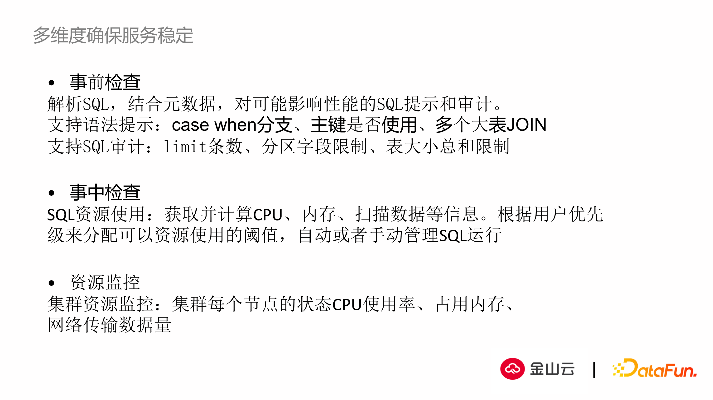

#### 3.多维度确保服务稳定

- 事前检测

  解析SQL：上面都是在运行时做的确保工作，但是在实际运行中，由于某条SQL写的不是特别好，在运行几分钟甚至更长时间都没有结果返回，虽然用户可以在事后通过回看SQL执行计划和中间的执行过程来判断是否有改善空间。 但是如果我们能够提供对于SQL静态解析的方法，就可以在SQL提交之前，动态的检查SQL是否满足规范，这样可以在另一个维度确保服务的稳定性，保证查询响应的时间。 这是通过SQL静态的语法解析来实现， 解析过程中结合元数据信息，这里的元数据除了目标列和字段的定义，也包括统计信息（唯一值，最大值，空值率等），因为这些统计信息会影响到执行计划的创建和SQL性能相关的提示。

  支持语法提示： 我们结合具体信息，开发了SQL预判的模型，提前对SQL做提示。另外对可能需要耗费大量资源的语句，比如case when语句，查询是否使用主键或者索引，是否有大表join等比较危险和耗费资源的语法进行智能提示；
  
  另外支持SQL审计：包括对是否会查询很多条数据，是否正确使用分区字段等做相应的事前检查。
  
  通过事前检测，绝大多数性能不是很好的SQL都可以提前解释给用户，用来判断是否需要对SQL做一些优化。 
  
- 事中检测：

  在SQL执行过程中还需要实时监测Trino/Spark集群的性能指标，包括CPU，内存，扫描的数据数等，这样在执行过程中可以发现CPU和内存是否达到集群上限阀值，是否有对数据进行全表扫描，用于判断是否需要提前终止SQL的执行，或者通过这些指标对最终SQL的优化提供一些提示信息。

- 资源监控

  我们现在对于集群的监控涵盖到集群中每个节点的具体状态，包括CPU使用效率，内存，网络传输占用带宽和数据流等指标。

通过这三点手段在SQL执行的开始和中间来解决SQL性能的问题。

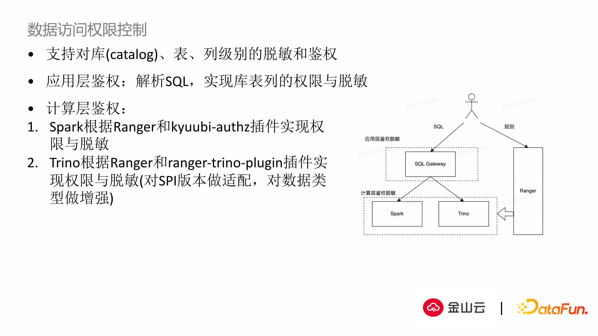

#### 4. 数据访问权限控制

最后是数据安全相关的方向。有些用户场景需要考虑数据安全，访问权限管理，对查询结果的敏感信息脱敏等。

我们从应用层面和物理层面两个维度来解决：

1. 在应用层面限制：通过SQL的静态解析，可以从SQL当中提取出用户需要访问的源库、表、列等信息，另外根据这些信息出现在SQL的不同位置，比如出现在查询结果，还是出现在 join、filter、查询条件中，可以在业务层面判定用户对于数据查询是否有权限，或者是否需要对数据脱敏。
2. 在物理层面限制：主要结合Trino，以及Trino提供的相应插件的能力，实现了底层的权限鉴权。对于Trino场景，我们还hook JDBC获取元数据的方法，在元数据层面就可以直接跟用户权限挂钩，这样对于用户没有权限的数据在元数据侧就不可见，也能防止权限的泄漏。

通过这两层限制的叠加，更好的保障数据安全。

## 03 不同查询引擎查询结果的差异

我们在具体应用中，因为集成了Spark/Trino两种查询引擎用于满足用户需求，这也带来一个很严重的问题，即不同的查询引擎对于包含一些特别字段类型的相同的数据，查询结果会有差异。 这会给用户带来一些困扰，比如查同一张数据表，由于SQL写法不同，会造成查询结果的差异。 对于这种情况，简单分享一下我们遇到的相关的问题：

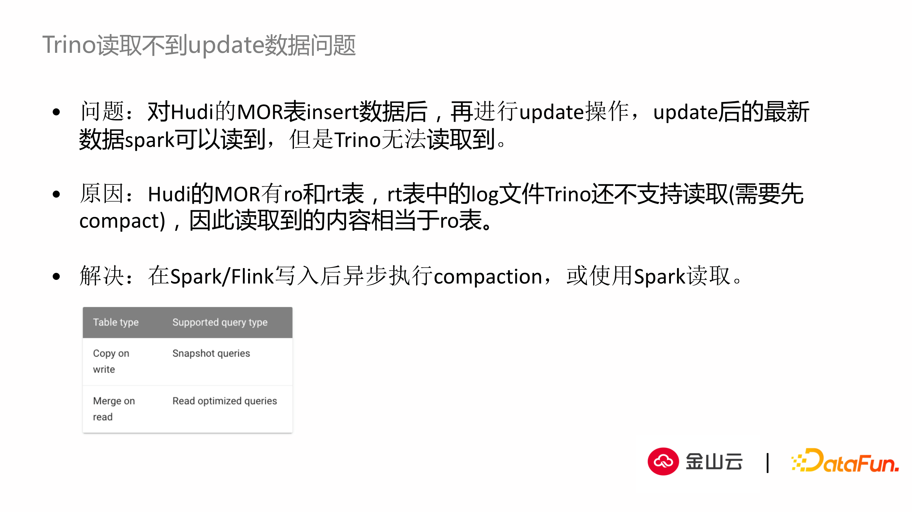

#### 问题1. Trino读取不到Hudi MOR表数据的问题

- 问题：对Hudi的MOR表先做了insert的动作后，然后对其中一些数据做update，最终更新后数据在Spark可以读到，但是在Trino上无法读取到更新后的数据，只能读到一开始insert后的那部分数据。
- 原因：因为Hudi自己的特性拥有ro和rt两种格式表，目前Trino的connector还不能读取rt表中的日志文件，从而也不能读到更新后的数据， 因此当前的Trino只能比较好的支持读取ro表的数据。
- 解决：如果我们需要Trino支持读取Hudi更新后的数据，就需要在数据更新后执行compaction，让日志数据落到盘上，或者换成Spark引擎来读取。为了解决这个问题，我们在架构上对数据内部做了兼容，识别表最近几次SQL执行的类型，是insert还是update，然后动态切换查询引擎来避免这个问题。

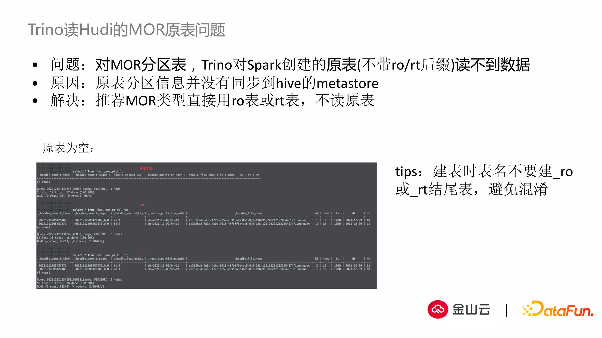

#### 问题2. Trino读Hudi的MOR原表问题：

- 问题：对于Hudi的MOR分区表，内部是存在3种表的数据结构（源表、ro后缀表、rt后缀表）。我们发现对于Spark创建的分区表，Trino是无法读取到源表的数据。
- 原因：是因为Hudi源表的分区信息没有同步到hive的metastore里，Trino是通过hive的metastore server(HMS)来获取元数据，没有获取到元数据也就无法读取到源表的信息
- 解决：正确的使用ro/rt表，同时我们遇到了一个很有趣的问题，如果我们在建表的时候在原始表的后面带上\_ro或者\_rt，也会产生一些很莫名其妙的问题，建议大家尽量不要用到ro/rt的结尾。

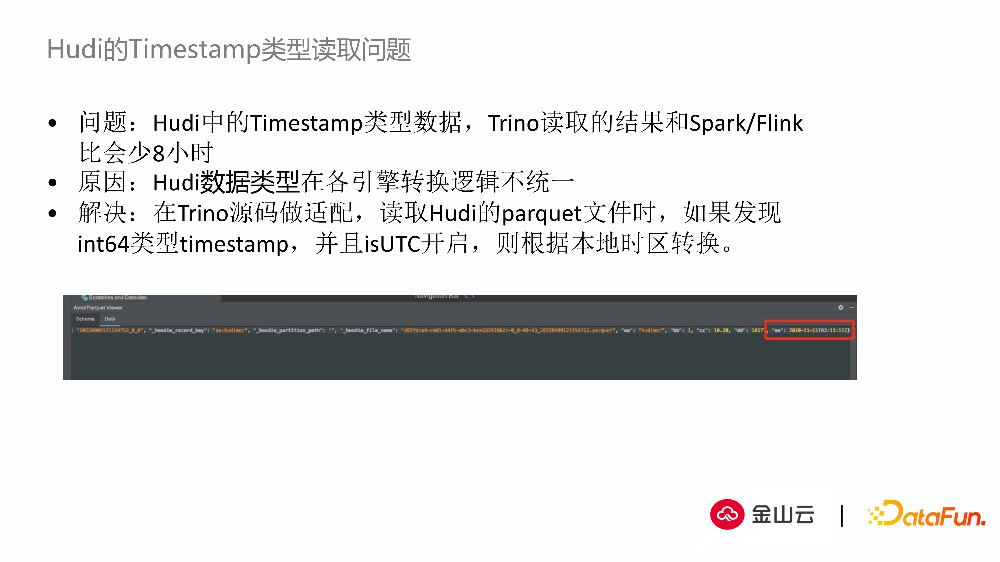

#### 问题3. Hudi的Timestamp类型读取问题

- 问题：在实践中发现，对于带时区的数据类型，如Timestamp，Trino读取的结果和Spark或者Flink的结果会不一样，比如北京时间下执行结果就会少8小时。
- 原因：Trino源码在做时区适配过程中，没有主动做本地时区的转换，但是Spark/Flink会做转化
- 解决：在Trino源码上做适配，对于带时区的时间类型，强制转换成本地时区，保证不同计算引擎的查询结果一致。

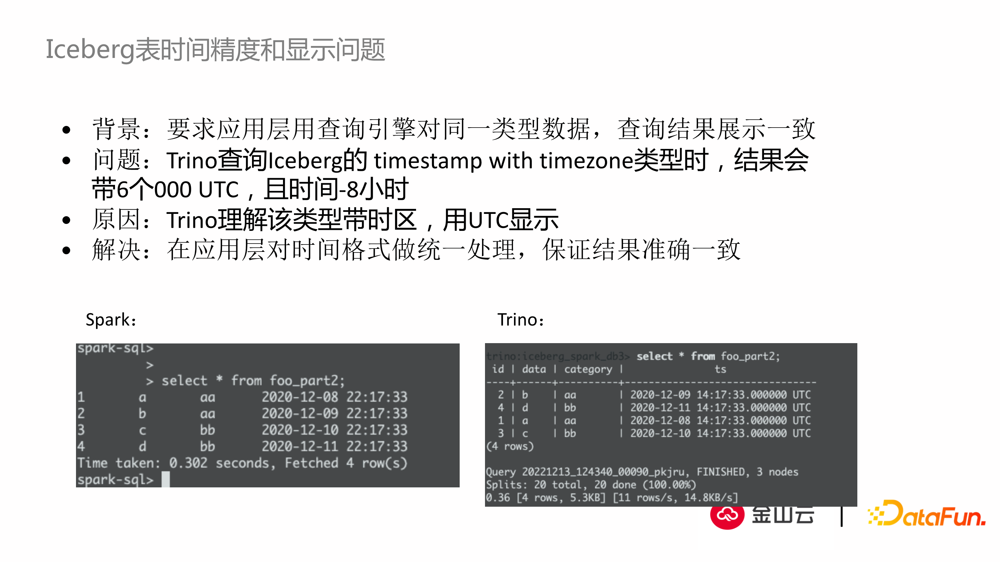

#### 问题4. Iceberg表时间精度和现实问题：（是个非常细的点）

- 背景：如上图，除了时区差8小时外，时间格式和时间精度也是不一样。
- 问题：Trino查询的结果会带上6个0，达到纳秒级别，但是Spark查询结果是达到秒级别。
- 原因：Trino理解该类型带时区，用UTC格式显示。
- 解决：在应用层对数据格式做统一处理，保证对外显示结果一致。

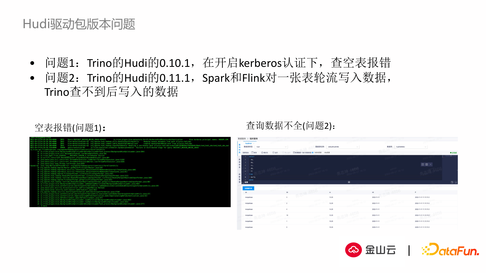

#### 5. Hudi驱动包版本问题： （我们发现的一个有趣的现象）

 当我们开启kerberos认证的情况下，去查询一张空表，Hudi的不同版本表现也是不一样

- 问题1:  在Hudi的0.10.1版本，开启kerberos认证下，查询空表会报一些莫名其妙的错误。
- 问题2:  升级到0.11.1的版本，用Spark/Flink轮流对一张表写入数据，Trino无法查到写入后的数据，但是在0.10.1版本却又能查到。
- 原因：Hudi的官方包在升级时存在兼容性问题。

## 04 查询性能提升探索

上面是我们在具体应用中发现的一些细节的问题，最后分享我们在查询性能提升上的探索

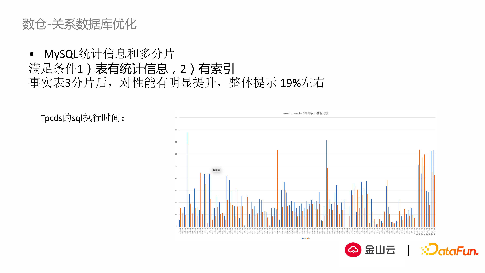

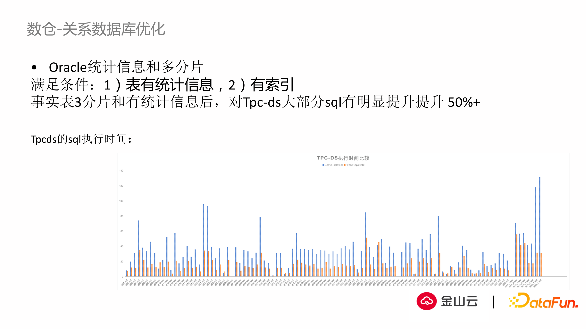

#### 数仓-关系数据库优化

在前面架构图中有提到我们应用alluxio缓存作为查询性能提升的方法。另外在源码角度，我们也提出一些提升性能的解决方案。

通过tpcds对SQL的测试，我们发现元数据信息对于性能提升的帮助很大：

- 对于关系型数据库，如果关系型数据库的统计信息很完整的情况下，使用数据库的统计信息来优化数据库的执行效率，性能提升在19%左右。
- 对于Oracle数据库，性能提升能达到50%。 

可见元数据的统计信息对SQL查询有相当大的帮助。这也带来了一个问题，当前统计信息不全，除非我们对表主动做analyze处理之后，它的统计信息才会被收集，更新到它的HDFS里。我们知道analyze是相当耗费资源的，当我们表的数据达到千万级以上或者上亿，无论是否有分区，执行analyze对于底层存储引擎资源占用非常高，执行引擎可能在当时无法提供服务。对此我们探索了如何通过底层HDFS获取统计信息的方法。

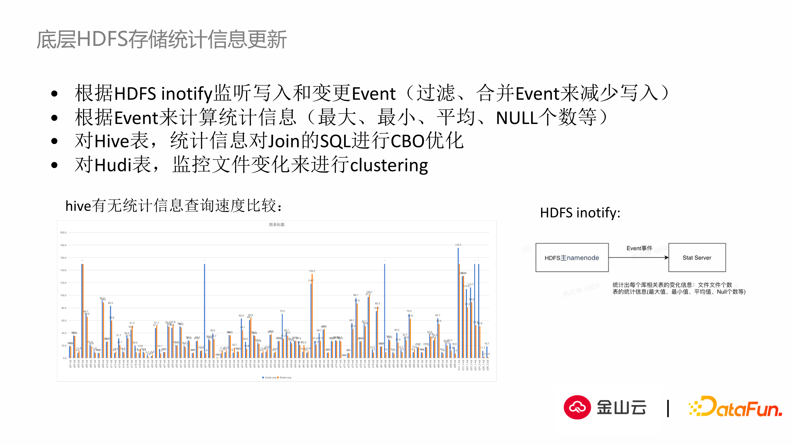

- 根据HDFS inotify监听写入和变更Event（过滤、合并Event)。实际上HDFS本身提供了监听变更的事件，当有数据写入或者更新，通过监听事件可以知道具体是哪张表或者哪个数据文件发生变动，可以很快定位到发生变更的数据文件。我们只需要计算更新的数据文件来得到更新的数据集，包括统计信息，包括最大值、最小值、平均值、空值率等数据。

- 对于Hive表或者Hudi表，我们拿到统计信息后就可以干预SQL执行计划的解析， 包括CBO和RBO的优化。

如上图，hive在有统计信息和无统计信息的查询速度差异还是很大，优化空间也很大。

通过这个方法，可以周期性定时统计HDFS底层所有库表的元数据的统计信息，计算出小文件的数量，通过规则定义，增加小文件数量阀值的报警，当小文件数量超过一定数量后，触发小文件合并，来提升HDFS本身的效率。 另外通过监听数据文件的变更，实时获取发生变化的统计信息，通过定时任务的更新和实时监控两则来完善统计信息。

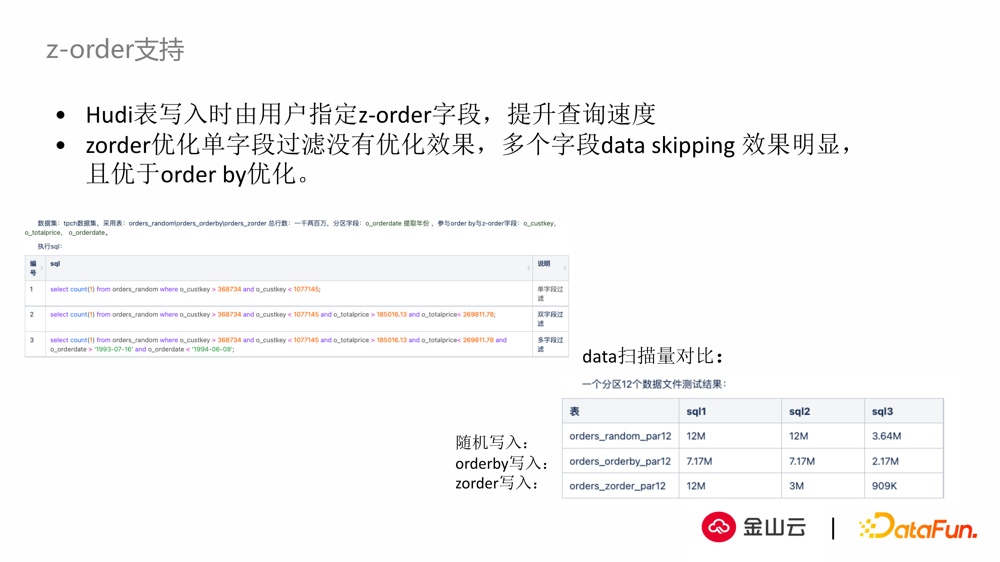

#### z-order支持：（功能还在探索过程中）

用户的数据在存入底层文件时候，如果数据是按某种条件排序，在查询侧可以很快返回结果。通过实现在数据写入后，自动的对数据进行z-order排序，把落到盘上的数据文件的顺序做了优化，运用到查询过程中，在优化之后查询可以更好的命中我们想要的结果。 如上图，通过对随机写入，orderBy的写入和z-order写入三者进行比较，发现对于相同的SQL查询性能提升的效率很明显。

## Q&A

Q: UDF server能否支持横向扩展？

A: 我们现在设计的方案，UDF server跟Trino集群是完全剥离开的，是支持横向扩展甚至是支持云上部署。UDF server 和Trino集群是通过网络联通。这里考虑到Trino是个高速的计算引擎，它和UDF server之间的通讯每秒达到上万次或者几百万次。之前我们在两者通信协议中探索过许多，包括http协议以及更底层的tcp协议。 即使采取tcp协议，也需要UDF server的横向扩展能力才能支持更多的查询并发请求。 不仅通过横向扩展，还可以通过Trino和udf之间的路由，用户可以自己定义UDF分类，把特定的UDF路由到特定的UDF server中，更好的进行资源的选择，同时也实现了多租户的概念。

Q: Trino能否在真正执行SQL查询前，预估出执行代价？

A: 这不是Trino本身的功能的，Trino计算代价是需要元数据统计信息来制定执行计划。我们计算SQL执行代价是在SQL还没提交到Trino之前，通过静态解析工具来实现SQL计算代价的预估，也会引入到元数据统计信息，以及经验累积和事前规则制定。同时我们记录历史执行计划的信息，通过对相同表历史上执行SQL的结果以及对当时执行计划的汇总，对历史结果进行事后分析，创建模型动态推测这条SQL查询可能需要的查询条件，以及带来执行上的问题，对之后的执行检查做数据结果的支撑。

Q：SQL的gateway是基于什么条件来做方法选择，选择哪个执行引擎

A：这里包含两种比较有特点的情况：

	1. 特定SQL：用户写的SQL很可能是用一种特定的查询引擎， 比如hiveSQL，sparkSQL，flinkSQL，这些SQL都有特定的SQL定义文件，通过这个文件来直白的分辨执行引擎。
 	2. 通用SQL：这种SQL没有自己的特征，符合规范的标准SQL。这种SQL是没有办法直接判断类型，只能通过对SQL的解析，提取具体信息，包括返回的库表，所使用的函数，join/filter条件来判断用户使用该SQL的具体使用场景，是想进行类似数据服务的高速查询，亦或是数据分析的场景，亦或是执行ETL和数据加工，通过这样的解析和规则判断，来选择具体的查询引擎。

