## 数据湖ICEBERG在小米的落地与实践文章整理

导读：随着流批一体技术的发展，和对实时查询的需求以及出于成本的优化考虑，小米对数据湖iceberg技术下做了一些实践和场景落地。

我今天介绍的内容主要有以下4个方面：

1.  第一点我们先介绍一下Iceberg的技术是怎么样的以及一些背景知识

2. 点介绍一下iceberg在小米的一些应用场景

3. 第一点我们对iceberg的流批一体的一些探索

4. 最后介绍一下我们的未来规划

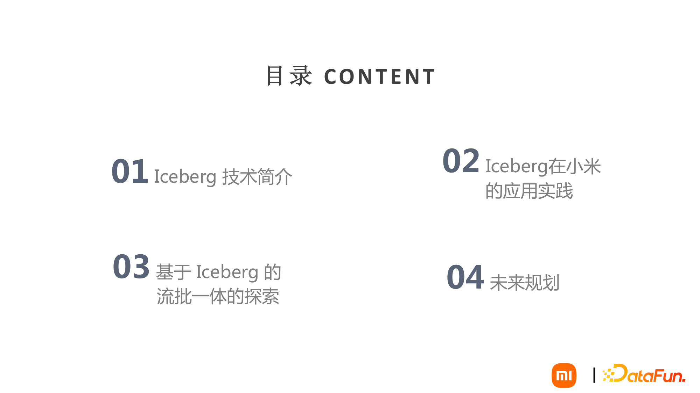

### 第一章： Iceberg技术简介

首先介绍一下Iceberg这个技术。这个大家应该都知道，因此在这一块上我们简短一点

Iceberg是一个基于大型分析型数据上的一个表格式，它允许将一些文件、数据集以表的形式提供给spark、trino、prestodb、flink、hive这些计算引擎

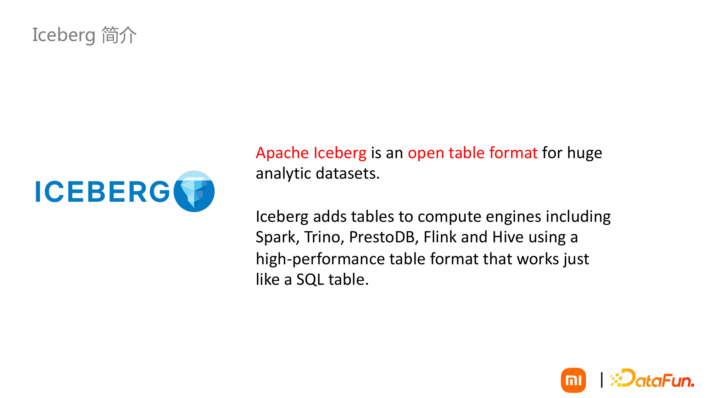

通过如下右边可以看到iceberg所处的位置，当然hudi，delta lake也是同样。

然后通过iceberg这个抽象层，将上层的计算以及下层的存储进行分离，这样就使我们在存储上以及计算上的选择更灵活。你可以选择flink、spark、hive、trino，你也可以对之后对其它的计算引擎做一个支持。

下层有parquet、orc、avro可以选择，以及最底层的实际物理存储上可以选择s3, aliyun oss以及HDFS。通过iceberg这个抽象，它一个最好的优势就是你可以将底层文件的细节对用户屏蔽，用户可以通过表的方式去访问，而不需要关心底层你到底是存了什么样的文件，底层你到底是存在哪里。

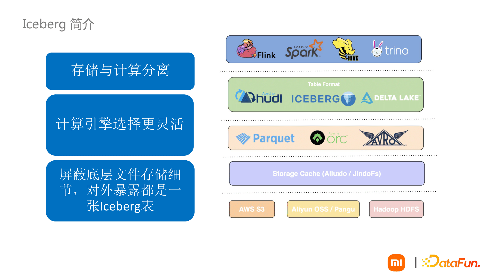

iceberg它的实现的本质原理其实就是一种树的组织方式，大概是一个4级的结构，

我们从下往上看，最底层其实就是一些我们写入的数据文件，即是一些data file。当我们写完这些data file之后，它的元数据文件（就是上面这些所有的），会有一些清单文件，即这些manifest文件，来记录文件和分区的关系。在iceberg也有分区的概念，而且它分区和文件对应关系都记录在清单文件里面。当这个清单文件写完之后都会形成一个快照，就我们每次commit都会形成一个快照。然后多个快照就会通过metadata文件来进行记录。这样如果我们使用一些历史回溯，就可以通过这个文件索引去确定使用哪些快照。

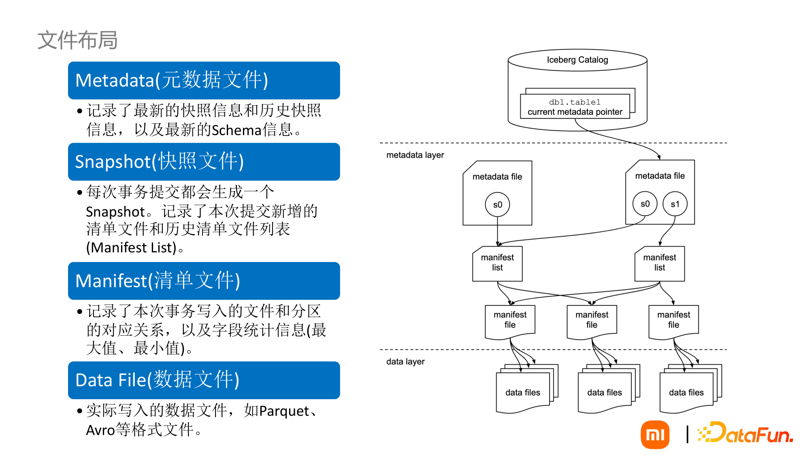

Iceberg向用户宣称的第一个优势就是它支持事务性。

事务性带来的第一个优势是可以避免我们写入一半带来的脏数据；

第二个优势是我们可以用刚才所说的快照的方式来实现读写分离。以hive为例的话，比如这个hive读的程序已经启动了，结果这些文件刚好被overwrite了，然后就可能会导致我们写（读）失败。而iceberg这种使用快照方式通过读到不同的快照来进行一个分离，做到读写的隔离。

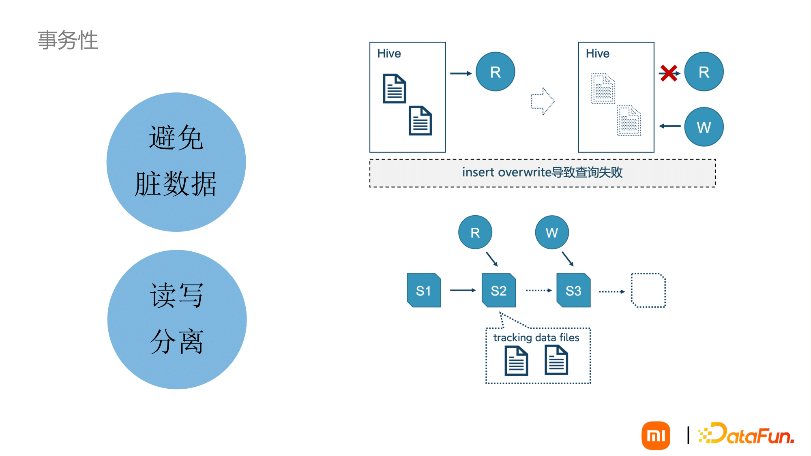

它第二个优势是它提供了一个隐式分区。

我们可以在建表的时候对一个列做一个转换，用一个如transform的函数来做一个隐式分区。这样的话，当我们写入数据的时候，不需要额外指定一个分区来写入，直接写就可以了，它会根据数据去判定到底落在哪个分区，而且它的分区也不跟目录强绑定。另外它提供了partition evolution机制，提供灵活的分区变更，如果当我们在把月替换成天，分别读取的时候就会进行两个查询。

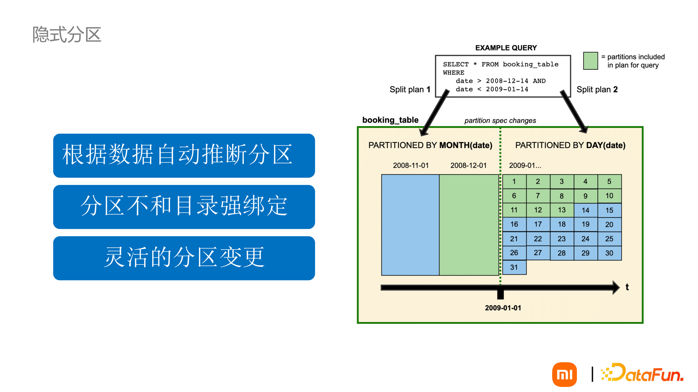

它的第三个优势是一个行级更新的能力。

在iceberg现在版本中有两个版本，即V1版本和V2版本，我们就经常称V1表和V2表。V1表的更新即Copy On Write（COW），简单介绍就是将需要更新的文件读取出来做更新后再写入。在V2表中除了Copy On Write，还增加了Merge On Read（MOR）。

以下图为例就是做一个Merge On Read的简单介绍，它通过记录另外两个文件，即position delete和equality delete文件来对已有的文件进行一个删除，当我们读的时候需要将对应的文件进行一个合并，其实并没有执行真正的合并，而是在读的时候对记录进行一个join，过滤出来之后再对数据进行merge得到一个最终结果。

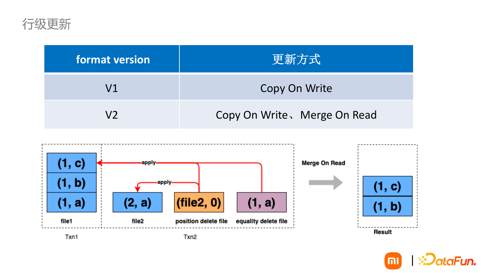

### 第二章： Iceberg在小米的一些应用场景

介绍完iceberg一些背景知识，在第二章我们介绍一下iceberg在小米的一些实践以及一些场景。

现在iceberg表在我们小米大概有4000多张表，数据大概是8PB，其中v1表大概是1000多张，v2表大概是3000多张。像v1表主要是一些日志场景，v2表是可以配一些需要通过主键进行更新的场景。

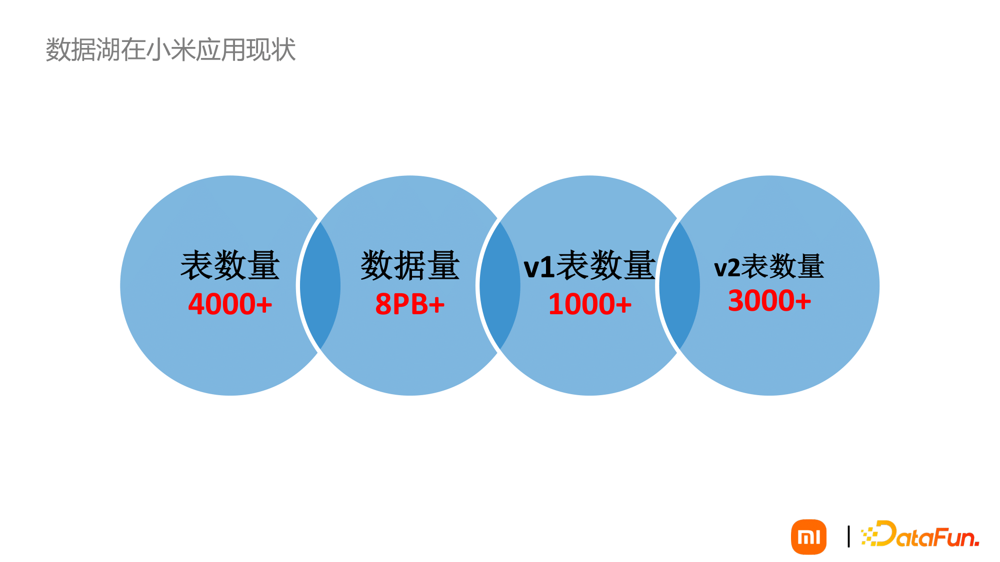

我们第一个也是最多的v2表有3000多张，最多的场景就是一些cdc数据，也就是ChangeLog的数据入湖。链路大概如下，就是我们通过flink cdc采集mysql，oracle，tidb的一些数据，然后打到我们中间的mq，然后通过flink写到我们这个iceberg的v2表里面。

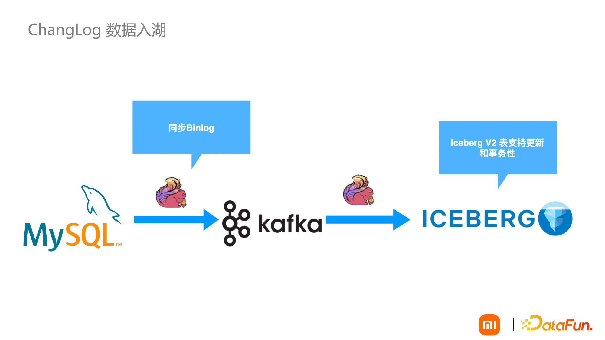

这个能带来什么优势呢？

1. 首先一个我们可以对cdc数据进行近实时分析；
2. 第二个iceberg可以实现支持flink引擎，因此我们可以进行流式消费，在这一块上我们开发了对v2表进行flink流式消费的支持；
3. 第三个就是可以同步变更schema，比如上游的mysql schema变更了，我们可以在这个链路中将schema变更同步到iceberg。这样的话，用户不需要去关心整个链路的变动，直接去取下游的iceberg表就可以了；
4. 第四个就是使用iceberg来替换一些专有型的数据库，它的成本就是价格更便宜。比如我们之前有些链路使用的是kudu，我们就可以在某些适应场景用iceberg来替换它，成本更便宜。

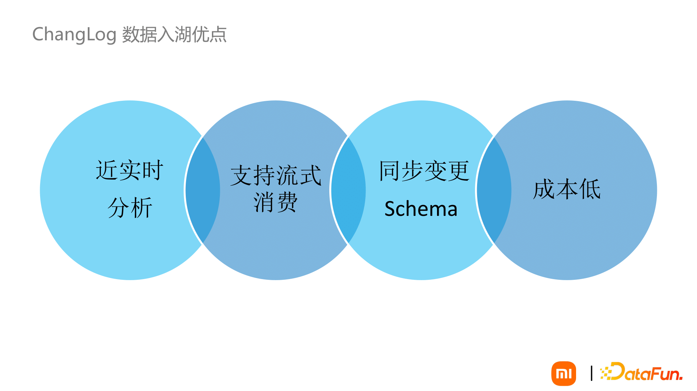

我们在数据入湖之中也遇到了一些问题，主要是像mysql这类以自增id为主键的数据入湖。我们给用户提供两种数据分区的方式，第一种是Bucket分区，第二种是Truncate分区。在以自增id为主键的场景我们更推荐用户使用Truncate分区而不是Bucket分区。

Bucket分区示例如下，即分桶的形式，比如有4个桶，当我们自增id来了之后，相对来说可以比较均匀的进行分布。然而这样也就带来一个问题，因为我们merge on read的性能比较差，需要我们进行异步的compaction，可能就需要对所有的都进行compaction。另外在当前这个iceberg版本当中，v2表的bucket分区是不可以修改的。这样就随着我们数据量的增长，由于我们的分区是不能变，那可能会导致分区数据量变大，我们的查询性能就会越来越差。

而在truncate分区下，我们可以看到，它的分区是可以扩展的，而且由于基于自增id的话，我们的数据写入和compaction只会集中在某几个分区。所以在这种场景下我们更建议用户使用truncation分区。

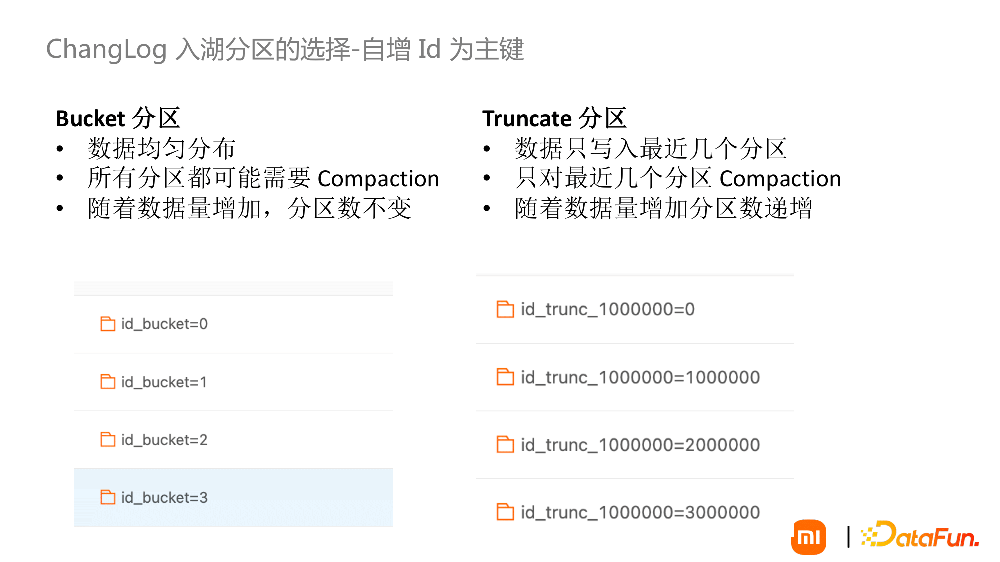

以下是我们数据入湖的一个简单产品化的页面，有一个schema的对应关系，左边是mysql，右边是我们的iceberg表。在这个示例中，用户是没有选择使用自增主键，而是选择了一个自己的业务id（order_id)来做key。

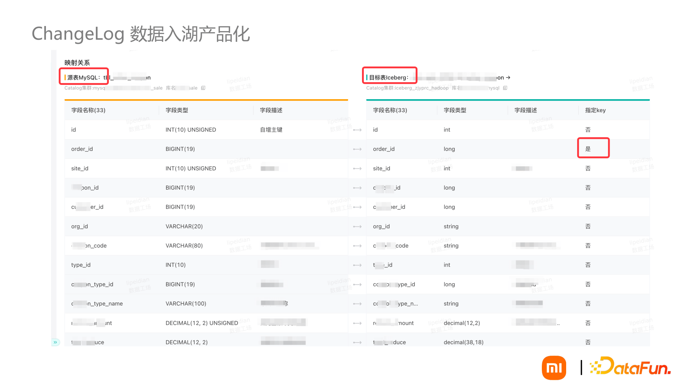

然后第二个iceberg常用的场景就是日志入湖。我们为什么说选用iceberg要比之前的hive要好呢？

1. 第一点是隐式分区避免了在凌晨的时候出现数据漂移；
2. 第二点也是隐私分区带来的特性，延迟的数据我们可以将它落入到正确的分区，这点是用户非常关心的，在小米的一些比如lot设备，电视设备上的一些打点上报的数据的延迟情况是非常严重的。如果说用户选择以前那种方式而不是数据湖的话，它可能会导致最近几个分区错误，可能就需要去搞另外一个表把这些数据重新存一遍，然后导致下游也需要再重新算一遍。隐式分区就可以帮助解决这个延时数据正确的问题。这样的话，用户只需要对下游重新算一遍就可以；
3. 第三点是flink的exactly once以及iceberg事务性能够保证数据的不丢不重，这个也相比我们之前的老链路，可以保证即使链路失败了，我们的数据还是准的；
4. 第四点是在我们的日志场景下也可以支持schema同步变更。

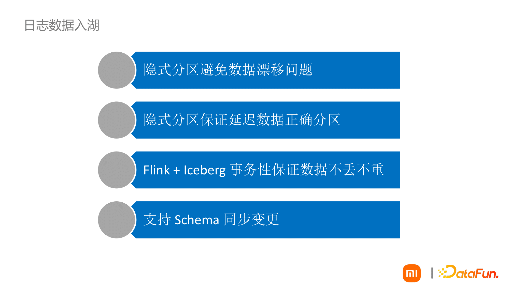

这是我们内部的一个日志入湖场景下的产品化。我们在最后一行加了个时间分区的映射，用户可以选择Talos（Kafka）的一个记录时间，也可以选择以一个实际的业务时间来做时间分区。这样用户在数据入湖的选择上就会更多。

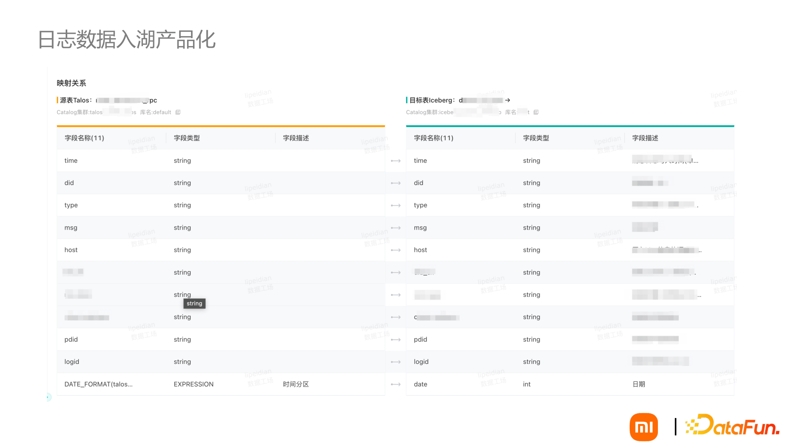

刚才我们提到了compaction，为了维护上层的作业正常，我们在后台有这样三个服务，这三个服务都是以spark的作业形式来运行。

- 第一个是Compaction服务，用于合并小文件。对于v2表来说，除了合并小文件，也可以对这个数据的delete文件进行提前merge；
- 第二个是Expire snapshots服务，用于处理过期的snapshots。如果说snapshots一直不清理的话，那么元数据的文件就会越来越多，这会导致一个膨胀问题。服务会定期的做一些清理；
- 第三个的话是Orphan Files clean服务，由于一些事务的失败，或者一些快照的过期，导致文件已经在元数据文件中不再引用了，我们就需要把它定期清理掉。

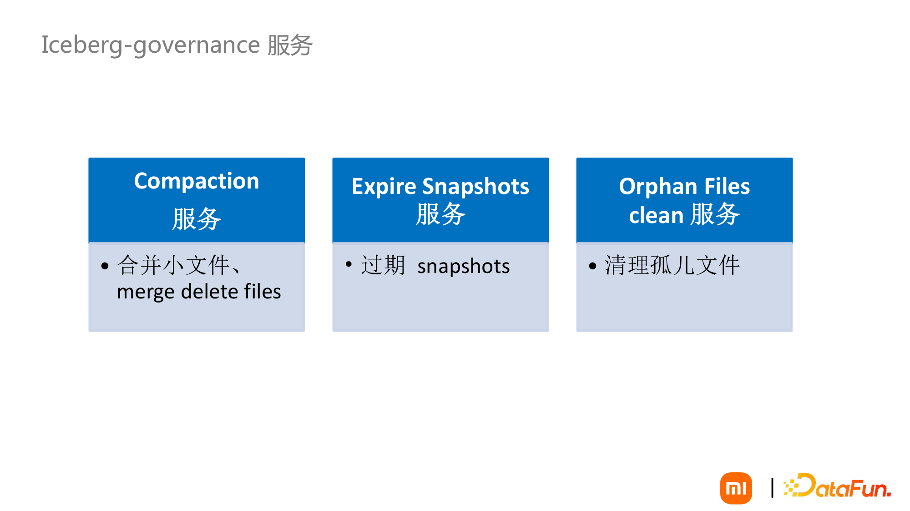

基于上面的两个产品，我们基本上可以把数据集成的场景都覆盖到了，不管是cdc数据还是日志数据都可以灌到iceberg上。下一步就是想让用户去做一下技术架构的迭代，推动从Hive升级到Iceberg。在这一块其实也遇到了很多问题，主要问题是用户对这个新技术的接纳性并不是很高。

后来我们调研了Parquet+ZSTD的技术方式。除了iceberg本身还是有我们之前提到的那些优点，Parquet+ZSTD的方式还可以做成本节约，这个是用户比较关心的优点。如下可以看到当我们切换到ZSTD之后，TEXT数据我们可以压缩节约80%，因为TEXT数据本身是没有压缩的，因此这个效果比较好。像一些通用的SNAPPY+Parquet，我们也可以节约30%的存储。这是用户和一些部门比较关心的，可以降低30%的成本。当然我们现在选择的ZSTD级别是国内比较流行的level3级别，这个是在压缩效率和压缩时间上都比较合适的一个level。如果我们选择更高的压缩率，可能会导致压缩时间更长，这可能在用户作业中是不可接受的。所以我们也提供可以在后台配置更高的压缩级别的选项，供有需要获得更高的压缩率的用户进行自行选择。

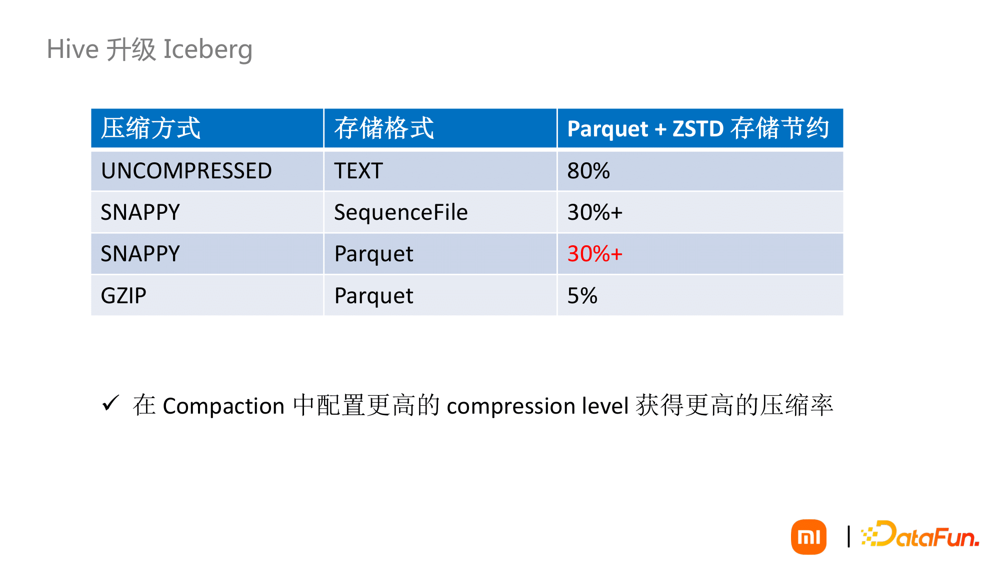

为了方便用户从Hive升级到Iceberg，我们也做了一个产品化。

- 第一类我们会对hive表拷贝一张一摸一样的iceberg表，然后去对它进行一些升级操作，比如说我们会显示hive表的历史数据，用户可以选择原封不动的拷过来，这样的话从原来的方式切换到Parquet+ZSTD方式，对他们来说处理历史数据的成本也有降低，这其实也是收益很大的；
- 第二类我们可能也需要对上游的写入作业做一个升级；
- 第三类也是迁移到iceberg最复杂的步骤（这里没有列出），就是迁移到iceberg可能导致它的下游作业也要跟着改。

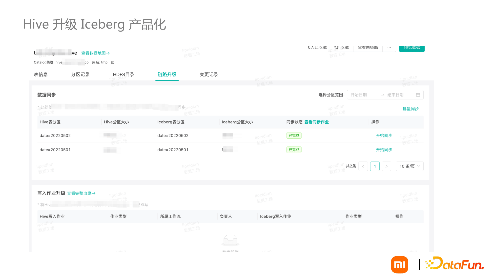

### 第三章：基于Iceberg的流批一体的探索

介绍完我们的当前场景后，我们更进一步基于iceberg，做了一些流批一体上的探索。

我们现在的架构是基于常规的Lambda架构，如下的这条T+1链路，在ODS层算完之后，每隔一天使用Spark或者MR这样的方式去计算。如果为了实时性，比如一些实时大屏的需求，他们就需要用Flink+Talos（Kafka）来搭建一条实时链路，这样的话用户就需要维护两条链路。

这两条链路其实也没有什么问题，我们在实时链路上提供一个时效性，在离线链路上提供一个准确性。而且在hive离线链路上，如果数据错误我们可以做一个回溯，离线入湖上也可以支持查。但是它也有它的一些缺点，比如在实时链路上，我们这个Talos/Kafka目前是没有办法做一些OLAP查询，由于它不能存储全量的数据，它的回溯处理能力也有限，这样我们就需要维护两套代码，两套存储。也很有可能面临到实时离线数据不一致的情况。

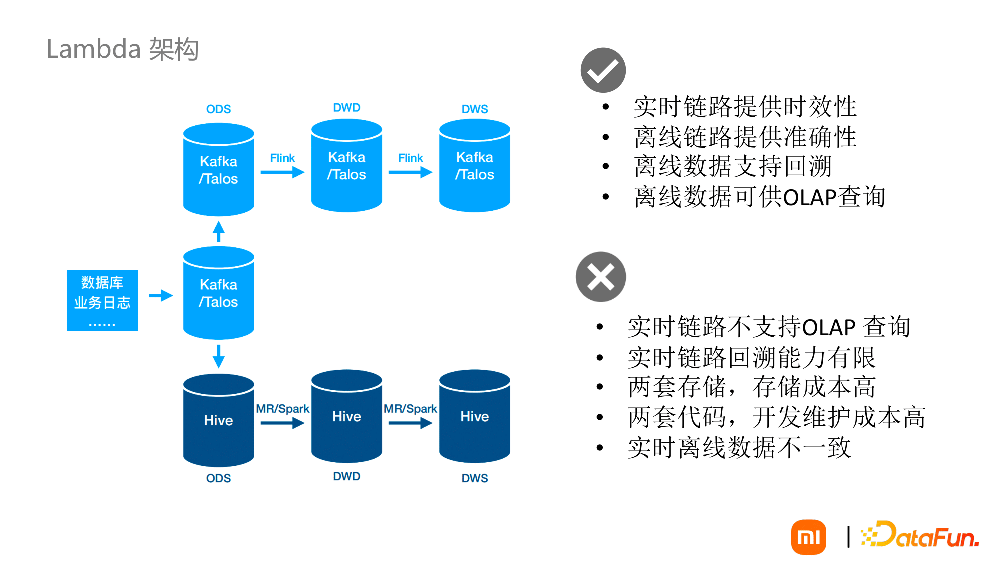

接下来就是我们对iceberg批流一体的设想，我们会将存储层，也就是ODS，DWD，DWS层全部换成iceberg。这样的好处就是我们可以在存储上实现一个统一，就不需要Kafka和Hive两套存储。如果我们将中间的链路切换成Flink的话，这样我们也可以在Flink上实现计算引擎的统一。另外我们也可以做一些回溯，也可以在一些开放的链路中提供一些实时查询。基于iceberg的v2表我们还可以去构建一个变更流。这从业务角度来看，也是一个不错的实现方式。

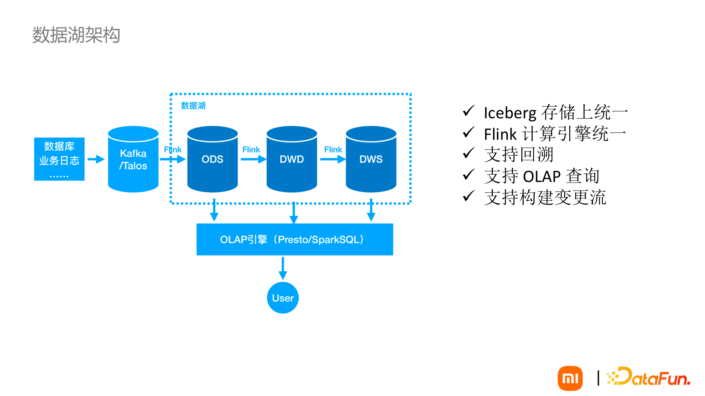

在这我们总是提到，在批流一体中为什么需要一个离线作业来修数据？尤其是一些开发人员对业务不懂就会来提这个问题。为什么非要用批去修，实时为什么不准？总结下来大概有这么三个原因（当然也有其它的原因）：

- 第一个就是Flink状态过期了，由于内存等一些原因，状态不能一直的保存，Flink的状态过期了导致一直没能join上；
- 第二个是因为一些窗口的设置或者watermark的设置导致数据延迟数据丢失；
- 第三个的话就是Lookup join维表的时候完成之后，维表又发生了一些变更。

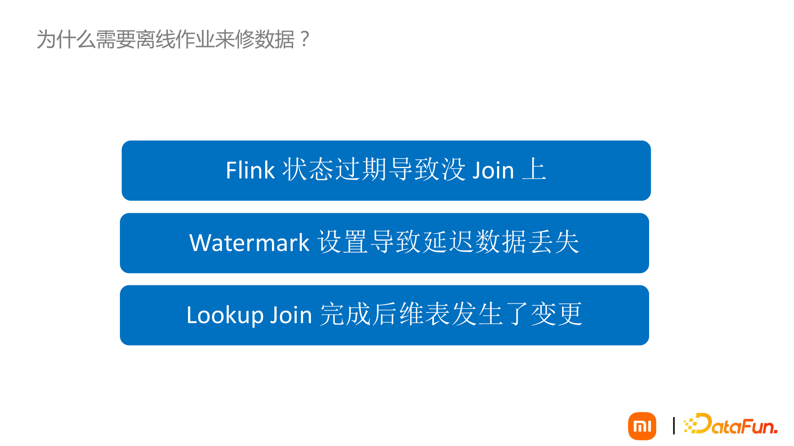

一般对于我们离线的修正，目前一般用overwrite语句覆盖分区的方式，overwrite语句将原来的分区删除掉，然后追加进去新的数据，在spark，flink和iceberg的结合中，有一个Merge Into的语法。它的语法简单如下，MERGE INTO到一个目标表，我们选择一个数据源，然后将数据源的数据merge到目标中，需要一个ON关键字（和join一样）用关键字来连接，在这里也可以指定一个目标表的分区来只对那个分区进行更新。当完成join之后，可以进行下面三个操作：如果我们join上（MATCHED）我们可以对目标表数据进行一个删除，或者是一个更新。如果没有MATCH上，可以把这条数据插入进去。

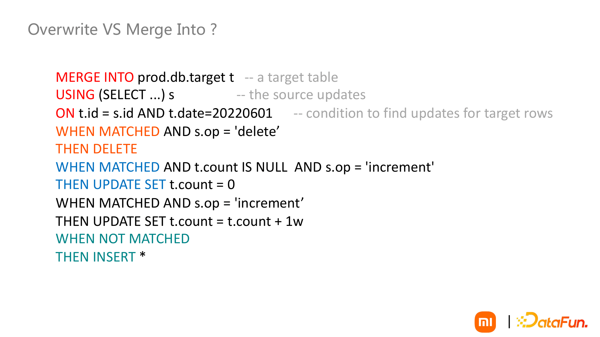

那这两种修复数据的方式，它也是有它们自身的一些特点。

Overwrite的话它是分区覆盖的这种方式，相对Merge Into的话它自身语法简单，性能也比较好，不需要进行join操作，但它有个缺点就是使用Overwrite去覆盖历史分区的时候，我们下游的实时作业还在跑，如果读到了这部分数据可能导致下游的实时数据出现波动。

当我们使用Merge Into的模式写入的话，它可以实现一个增量的更新，只写一些partition，或者用equality、where来标记某些数据被删除了。但有些用户无法接受它的写法复杂。因为要做一些join，它的性也能比overwrite要差一些，但它的优点就是下游只会消费到一些变更的数据，对下游的影响比较小。

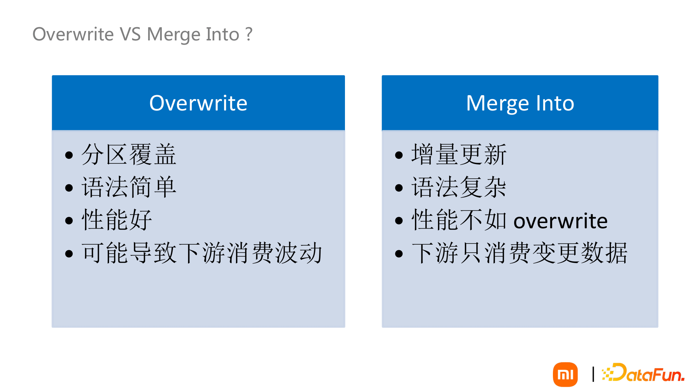

这个图可以看到，用Merge Into去做修正大概的一个链路。就是我们上层的hive表或者iceberg表去通过merge into的语法去增量的更新，然后这些增量更新的数据我们会通过Flink-Sql对它做一些变更更新到下一层（Mysql层）。这条链路还被用来去做一个增量同步。比如说用户有个需求是将Hive的一些数据变更增量同步到Mysql。如果我们全量同步写入mysql的话会造成mysql的一些波动，mysql性能可能会扛不住。就可以选用我们的merge into写到iceberg里面，然后对iceberg的变更增量同步到mysql。这也解决了他们一个独特的业务场景和问题。

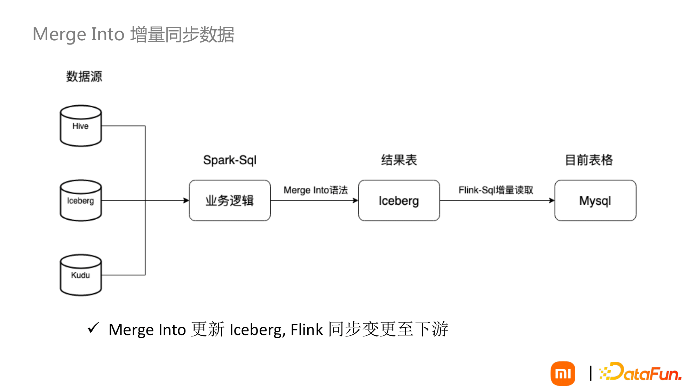

第三点因为iceberg它的隐式分区的特性，会带来一些分区上的选择。比如在构建这个链路中，一般如果以天为分区的话，会有这么两种选择，第一种是使用处理时间作为分区，这样的话用户可以将实时的数据落到当天的分区，也可以离线的去修昨天的数据（Overwrite或用Merge Into去修）。这样的一个优点是这种场景它的实时和离线数据是没有交集的。

另外一种是用户因为它隐式特性，可能会选择一些事物的时间作为分区，比如最常见的一些订单的创建时间做为分区。这样的话，当我们在变更的场景下我们实时的写入数据会操作多个分区，那我们离线修的时候，因为每个分区都是增量数据，那历史全量都需要修一下，这带来的一个问题就是我们实时和离线处理的数据存在一个交集，这就引入了另外一个问题。

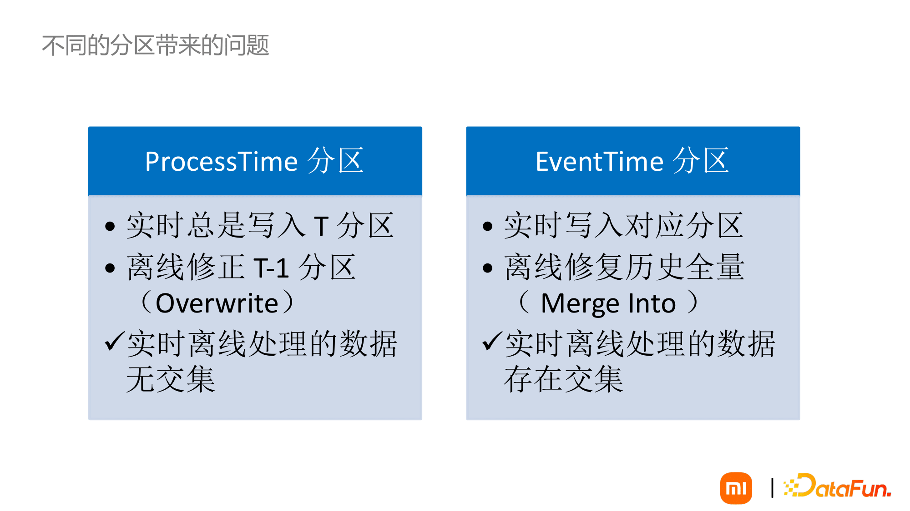

Merge Into通过隔离级别处理有存在交集数据（事务）带来的问题。

在Merge Into实现上，每个引擎对不同的语法有不同的实现，它提供了两个隔离级别。

第一个隔离级别是最高的隔离级别，“可序列化隔离级别”，它也是默认的隔离级别。如果我们配置这个级别的话，我们在Merge Into事务提交的过程中，如果有其它已经提交的事务，并且和其它已经提交的事务发生冲突，那我们这个作业就会失败掉。这个看上去没有什么问题，但是其实在实际应用中用户是没有办法接受的，因为可能会导致Merge Into的离线作业经常的失败，我们可能需要一些其它的办法，比如我们在实时上去做一个过滤只处理当天的一个分区，把其它的历史分区交由离线去做修正来避免这些冲突，当然这也不是一个非常好的方式。

第二个是“快照隔离级别”，在快照隔离级别下，在我们Merge Into提交的时候，当之前提交的一些冲突的事务给覆盖掉，这样的话假如有flink，spark这样的流和批同时去写，它们到底是哪一个提交成功，这种情况是不可预知的。这导致我们结果其实也不准确。这两种问题也是当时我们设想过的使用这两种隔离界别都会存在一些问题，这个我们还一直在探索中。

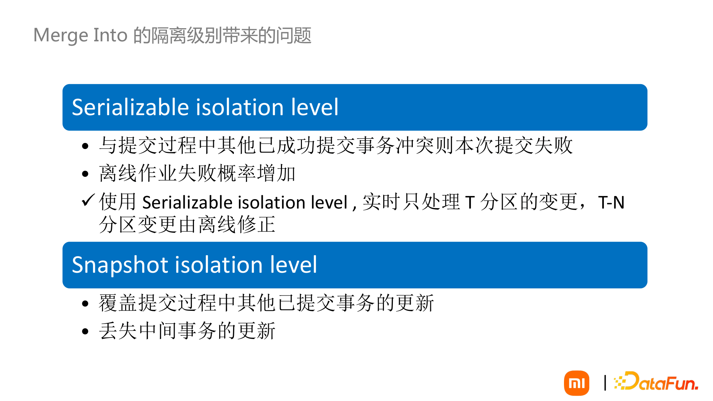

最后下面我们列一个正式应用中使用的批流一体的链路，可以看到上面这段红线的历史数据是存在kudu里面，实时数据是存在Talos（就是我们的Kafka）里面，用户如果想把这整个流批一体的链路完成的话，他可以使用flink-batch当然也可以用spark去做各个层的初始化，这上面的红线就是去读存量数据去初始化。

当初始化完成之后他们就可以把streaming作业跑起来，一般来说从ODS到DWD这一层，其实只是做一些简单逻辑的数据处理，这块并不需要去做修正，当在DWD到下一层的时候，我们可能需要做一些修复，这里就选用spark Merge Into对DWM层做一个修复，完成之后我们这个streaming作业把包括当天实时的以及一些修正的数据都可以写到下一层，比较方便。

当然这里也有用户想用overwrite，如果用overwrite的话我们的实时有可能会把这一部分数据消费到，这样这个作业可能就变得不稳定。当然我们可以去改代码，比如说把这个overwrite给过滤掉，就是不需要这一块。不需要这一块数据可能会导致我们DM这一层还需要一个离线作业去做一个修复。这也是需要用户需要做的一个抉择。以上就是我们对批流一体的探索。

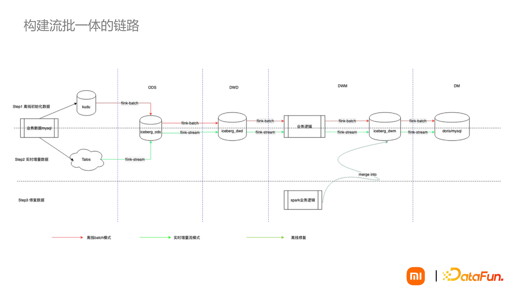

### 第四章：未来规划

第四个最后我们介绍一下我们未来的规划。

我们未来打算对Flink CDC2.0持续跟进，Flink CDC2.0当中对全量和增量的切换比较友好，而我们现在的实现方式其实是参考hypersource这样一个方式来做切换。第二个我们会去优化治理下我们compaction 服务，当前iceberg做compaction都是在后台去运行的，这样每个表（尤其是where表）都需要起一个作业，如果多了的话会有资源占用的问题。第三个我们会去跟进一下iceberg和flink1.14结合，当前我们的flink是1.12的版本，它的source结构没有那么的完美，我们去切iceberg的时候经常会遇到一些反压，我们会在后面去跟进一下flink1.14和iceberg的一些结合。

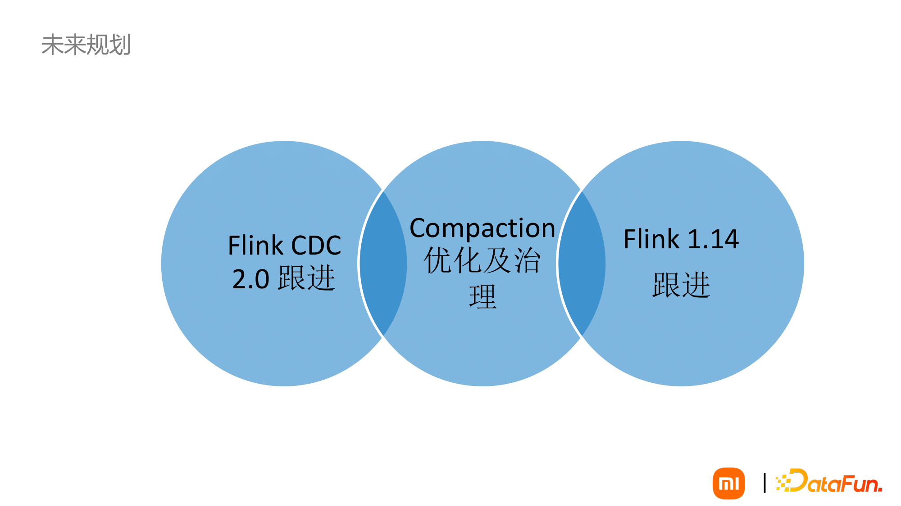

以上就是我本次的分享，谢谢大家。

### 问答环节：

问：Iceberg数据如何把数据回滚另一个snapshot版本？

答：Iceberg有一个语法（rollback）可以指定snapshot的id。

问：Upsert生成过多小文件导致合并时候OOM

答：因为生成equality file量太多，在我们实践当中也经常会遇到这种问题，其中一方面需要解决冲突问题，另一方面增加策略，条件判断等，提高Compaction调度次数（如每10分钟调度一次）。

问：Upsert基于分区还是基于主键来更新？
答：Upsert是基于主键来更新的，但是要求分区必须在主键中选择。比如我们基于id更新的话，分区只能以id来做，不管bucket分区还是truncate分区。

问：如果需要按月年做财务账单数据，那么flink如何读取数据？

答：跟实际业务有关，业务逻辑需要什么数据就读到什么数据。

问：Iceberg成熟度是晚于Hudi的，因此hudi的成熟度也不会比iceberg差，那么为什么要选用iceberg做数据湖技术？

答：我们是在去年5月份开始调研，当时iceberg的版本是0.10，hudi版本在0.9左右，还有没有正式release。之所以选择iceberg是因为iceberg要比hudi早一点支付flink。因为我们用户比较看重flink的技术场景，同时hudi在当时还没有完全跟spark解耦以及支付flink。如果用户在做具体选择时候可能跟自己的业务场景来做判断，比如是一些日志场景还是变更数据的场景，然后可以参考社区的活跃度以及各个大厂的使用情况，这是当时我们的一些评判方法。

问：现在小米落地的iceberg表是v1还是v2？

答：都有，如果是变更的话v2表比较多，日志的话v1比较多，相对表来说v2比较多，但是数据量不是很大。

问：现在小米只有iceberg和hive，然后从hive切换到iceberg的量大概有多少比例？

答：从hive切换到iceberg的比例不是非常高，跟历史原因有点关系，像iceberg对离线spark支持的最低版本是2.4，而我们内部的spark版本有2.3，对用户的jar作业切换比较困难。因此在新场景新业务接的比较多，然后也在做产品化来推动hive到iceberg的迁移，但是过程比较漫长，需要业务也更新技术栈，比如从MR/spark2.3切换到spark3.1。

问：在业务场景用Iceberg究竟可以解决什么问题，有哪些收益？

答：这个也是我们跟用户分享中用户反馈的。我们讲的iceberg事务性用户并不是很关系。第一我们可以解决ods层数据准确性问题；第二隐式分区可以解决延迟数据问题；第三用zstd压缩方式可以降本增效，吸引用户切换到iceberg。

问：大数据量下upsert性能如何？

答：当前v2表的数据量还不够大，每天日增几亿条，当量再上去后，还需要大量的优化。

问：数据是如何存储的，存在哪里？什么格式？

答：目前都是存储在hdfs上，存储格式很多，有parquet，还有text来写历史的数据。

问：跟alluxio比较有什么差异？

答：这两个没什么大的关系，iceberg是上层对文件的一个表抽象，alluxio是在olap上做文件的缓存，查询的性能更快。

问：如果更新过于频繁，如何解决文件数量的膨胀？

答：1. 提高flink的checkpoint后可以降低文件数量，2. 文件数量跟分区有关系，如果分区选择合适的话也不会产生小文件问题。

问：v2更新场景的小文件比较对，这个问题在hdfs有什么好的解决方案？

答：这个问题是当前比较头疼的问题，我们目前也没有很好的结发。如果遇到比较多的小文件问题，建议不要使用hdfs，可以使用对象存储。

问：Iceberg/Hudi都缺一层缓存，未来如何考虑？

答：指使用alluxio，iceberg/hudi这两个都是文件抽象层，都是可以对alluxio做支持，这两社区现在也都在更近。

问：底层支持clickhouse吗？

答：目前是不支持，现在没有在iceberg下面接clickhouse的方式。

问：Iceberg和olap的StarRocks有什么关系？

答：这两个还是在场景使用方面，Iceberg更偏向于数仓中构建的pipeline的链路，StarRocks更偏向多维分析的场景，在数仓设计中更靠上的一层。

问：为什么在流批一体的flink链路中，在dwd层加了个spark任务？

答：因为目前社区版本只有spark支持merge into语法，我们内部其实实现了flink的类merge into语法，另外也可以使用flink的overwrite来更新。

问：大批量库表入湖是如何处理的？（接入层）

答：目前业务上配置即成作业即可完成数据入湖。

问：业务表入湖数据表结构变化是怎么实现的？（mysql schema变化到iceberg schema变化的问题）

答：我们实现了一个定制化作业，去捕捉ddl信息，对iceberg的schema做变更，对于talos（kafka）的ddl我们捕捉不到，我们采用的是用上游消息的schema去替换iceberg的schema。

问：如何低延迟读取数据，数据延迟情况？

答：分钟级别，flink构建的链路依赖flink的checkpoint配置，我们建议用户设置5分钟延迟，也可以3分钟，最低不能低于1分钟。

问：单引擎Iceberg并发写入如何？

答：跟业务逻辑和写入分区有关系，日志场景下是写当天分区所以并发会比较小，可以建两级分区来提高并发量。

问：flink cdc跟iceberg社区关系？

答：flink cdc2.0上会跟进schema的变更。
