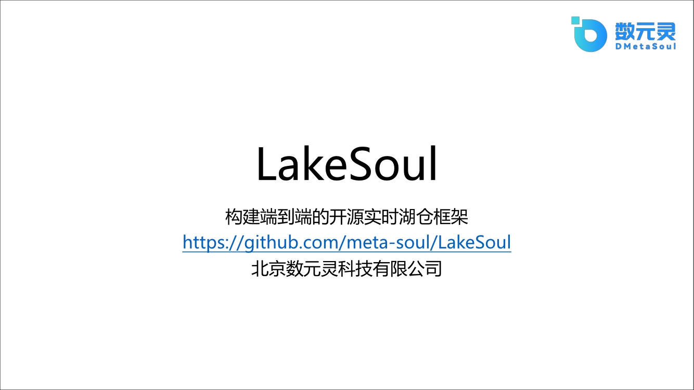

背景：这次分享的主题是数元灵开源一年多的数据湖产品Lakesoul。数元灵同时还开源了另外一个产品，一站式机器学习平台MetaSpore，在上面可以做很多搜索，给大家在业务上带来一些非常方便的体验。

Lakesoul在我们公司主要的定位是我们希望构建成一个端到端的开源实时湖仓的框架。

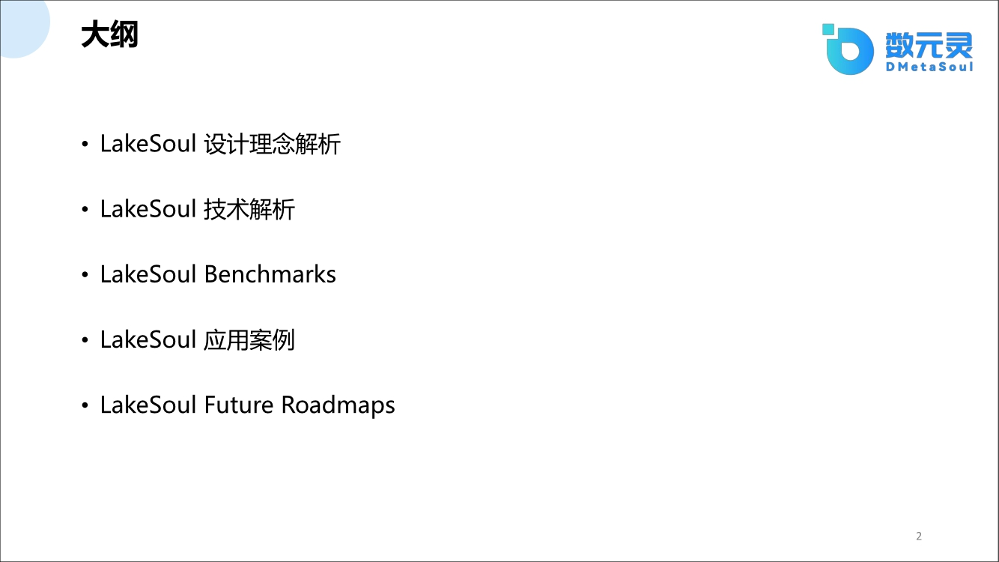

该框架如何实现端到端的实时湖仓呢？
这里涉及到一些设计理念的问题，Lakesoul是作为现有国产唯一的开源框架完全是由我们自研的，并不是基于其他的框架之上开发的。从底层设计到上层应用，包括一个生态系统的建设，整个链路都是我们自己实现。
今天在这里详细分析一下我们是怎么设计的、为什么这么做、做好之后会带来什么好处、
有什么样的应用价值以及未来怎么做。本次分享的目录：
- LakeSoul 设计理念解析
- LakeSoul 技术解析
- LakeSoul Benchmarks
- LakeSoul 应用案例
- LakeSoul Future Roadmaps

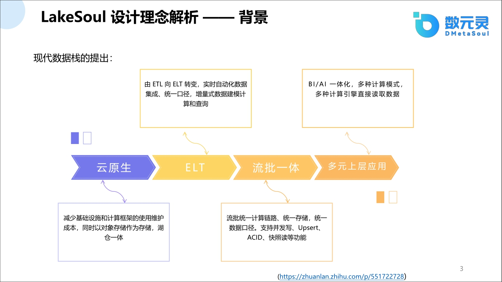

因为湖仓一体框架概念比较新，大家不太了解，可能会思考为什么要使用湖仓一体的框架
所以在正式讲解技术主题之前，由我先介绍一下湖仓一体的技术背景。
提起湖仓一体的技术背景就离不开云原生，云原生给我们带来很多便捷的体验，比如随时拉一个镜像，搭几台集群，基本上通过一件事或者几行命令就能把一个集群或者一个应用部署上去，这极大减少了使用和维护成本。
并且云原生在底层，其实都是以对象存储为基础的，对象存储带来的最大的好处就是特别廉价，同时它的性能也不差，存储数据的格式多样化，包括结构化、非结构化、还有半结构化等等。
对于数据分析来说，这样的一个廉价的存储就能存储更多的数据，也会带来更多意想不到的收获。

首先是带来数据链路模式的转变，正如现在就是说大家都后来就是说
呃对象存储之后，有一段时间特别兴起的一个名词：”数据入湖“，同时相应的出现了一个新的工种： “入湖工程师”。针对数据，为什么先入湖，而不是像传统模式，数据结合使用方先做处理。

我们现在归结这种处理方式的转变是从传统的ETL转成到现在的ELT。
elt的含义可以理解为：

- e: 是从源头拉数据过来
- l: 是先加载在我我这个数据湖仓里面，就是先加载数据然后再做处理
- t: transform，就是说再做处理，比如做count，或者做字段这抽取，或者做其他处理等

这样的一种模式

传统etl模式是：

- e: 就是说我新数据抽取还不变哦
- t: 就是说做转换
  比如说这个转换
  比如说还是做那count的distinct
  但是这个问题就是说
- l:转换之后怎么load到哪去呢
  这个在传统框架里面具有很多不同的这种实践方式
  比如说可能会分流还是批
  - 对于批的数据，一般会用spark去做处理，处理T+1的数据，处理完之后存在数仓里面，典型的就是Hive。
  - 对于流数据，一般就用flink处理，也没法直接存在hive里，需要找一个更强劲的数仓引擎，典型的比如clickhouse或者Doris。
  - 如果还需要日志型的数据话，就需要存在Elasticsearch引擎里面.

传统的ETL这里面会造成了一些困扰：

1. 链路多样：包括一个流链路和一个批链路，导致流批不一致
2. 存储不一致：比如离线数据存储T+1的数据，日志数据存入elasticsearch，实时数据存入clickhouse。这会导致整体成本都很高：
   a. 维护成本高：可能需要一个团队或者几个团队来维护这一套产品；
   b. 开发成本高：例如数据分析师对某个表提出了一个新的处理方式，比如新增几列或者修改几列，需要及时同步数据工程师对相应的任务进行调整，对任务进行不断的修正。在传统模式下，先把T任务按照数据分析师的要求重新转换，再把T+1的数据重新从源端拉取回来。但是源端的数据可能存在保质期（比如7天或者一个月），如果需要拉取更久的时间，数据可能就存在丢失，数据的价值也就体现不出来。
   但是如果你现在如果你
   就是说这是另外一个
   但是还有一个就是说你对上层
   上层统一的话
   上层我AI我和BI就是这种分析人员
   也造成了一定的开发的一个困扰
   比如说对于AI开发者希望用的数据越广泛越好，比如存在hive的离线数据和存在clickhouse里面的在线的数据，还包括存在elasticsearch的日志数据等。
   我希望能够做一个大杂烩
   就说就是说能够还能有一部分数据
   就说流式数据
   回流到批数据再进一步处理加工
   另外我再结合日志数据
   因为现在咱们现在
   尤其是类似最近比较火的chatGPT这种大模型，需要大数据量才能喂饱
   才能这个
   神经网络的这个这种这种模型训练
   所以说大数据量
   也就表示这个多特征的一个特性
   所以说你AI工程师就比较痛苦一点
   就是我又要集成Hive，开发一套Hive的一个接口，又要开发成一套集成clickhouse的接口
   结果还在结合一类elasticsearch结构他也不统一
   这存储不统一
   那我开发成本就也是巨高
   所以说就造成了AI和BI工程师
   他俩之间的开发也是不统一的一个现象
   所以说传统的这个现象比较多的问题
   其实很重要的问题就是传统的模式，
   它的发展过程也是一个必经的一个过程啊
   它因为有历史原因发展过程
   但是现在是云原生时代

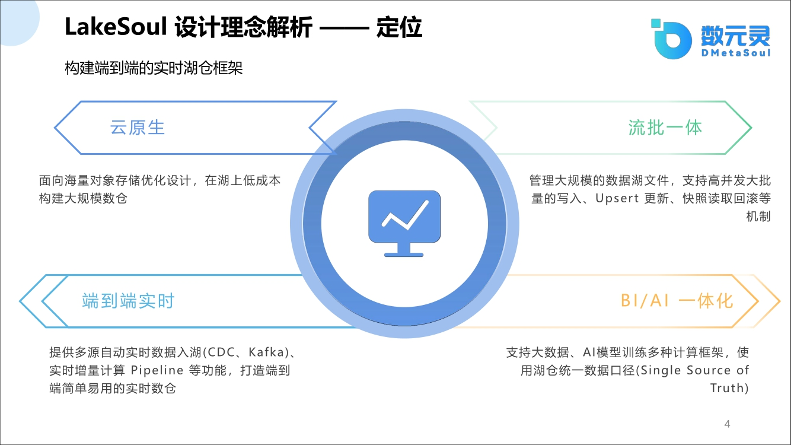

数元灵的设计理念是认为现在的ELT应该是一个通用的比较流行的一个模式，即数据先入湖仓，再在上面去做处理，并且处理的链路要统一，不能像以前那种spark和flink两条链路。

只有湖仓数据已经统一了，在上面做计算才能更方便。但流批统一可能还有很多其他的一些实现细节，这在后面会有提到。

另外流批统一之后，自然而然的AI/BI，都可以在上面做计算，也做到了统一。

所以结合我们的背景总结，我们对lakesoul的定位是在云原生之上存储海量数据的数据湖技术
首先就是必须云原生是我们一个很重要的一个特性
要是说其他我们是也是只云原生
总提供什么
就是说在海量的一个数据湖的技术上
我们提供输入仓库，这和数据仓库不一样。
数据仓库可能就是说
我是有自己独特的计算引擎和存储引擎
我是原先是我自己涂套？？？？去
慢慢去往数据湖上去兼容

Lakesoul的使用模式还是不一样：

- 第一点：直接在数据湖上面去勾选数据仓库
- 第二点：就是说我们在所有的数据都有
  首先在elt模式下所有数据都要
  进入到我这个湖仓这个框架里面
  那我必须要提供一个端到端的这种数据转入能力
  而且数据转入能力你你实时
  和这种批量都能支持所以我们必须要提供一个实时的这种能力
  就是说你不同的异构数据都能进入到我的湖仓里面
  而且必须是简单易用
  因为以前大家可能是会说我用flink啊
  或者我用什么我自己写
  也已经写大家很多写了任务
  我元端一个一个一个sql
  然后flink再写个sql
  再做个里面做一个insert into
  这样不断写，开发成本和入门成本都会很高。
  而我们现在要提端到端
  基本上用户不需要很多东西
  就直接就配置我的连接信息
  剩下的数据都要进入到这个湖仓里面
  你不需要去做很多操作
  另外一个就是说
  我们在这上面
  我们提供了一个很重要的这种流批一体的这种能力
  这种流批一体最重要的就是大家在并发写的时候
  要提供一个这种高吞吐，这个高吞吐呢可能就会分很多场景
  这种场景比如upsert能力 
  还有这种copy on write是都要提供了
  另外一说就是
  大家就在不断的写的时候
  还能提供这种timestamp的这种能力
  这个是后面就是说是会详细的讲一下
  另外一个就是说
  最后所有能力都统一之后，我的AI和bi框架都能用这个数据去做进一步的分析

就是说lakesoul不是说简单的只支持sql，同时也支持类似于Pandas这种AI的引擎

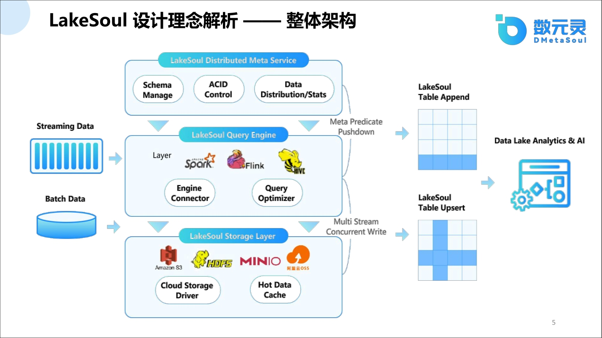

从我们整体架构上来看，
其实我们这边也是做了一些分层的处理
就是说我们上层是一个元数据的分布式的服务层
这个元数据服务层是做什么
做一个schema的这种管理啊
说实话另外一个就是提供一个acid的一个属性就是控制并发
另外就是说我们对一个数据能有一个上帝的视图
就是说我这我们这一个服务层能够将数据湖里面所有的文件
都能提供一个上帝的视角
给AI和BI分析人员都能够去看到所有东西
而不像以前那种分裂的存储
就是说
只能是我的元数据只在我hive里面有
我的clickhouse里面有
而他们没有一个总体的一个生命周期
所以我的BI或AI分析师还得自己去找
但是如果现在
引进了我们这种服务层的话
其实就在我们这服务层就能全部看到所有的东西
另外是我们对接在上层对接引擎的时候
其实
成功推荐？？？引擎
我们是对接一些开放的引擎比如说flink、spark、hive，未来还会对接presto
我们都是能够对接开放引擎

在这底层，我们是能够对接很多这种对象存储
对象存储上面也包括HDFS啊
不是不是对象存储但是也包括HDFS
我们都是有能力去支撑的
另外就是我们在写入格式的时候是用的一些开源的格式，如parquet/arrow等开源格式
而不像某些数据仓库，使用自定义的格式，对于其他数据仓库来说就显得不通用

最后如果是这一套整体架构
上面说数据
不管的流和批数据都能
进入到我这个湖仓的这种框架里面
然后流批数据都能做到一个统一
高并发高吞吐
然后统一完之后
对于上层的AIBI的分析师的话
直接从我这个类送里面去
所有的东西去全部拿出来就行

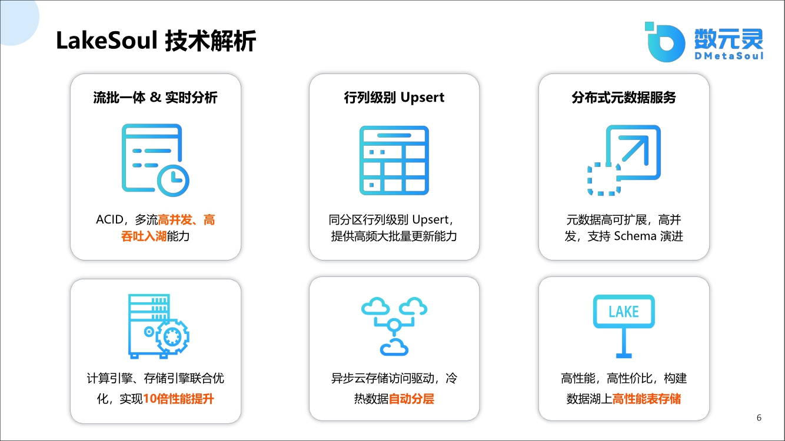

通过刚才看那个整体框架之后
其实我给大家总结一下我们的几个特色的这个技术能力：
一个是就是说我们提供的acid这种高并发高吞吐的这种能力

当你想实时写入的时候，通过ACID能控制写时不冲突，遇到冲突的时候会做一些冲突检测。
另外就是说我们提供这种行列级别的upsert
这种的话就比表级别就肯定是
在吞吐量上什么就表现了
就是说更细腻度
肯定就是并发上就会高一点

在元数据这一层，我们提供是个分布式元数据，对比现有的现有的一些同业产品
其实那个小数据文件的元数据文件会比较多
甚至会造成一些困扰
另外一个就是说我们在对接的计存储引擎上面
比如说我们现在对接云原生这种对象存储上面
我们是做了大量的这种加速优化的
后面会详细讲我们是怎么做的
但是这个这里面加速优化
我们的性能会有一个几倍是十几倍的这种提升

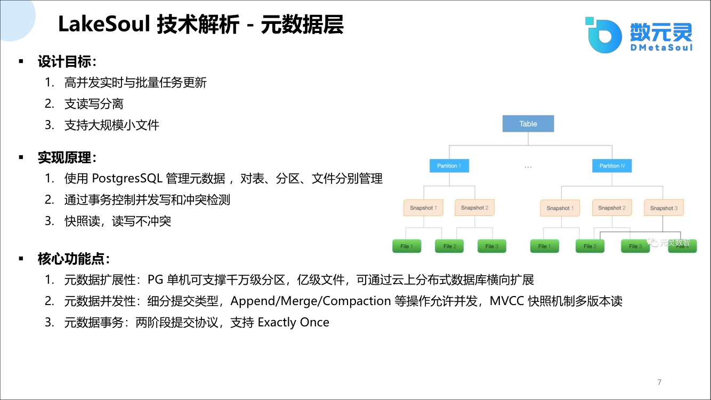

然后从单个讲的话
我们就说刚才看了些嗯技术的一些啊
单个一些
能力特色
就是说从现在不说深入细讲一下

就是说我们的元数据层是怎么设计的
我们设计其实想设计元数据层呢
主要的设计目标就是说
我们希望能提供高并发这种实时
嗯实时更新和批量更新的这种能力
这种能力其实呃这种能力就是说
以前在传统的数据湖上面
没有数据湖上面
你你写数据
有可能就是说我这个写和那个写
有可能就造成覆盖
比如写同一个路径下面

你不知道你读的是最新的数据是哪一个
如果是事先来说引进的元数据层的话，
你在高并发读写的时候你是能够做成
读写分离的
你需要做成读写分离
就是你读的数据
一定是读了一个比较一致的数据
另外就是说你在高并发写的时候
其实有很多这种元数据
才会产生很多这种元数据的小文件
比如说你可以想想你的hudi/iceberg里面
有很多这种这种delete file
这种这种元数据的这种文件
这种文件数据文件一旦规模大的时候
他会造成很很高的一个性能瓶颈
但是大家可能也会有各种各样的一些优化的方法
然后在我们的怎么实现呢
我们实现的时候是我们直接是用postgresql这个数据库做元数据管理
我们可能对我们可以管理表管理分区
管理文件
然后每一个管理上面就设立它的主键
你可以认为这就是它的索引
又有索引的
另外的时候
我们通过这种
数据库的这种事
事务机制
来控制着那些并发写的时候产生的冲突
另另外一个就是说
我们是实现了一个快照读的一个方式
快照读是说你只能读
某个历史的版本啊
就或者读最新的一个版本
而你如果是刚写
正在写的数据没有提交的时候
我们也他是不会读出来的
然后这就是我们用快照读
实现了一个读写分离
另外就是说
就是说它的一些性能点呢
就是说我们pg数据库
在单机上面可以切
可以支持这种千万级别的一级
千万级别的分区
一级别的文件
想想这个事其实比那个小文件
大家都知道
HDFS
上面如果是存在这种小文件的问题
还是比较头疼的一个问题
因为他不能做更增量更新
你只能做做一些
你只能做一些
其他的一些处理方式
另外如果你在云上面
你可以用一些分布式
这种就是PG数据库的这种分布式数据库协议可以做一个横向扩展
所以他在
所以如果是大家的规模更
大的时候其实这么做成
做成几十亿级别的也是没问题的
其实另外在原数据这种并发
在并发写的时候
那你说在并发写
为什么我们能做到并发的控制呢
其实我们对这个任务在提交的时候
做的任何的数据类型
他提到类型做了很多这种细分
比如说我们支持是我们把任务进行
比如说你是append的操作
还是update操作
还是MERGE操作还是compaction操作
细分很多不同任务类型
任务类型这样的好处就是说
我们在解提交的时候
会对不同类型做一个判断
看看是不是允许并发
如果是冲产生冲突我们就会退
然后另外我们是基于MVCC的这个技术
去实现这种快照图
就是说MVCC大家都知道数据库上面
像在数据库上都是这种实现
实现方式
我们其实这个也是
就说借鉴了这种这种
因为数据库毕竟还是很多人
东西是可以借鉴的
另外再是说在元数据的这种
就是提交的时候
是不是大家之前不是说了读写分离吗
读写分离其实我们直接
在写的时候提供了一个两阶段提交协议，在数据写入之后，再提交的时候需要确保数据是exactly once。

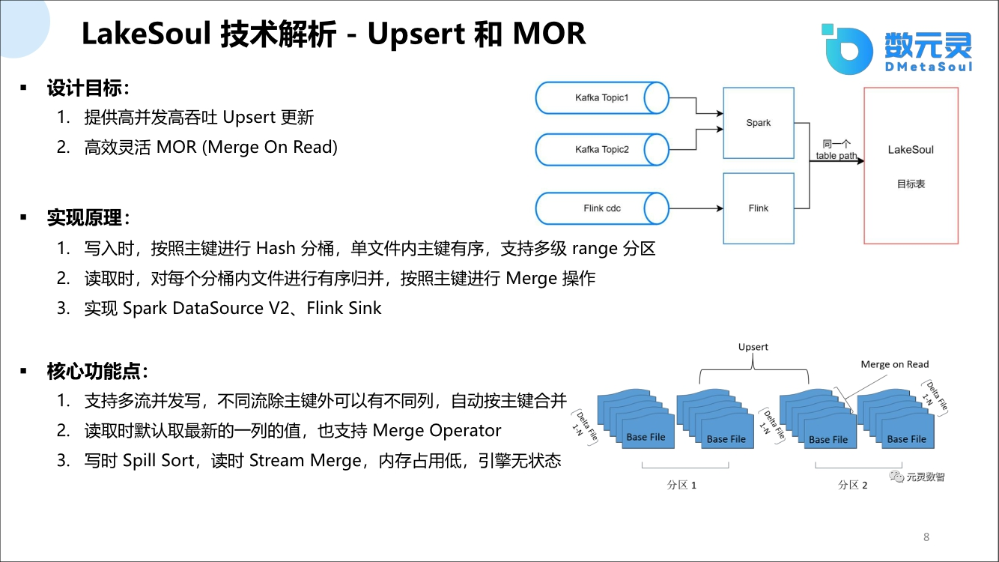

另外一个就是说要着重讲
就是说我们的upsert和mor的这个能力啊
因为不是说upsert的其实是
就是说
就是说mor就是说merge on read的啊
叫merge on read
其实
他对比就是大家以前那样说copy on write
在lakesoul里面copy on write是天生就支持的
然后我们后来是我们后来就是说在
在就是说括copy on write 和mor是两种场景啊
copy on write一般就是大家可能认为就是说
我读多写少这种场景copy on write比较好
因为copy on write的实现方式上面是这样的
就是说他写了一批数据
他会把之前的这些数据先读出来啊
做一次合并
然后再写数据
所以说你这个一直在写的时候
他就产生了很多这种这种性能上的
因为你要读一遍
写写增大的这种问题啊
然后如果这个问题就是说怎么解
如果是读多了你还好
你你你就写一次然后一直读
那copy on write就有一份数据
就是说你直接就是读一份数据
这就没问题
但是在写多读少这个场景的话
其实你要需要有upsert的能力，即update and insert的能力
这种能力就是说是
在不断的说并发
更新的基础上去做的事
每次我们需要去在写多读少这种场景下
去提供一种高并发这种写入的机制
所以说是我们引进的upsert哦
另外是我们在读的时候
每次upsert就会有一个版本
在读的时候我们会做一次merge on read

merge on read 就是对以前已写的这个数据
去做一次合并
然后我们怎么实现了呢
在实现在
实现的上面说写作的时候我们是按照
哦就是说upsert的时候必须提供主键
啊主键的话
我们就先会按照主键进行一个hash分桶然后
单个文件呢我们还要主键做一个排序
你可以认为是每一个单个文件里面
他就是有序的
另外我们还支持多级range分区，将来可以运用到一些分区查询中
另外就在读取的时候，因为我们单独文件是有序的，
但是在
我们会产生很多不同的版本的文件
不同版本文件怎么去做
怎么去做那个那个merge呢
就是我们就
其实前景呢
就认为
就把几个有序的文件做一次归并就行了
这归并会比较效率会比较高一点
另外就是你在归并的时候
其实你要做一些其他的一些操作啊
因为你比如同一个主见会有很多
不同的数据哦
你是拿最新的数据做呢还是
怎么做一次什么处理
比如说做一次求和
这个我们提供的一个叫做operator的功能
这个operator的功能就是说啊
你给我能够控制主键的行为
但是目前默认的行为就是用最新的
版本的文件去覆盖以前版本的文件
所以你每次拿到的只是拿到最新
但是我们还提供比如说
比如说你是对这个同一个主键
做一次求和
但是你这个主键里面有null值，你希望null值去做过滤
就用他之前版本的非null值去做
我们是也可以支持的

另外就是说我们在这个
在这个upsert的能力上
其实我们可以就是说
能扩展出很多新颖的东西啊
因为我们就是说多流并发写
多流并发写的话怎怎么写呢
就是说你有一个表
这个表的话就是说
就是说是不同的流往里写
但是不同流有一个条件
就是说你的主键是必须相同的
但是你非主键列可以不同
这样的话
你就是说你就往这个表里大家
相互的写
因为我们有那个那个acid吗
所以说你冲突了也不要紧
我们能够保证数据的一致性
所以你在写的时候
大家都并发的往里写
并发往里写的时候
这样的话吞吐率就很高
所以你最后读的时候
读的时候怎去要去做合并呢
其实读的时候就是说我们主键是不变的
但是非主键列如果有我就拿出来
就是说你不同的流里面的主键
我都会给他拿出来
是做叫叫做
叫做叫做叫做schema引进嘛
然后就是说我们就可以
就是说这样的话自动去扩展
像一个做一个join操作呀
自动去扩展这种大宽表
所以说这是
后面是一个我们很特色的一个功能
另外就是我们在写的时候
是内存占用率是资源占用率是极低
而且是与引擎无关
这个其实大家在
在使用hudi或iceberg的时候
其实大家就关
其实除了关大家比较关注他的性能啊
或者是他的功能之外
其实大家没有关注他的资源
他的资源其实你如果看他的内存消耗的话
你会发现他们的消耗内存消耗很高
然后你如果你去以后你去做对比
我们的内存消耗是非常低的，因为我们是用的rust去做了底层的这种处理方式。

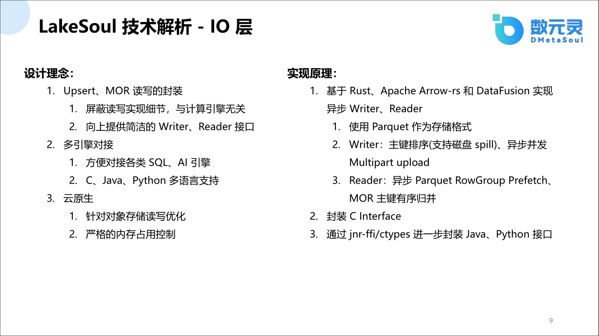

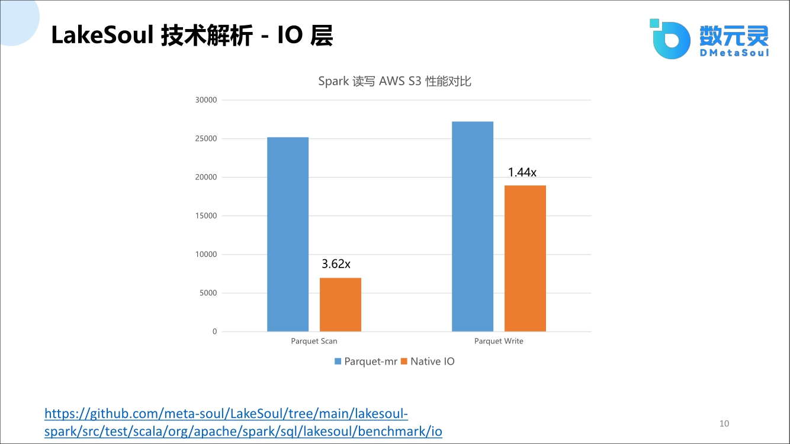

正如上面说的，我们在io层上最近实现了很大的突破。
这个大突破怎么说呢
就是说我们以前
不管你看很多这种hudi或者iceberg
你看那个框架特别是hudi啊
它每一个版本
或者是spark不同的版本
或flink的不同的版本
可能都要实现自己一套这种merge on read或者是copy on write
这这这这种操作然后
然后但是说你每次都要实现这么一套
也比较比较比较麻烦嘛
就是说开发成本会比较高
所以我们专门独立出一个io层的概念，该io层与计算引擎无关
我们只提供简单的这种，只包含读和写的这种接口，与上层引擎
上层引擎只要调我读和写接口就能
使用我那个server 的upsert的的功能、merge on  read功能、Copy on write功能，以及引入的其他
operator的功能
我们就是希望这个IO层是一个公共的，与计算引擎无关
另外针对计算引擎，我们只提供最简单的writer和reader的接口
你去调个接口就行了
对因为开放的计算方
计算引擎都有这种接口
另外就是说
我们这个引擎对接
还不只是说你是对接flink啊
或者是spark这种
我们还必须要对接这种AI引擎
AI以前的接口
就可能不是简单的这种sql就能搞定了
就是说你可能就是说你像你用Pandas
你肯定用Pandas里面有这种接口
你可能还有分布式什么
现在tensorflow或者是还有pytorch的接口
那你接口怎么弄呢
就是说
他肯定得支持多语音
就是说我们现在用底层
是用rust实现的时候
我们就是说我们可以提供c的接口
提供Java的接口
提供Python的接口我们都是没问题了
另外就是说我们是我们
而且说我们的底层是也是对云原生
天然就支持了
我们是底层做了大量的用了
rust做大量的这种存储优化
而且就是它的内存会消耗会非常低
严格控制的
就是说我们实现的时候大家也能知道
就是我们结合了
我们自己写了很多这种rust的代码
结合了一个参考的是arrow-rs 还有Disfusion的一些实现的方式
我们实现了异步式的writer和reader
这个其实是这个这个这个
这个就是说一不是
其实对我们来说是一个很重要的一种
加速后面会想想他有到底有多
多大的一个性能提升啊
就是说我们在写的时候
其实我们现在主要是
实现的是parquet的格式
后面会接其他格式
另外在writer的时候
其实就是说我们为什么是异步
啊比如说我们是在主键
按照主键排序的时候
我们是在实现了异步的
这multipart upload的这种机制
就是说你再写一份说我可以说多份去传
同时去传分开去传
这样会非常非常的高
另外说我们在reader的时候
我们试试rowgroup预读的方式
就是你在读这个rowgroup的时候
我下一个rowgroup已经已经都已经来了
所以说这个时候
这个时候我们这个效率也会非常高
啊另外就是说我们在
我们也实现了自己这种rust
这种merge on read的这个能力啊
merge on read就是还是按照主键进行有序的归并

另外我们通过JNI提供Java接口，通过ctypes提供Python的接口
后续大家可以去上我们的那个github上面去看一下我们的最新的一些接口文档啊
哦这里面就是说简单的做一下
就是说我们用这个io层
到底多大的一个加速啊
这个怎么怎么这个是怎么做呢
就是说把spark用spark去读
嗯去读aws  s3的数据
把spark里面的底层的就是原生的
他读的是
parquet mr的这个
这个东西替换成我们的native io
这样的话是做个对比
我们对比实验
就是说我们在在读的时候
我们会有一个3.6倍的提升
我们在写的时候会有一个1.44倍的提升啊
大家可以就是说下面也贴了个链接
大家如果就是说嗯想要尝试啊
可以去尽管去对比
因为我们这个都是代码还有公开评测
还有数据都是
都是都是开放的
我们就希望就是说在国产上面
就是说我们在这一块
我们是可以做到很好的一个领先的一个水平啊
就是说现在其实大家也讲出国产化啊
也这种这种国产化这个背景
其实我们其实作为国内
国内现在目前唯一的开源湖
国产这个湖仓框架
也是有我们很多独特的设计和优势
也比较符合当前的一些政治理念嘛

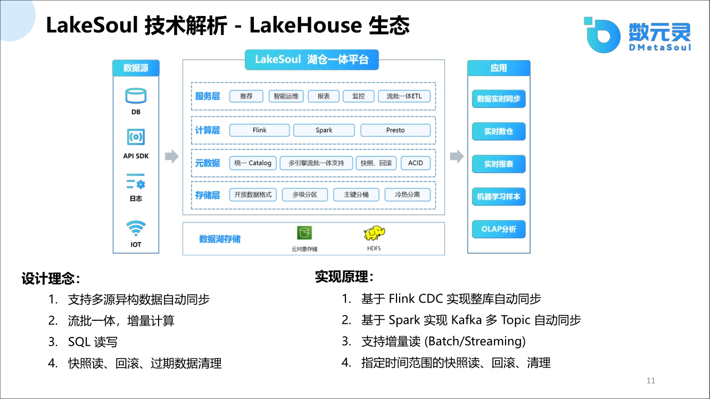

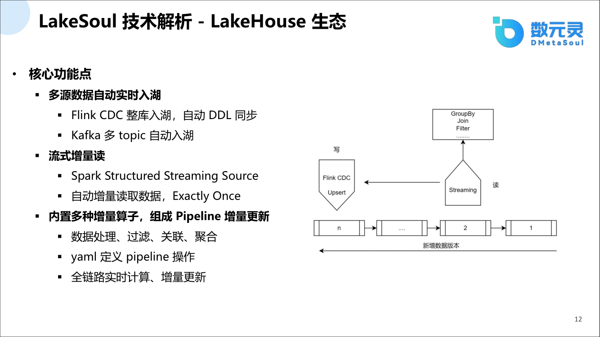

啊另外就是说从整个生态来讲
现在上面讲了很多这种细化的功能啊
大大家再往上走一走看一看
就说从生态系统上
我们怎么去看这个是
就生态系统上面
其实我们希望
就是说像之前的我们的定位一样
我们希望首先是我们是数据
能够数据
不管是异构的数据什么都能同步过来
同步进来之后
好然后在这里面去做很多这种
增量计算啊
流批一体的计算就是在我们这里做
包括你的分层设计
就是说你ods dds odl这种数据分层的设计你都可以
然后另外就是说你
有可能有很多用户想用
不同的这种接口嘛
比如说你可以支持有时候
就想用sql
sql接口人是有可能AI公司想用
其他这种我们也是可以
就说append的接口我们也可以提供支持
另外就是说
最重要的功能
就是说有很多这种细化工
就说你可以就是说在这里面
因为数据不断进来之后都会带版本
你可以去做一个快照读
你可以做去做回归
包括你去做一些增量
增量都是没问题的啊
这里面就是说
就说从我们
湖仓一体希望我们把我们的平台给建好
建好之后
我们要解决的其实是上端
上端水上端数据源的问题
数据源一定要一定要是说简单的
就能同步到我们湖仓里面
因为大家在考虑这个位置
这个
大家很多人都在考虑用湖仓框架
但是有很多问题啊
比如说第一个问题很直接
就是我现有的框架
比如说我hive
我是我我
我的框架已经现有的一个技术产品
已经很多数据
我怎么做迁移
这第一个问题
第一个问题
就是说我怎么解决这个数据
迁入到湖仓的问题
第二就是说很多都是说我数据源上面
比如说我很多开需要我自己还开发
很多成本
有先天举个例子你肯定有Flink CDC
你可能还自己1去写很多Flink sql去
你先去mysql里面去拉一些啊
压上去之后我在我后排
我再起一个那个sql
再起一个表
我再往这个表目的表里面去一色
就是说你还有开发成本
其实我对我们来说我们这方面就考虑
就是说尽量就说基本上呢
用户只配置一些
很简单的这种连接信息
就享受我们湖仓一体的这种优势
包括
你的实时数据的同步包括你的出现
出现比如说数据这种failover的时候
能够保证一个exactly once的这种机制
包括这种自动的这种这种
这种数据源的这种
呃那个数据资源的这种动态调整
我们都能给你做一些底层的屏蔽

数据在解决上层数据入湖的这个问题是吧
其实这后面就对接就是下游数据
我怎么去给用户去用的话
其实有很多这种不同的方式啊
你可能就是说
我只是做一些简单的bi报表分析

你就是直接就是说
我们提供JDBC接口
我们提供restful接口这种接口简单形式
你直接去拿我们的数据
你就可以做一个简单的报表分析
这个我们未来可能会有一个开源的产品给大家去看
我们是有这种能力的
另外就是说对于数bi分析师说
我希望我的数据更多更广
正好湖仓里面的数据又多又广
你就可以做各种各样的数据的加工处理
因为我们先前讲了我们可以支持流式的upsert
流式upsert的话
就是说
后面会有一个大宽表的拼接的这个能力
你可以把它无限的扩大
它的特征
就可以认为是无限扩大的特征能力
这后面会详细的再讲一下
然后在生态里面

我们现在已有提供的能力啊
是说这flink CDC整库入湖
自动ddl同步这种
这种多源入湖的这个能力
怎么说呢
就说以前大家那个
比如说举个例子mysql上面
大家做的时候
如果mysql上面新建的一张表
或者表里面自动做了更新啊
做了比如说做了一个新增或者删除
其实你后端是感知不到的

就是说原生的是感知不到

然后你需要把flink作业可能停了
停了之后你再改一下他的sql语句啊
sql语句之后你再起
然后你才能把新的新的数据能同步进来
就是新的上面地ddl同步进来
然后
这样的话就是他其实也比较困难吧
就是说你不断改不断停
那么要是任务多了也挺麻烦的对吧
就是说我们现在这核心就是说
我们就是说你就配置一个库
我这库的用户名密码是啥
后面就说这库里面你就不用管了
剩下就是说你剩下
新增那张表表示新增的数据
数据表里面改了数据
我全部给你自动去做这个处理
这里是我们自己去改了很多很多这种内核的源码

做出了这这种类似于商业产品化的这种能力啊
另外就是说我们在kafka上面
我们也可以做自动这种topic感知
你topic一进来之后自动去帮你去
后台的lakesoul里面去建你的表
然后数据会自动去同步
你就不需要去
你就配置这个
kafka的连接信息就行了啊
然后在这
数据入湖的时候就说上面读的时候
我们还提供一个增量读的一个能力啊
因为增量读什么快照读什么一些什么读我们都支持
因为增量读是一个比较有挑战的一个
你所以说我们在增量读上面
我们能够就说不断的去读取
增量数据就有很大的这种商业意义
就是说你
以前的读的数据
就每次都要读全部的全部的数据
那意思那就是说我每同步一批
我就我去拿这一批的数据
我下次同步一批我再拿下一批数据
这样的话就有很多就有很多这种
有很多这种这种
上面可以做很多这种这种计算
你比如说做一些新增用户了
什么感知什么自动就能帮你去呃帮你去做这个事

但是做这个事可能会有一些阻碍
就是说我可能用户不太喜欢写SQL
或写一些比较复杂的这种处理流程
我们也为你们考虑的其实

lakesoul里面我们考虑的就是说
你这些比如说简单这种算子

比如说那种过滤算子
比如说group by这种这种能力啊
比如说再就是说join
比如说left join
然后再比如说distinct这种
我们把所有的算子
常用算子给做成一个
就做
就是用yaml做成一个文件表现形式
就是说你在yaml里面去定义你想做什么
我举个例子
比如说我想对这张表做一个group by
之后想做一个统计sum值
就是说做一个求和
你要么就填一下yaml文件
要么在前端点两下
你就能把整个的整个的这个pipeline
给他构建起来
下面你起一个flink任务
下面起的什么任务或任务保护任务
任务是什么状态其实你都不用关心哦
lakesoul底层自动就帮你去做这个事
而且你还是保证他的这一个例外
因为我们做了大量的这种failover这种
这种保证机制的

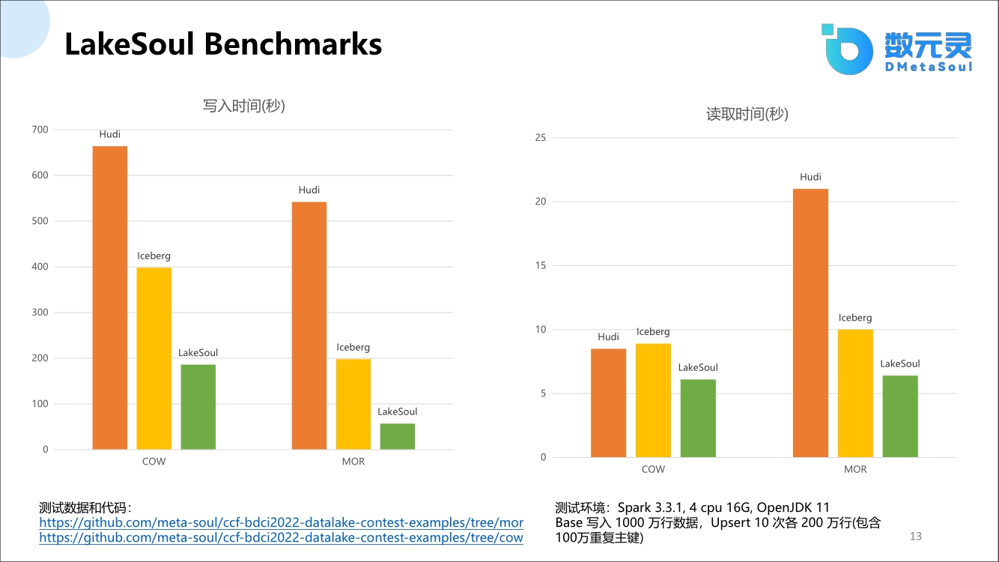

上面这张图可能是好多人都比较
最关心的一个能力啊
因为之前大家
大家可能都会问这个问题啊
我们可能也不逃避
就是说
就说这个就是说直接就是拿数据
咱直接就是拿出来一摆在台面上一对一的这种说一说

就说在benchmark上面
我们做的是
很多这种同业产品的这个对比
这个对比是怎么做呢
我给大给大家做一给大家说一下
就是说我们和
我们我们和CCF举办了一个叫数据湖仓的一个比赛
这个比赛就是说公开竞争
就是说就是我们出赛题
然后实现方式大家自己定
你用什么功能框架都行
但是这个赛季我们是背景是怎么弄的
就是说我们是严格控制他的资源
就是我们用严格控制他只能4C16G的这种
嗯4C16G内存的这种资源
不能让大家去超纲
每个人都最大限度用这个资源
然后版本也定死了
然后另外就是说大家
数据是这么数据是数据内容是这样的
就是有一个base文件
这base文件有1,000万数据总共11个文件
base文件是啊1,000万
然后每次每次会有一个增量数据
这个增量数据是有10个
这10个是有版本的，比如从版本1到版本10，代表今天的数据、明天的数据，后天的或者第10天的数据。
这个是模拟一个真实的一个业务场景
就说每天每批数据里面会有200万
但是有100万数据的主键会重复，不是指文件内部主键重复，而是和前面的比如base0或者base1的一些主键是有重复。

这模拟的是一个merge的一个能力
就说他最终评价的是一个什么指标呢
就是说我首先把这11个文件写进去
写到一个对象存储里面
就是我们用对象就是说S3存储里面
写在存入里面
最后还要读出来做一些逻辑计算
这逻辑计算是什么计算呢
就是说这11个版本的文件有两列要做特殊计算
一列是做sum求和
你要把一个一个列就是全是long型的时
给它求出来这第一个
另外一个就是一个string类型了
string类型要做什么处理呢
就是说
我随便那些有的版本里面就有null值
但是null值我没有什么作用
所以说我必须把null值给去掉
我必须
比如说我第10个版本里面有 null值
我第1个版本里面对应这个主键没有null值
我必须要用第9个版本的
这个非null值作为最新的数据
而不是说第10个版本
这是数据是这样的一个比赛流程
然后比赛流程的话我们就是说
你框架你随便定
你用lakesoul、iceberg、hudi都行啊
最终是我们的一个参考的结果

我们分不同模式都做了对比
另外就是说copy on write的模式上面
我们的lakesoul能比其他人快几倍不等啊
copy on write就是写入的时候我们就快几倍啊
然后m o r的时候我们写入的时候也能快几倍
然后再读的时候
再读的时候就是说也copy on write的和merge on read的读啊
copy on write的时候其实大家差不是很大，都差不多
在但是在那个merge on read的这种读的时候
其实还是有差异的
就是说我们还是能够快
然后而且我们很重要一点
就是说我们copy on write, merge on read的这两个
这时间就差不多
这个其实涉及就是得益于我们这个底层这个IO设计
我们这个做了很多这种异步加速

如果大家其实有感兴趣做这个benchmark的话
其实我们代码还有公开评测的
还有数据什么都在那
都在下方已经给大家链接了
大家可以就是说
就说以1种
就是说大家交流的1种方式大家去
大家去尽情的去交流
而且如果大家觉得不太尽兴的话
我们其实还有群
你可以24小时都在里面去交流
我们其实是
呃就大家可能有没有感觉
就是说你在hudi或iceberg提一个需求的时候
可能社区满足你的需求会比较慢
然后如果是你自己开发可能成本也比较高
但是如果是像我们这种国产的这种自己就是国内的这种社区
还有包括我们这个方式啊都非常方便
你可能这个需求我们评估可以
可能第二天或第三天马上就给你弄到了社区里面
这也其实是大家可以考虑的一个点啊

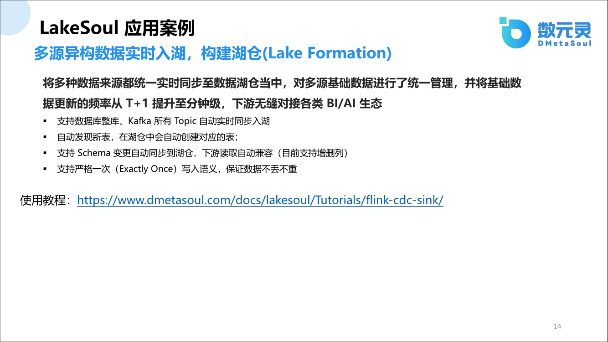

在应用案例上面
我就是说简单的给大家说一下啊
主要就是说我们就是提供了一个
嗯有前面一讲啊就是说
对外异构实时入湖的能力
你可以就是说你可以随便叫见湖仓吗
嗯你可以支持
比如说我们就是数据kafka的自动同步
然后我可以给他提供那个
那个flink CDC的自动同步
你可以自动还可以自动发现新表啊
新表里面做了Schema变更
你说新能列我们可以都可以支持

需要强调一下，lakesoul是必须严格支持一个exactly once，因为如果不支持exactly once的话，可能会导致很多数据不一致。

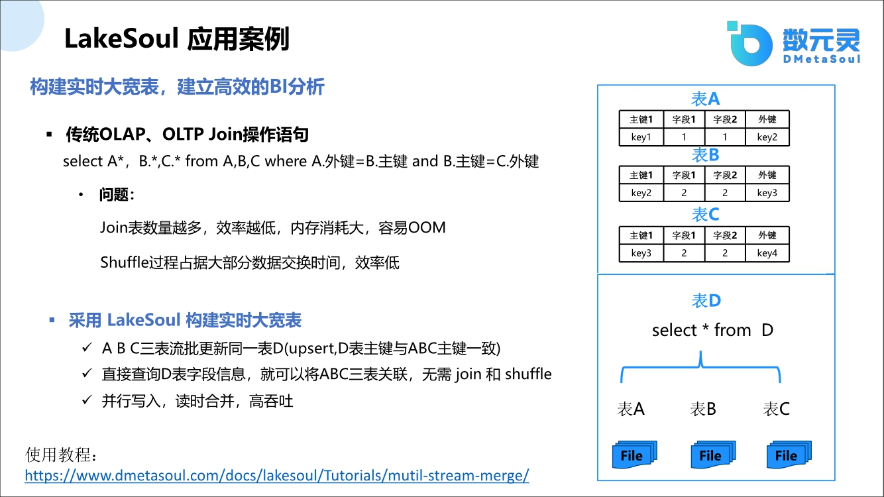

这必须必须要要强调一下这个
另外一个案例就是说这大宽表
因为以前大家知道
这个是比较有意思的一个点啊
大宽表过去的时候都是通过join实现，join的坏处就是效率比较低，内存消耗比较大，而且数据一清洗非常容易产生oom。另外在join的时候肯定会有一个shuffle过程，shuffle过程是最杂乱无章的，效率比较低的一个过程，过程本身是比较耗时。但是如果采用lakesoul的话，是怎么实现这个过程的？lakesoul需要先定义一个基表，然后比如有3个流过来A、B、C，只要保证主键一致，剩下的非主键列不需要一致，通过底层有acid控制，就可以并发往里写，也不用产生shuffle过程。最终这些写入数据怎么产生大宽表呢？只需要直接读一下，因为读的过程会产生merge on read，merge on read会把自动一些非主键列的自动扩充，就表现成一个大宽表的形式。这在性能上会有几倍几十倍的提高。

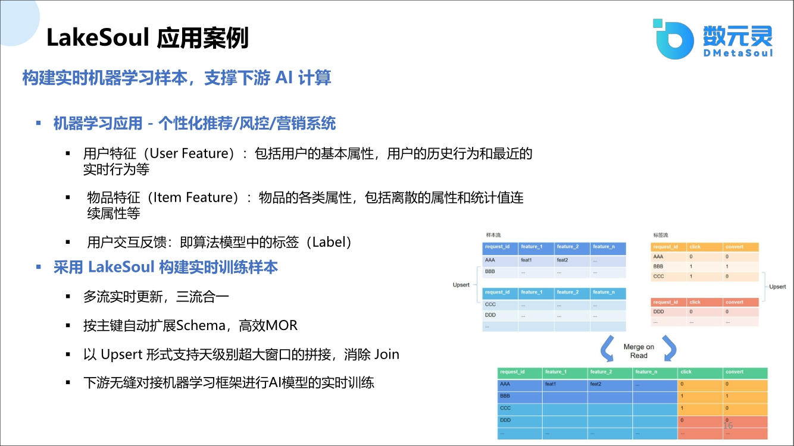

另外就是说在机器学习里面
其实说做这个比如说很很简单的这种
个性化推进啊还有营销行动
都会有一个大家比较认知的说
用户特征
物品特征和用户交互反馈
这么几张特征表
这些表的话很重要
就是说把它也给他做一个join啊
做一个合并啊
做一个大宽表

这个其实也是非常贴切
你们的应用场景呢
就是说大家如果有这种现在在做的
有做这种需求的你可以试试这种方式
就是说大宽表多流合并替换大宽表的这种

另外分享一个在商业上的商业案例
然后就是说
呃我们我们其实是这个
前面我们为什么强调在lakesoul 里面flink CDC的能力比较强呢，是因为有一客户跟我们提了这个需求
他有一个大量的在线的数据库，一个库里面好几千张表，这千张表每天都会有变更。
就是说做一个新增表
或者是表里面做一个变更
他比较麻烦
人工弄起来
每天你要做变更
大家维护生产大家都
大家都都知道一出事你就得起来
所以比较麻烦
所以说就希望能够
引进这么一个湖仓框架
湖仓框架能够解决这个问题
所以说就是说
最后最终出去肯定是大家可能要做
就是说做b i分析用啊
所以说正好就是lakesoul比较符合这个这个需求
然后对这个需求做了大量的这种修改
然后其实达到了这种商业化的成成果
然后大家如果是非常感兴趣的话
你可以去我们官网上，把这个CDC的案例好好看一下，这个案例是非常具备商业能力，而且和其他的竞品做的是不一样的。

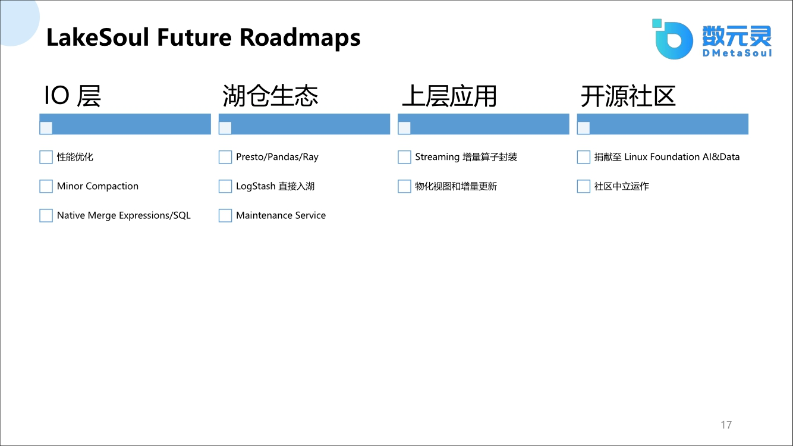

最后介绍一下我们的整体生态建设，诚然我们的roadmaps落下了很多。
这里面简要提一下我们接下来要实现的目标，主要是分为如下几个方向：

1. 因为在io层上面我们还要进一步的优化，我们还看到很多优化空间
   同时compaction还没有做进io层，因为之前我们是与引擎绑定的compaction，现在我们希望把它做成与引擎无绑定的compaction。
2. 实现native merge into的能力，其实我们已经支持merge into的语句，但是只是针对主键表，后面我会做非主键表，主键表实现merge into的表达能力。
3. 在生态上面我们还需要扩大，现在已经提供了Python接口和c接口，后续还会对接presto，doris、 clickhouse等。因为我们接口已经是非常简单丰富，大家只要把开源的source和sink接口对接上去就没问题了。在机器学习上面的pandas和arrow都已对接，但这肯定不会走其他那些SQL的方式了，得使用Python的接口或者走c的接口这种方式。
4. Lakesoul当前还缺失了数据湖的一个重要东西，就是日志。我们考虑接入日志格式，跟别的接入方式类似，让用户尽可能的配置简单，只需简单配置一下而不用关心中间的一些细节
5. 另外就是说我们还有要提供一个服务层，这个服务层怎么说
   就是我们的compaction
   或者说我们的那个clean up就是清理数据啊
   就是说我们希望给他
   以前我们是最开始我们是有参数做自动控制
   就是自动让我发现那个
   那个非常非常耗资源
   就说一旦你compaction和
   你在数据写入发生冲突的时候
   你的compaction没完的时候
   你通过这种自动这种做法
   你会非常的耗资源
   而且阻碍你的数据写入的这种效率
   所以说我们希望把它拎出来之后，做一个单独做一个服务层
   这样的话单独用一套资源就是专门做这些东西
   这样的话你对线上的业务不产生影响
   因为大家可能会很多案例啊
   hudi或者iceberg都有这种
   就说你自动compaction之后
   影响了数据的写入和读出这种能力
6. 当前我们已经分封装了七八个算子，未来达到一定的这种商业价值之后，我们也会把它分享出来
   或者是直接就给大家一起过来去弄这个事也没问题
7. 另外在上层应用上面其实还会做很多事，包括物化视图和增量更新等，就是说物化视图上面就是说
   是我们后面着重要要弄的一个事啊
8. 最后在最近，我们正在将项目捐献到linux foundation AI&data开源组织，我们想要通过这种引入中立社区运作的方式来扩大lakesoul的影响力，也扩大国产湖仓的影响力。

如果大家还有比较关心的问题，可以去关注我们的公众号，或者在我们这个群里面做各种各样的这种技术讨论，源码讨论，以及提一些大家的诉求。今天我的分享嗯就到这，谢谢。

今天的主题是自研国产湖仓一体框架的分享
我们邀请到的嘉宾是来自数元灵大数据部的总经理孙茂森先生
孙老师是是硕士毕业于中科院计算所
有10年的大数据内核的研究经验
先后在工商银行和民生银行深耕于金融业务
大数据架构与数据治理、智能运维、私有云等领域
有多篇的发明专利和国际顶会的论文
大家在收看直播的同时也可以把直播间分享给您的同事或者是朋友
然后可以领取到我们制作的数据湖仓的相关的资料一份
那下面呢就有请孙茂森先生为大家进行分享

首先自我介绍一下
我叫孙梦森，来自数元灵科技，现在主要负责Lakesoul这块的开发

Q & A
Q： 相比于iceberg/hudi的优势有哪些？
A：这优势啊嗯，首先大家呃
我就直接说了
我本来想弄一下那个对比图啊
用benchmark对比首先优势其实
我们其实是首先
呃就是说我们在源数据层面上
大家知道我们不同与其他的
可能就是说
做这个小文件
是用的是文件系统这个方式
我们其实在这上面
就是以前不管说他俩肯定吃过亏
比如说小文件多了之后
你如果不做compaction
啊或者是
compaction有可能小文件多了之后还会爆
OOM的问题
就是说你小文件多了之后
非常影响效率
然后这个时候我们在这块是说
在PG用引进PG之后
千万级的分区
亿级的文件我们都没发现什么问题
所以说这个这个问题
这个首先这个
这个上面是我们这上面着重去优化
另外一个我们就是说
另外一个问题就是说flink CDC

目前我们是直接把商业化的能力给开源出来了
你可以试一下就说你配一个库
这库里面1,000张表
1,000张表之后
你只要告诉我这个库的用户名
密码我这个cdc所有的数据
包括你的表所有的东西全部给同步过来
后台你就看到1,000张表
1,000张表数据全部在里面
里面做任何一个变更
新增一张表都是没问题的
都是能够自动感知的
你不用启停什么flink的作业启停什么
这个是他们也是没有的一个事
另外就是我们要我们要着重强调我们
我们这其实就是对我们这个这种
就是国产刚兴起的这个
这个新兴来上
其实我们与他们
他们是说他们走了四五年的路
我们现在是走了一年多
但是我们在这个IO设计上面
也是比较独特的一个设计方式
就是我们想要走最小的人做一个最简单的方式啊
就是io上面我们是用rust实现的
rust实现这个大家都如果了解rust大家就知道
就说这个这个底层从内存这种安全性
包括这种内存的使用率
包括这种他的这种加速机制
比如说大家现在都要用这种
有向量化引擎什么我们都是
IO层全部给你实现了
这种非常强悍的这种能力

大家可以去做那benchmark
看到benchmark你也知道
我们这个IO加速能力
还有这个那个
就是你读和写的能力都有巨大的提升
你随便拿一个数据可能测试
可能就是说就是就是没问题的
对然后还有还有很多优势
可能就是说的有点多了现在
我给大家说的可能就是这3点非常那个独特
另外就是说merge on read的时候其实我们提供operator功能吗
operator这个功能其实也算是我们比较独特的一个一种方式
可能大家可能说operator
可能hudi可能用的payload也能实现
但是你你可以看看你hudi payload
你写的代码得写多少
我们这operator你就写一行就行了
就是说这有很多
就是
有很多人有比较注重的是用户体验的层次

就说我们
本来是按理说应该商业化考虑这个事
但是我们在
我们在做这个这个开源社区的时候
我们就希望这个一步到位
就说底层框架我们都要
我们该做一些前线技术
该做做上层的上
游的系统对接和下游用户的使用
我们都要考虑
就是说用户上面不需要
太多的这种这种这种配置
大家那个那大家如果flink里边的痛苦
大家都是清楚的其实

Q. schema变更思路

A. 啊另外这个schema那个变更思路，大家比较关心这个怎么实现呢
就是我我们这边基本上基本上
底层都是全部我们被我们被我们改的
基本上没有什么以前的影子了都
这是这样的就是说呃
底层刚开始就得
去拿他那个souce的时候
你比如说举个例子mysql source 的时候还是用的是Flink CC source
那个没有去他的
比如说你该用他的
增亮读还是它的全亮读那块没变
但是拿完之后后面就变了
变了之后什么做了哪些操作呢
就是说schema里面我们分两个流
两个流什么
一个是ddl流一个是dml流
ddl就是说
你所有做的数据变更我都能拿到
所以把这个流给给他拿出来
dml就说你数据
数据你说insert 还是update 还是delete
我们这个也也没有
就是还是走dm l
由ddl拿到了所有的schema变更之后
我们去同步到lakesoul表
去做相应的并更
这是我们的schema
另外一个是我们在dml的时候
你再去写的时候底层走了很多这种
就是咱以前的就是说raw data啊
我们其实是用的binary raw data去做的这种实现
以前的flink可能都用raw data
效率很低嘛
binary raw data一实现效率极高
然后
你这个底是稍微细节一点啊
然后你dml raw data之后
我们在写的时候
他其实能够感知到
就说他要写哪个表
因为我们的所有的表都在这里面
你1,000张包里面就在1,000张
他一个dml里面
所有把1,000张包全给写出来
因为你配的是整库
你没有说指定哪
我们也可以指定哪些你要同步哪些表
但是你如果我配置整库
我会把一个库全部写进去
这个流的时候
你就是说你在写的时候
他会分他是写到哪个表里面啊
再去做那种分区写
再去做那种hash排序
而且我们底层就是native io对吧
这个效率大家也看到了对比
所以说这这这实际方式是这样的
我们主要重重要的是分流
底层在做一些加速优化
他的写的吞吐力啊什么度很会很高
代码如果细节的话我看之前群里有人讨论过怎么实现
那个我不知道是不是群很多啊
就是可以在群里面去看
如果你你不行的话加我们这个群
加我们这个群
我们这个群
给你详细去解答一下这个
这个代码量还是挺高的
有好几万行了应该
这个就专门实行这个功能

Q: 是否支持Oracle？

A: 我们现在Oracle
其实你可以看我们的源码
Oracle也支持
你可以去看看

还有就是我们现在我们现在没有我
我们现在就是所有东西
就是就是开源免费的
你随便拿过去用就行
然后如果你有问题随时随时找我们啊
然后我们都第一时间就帮你解决这个问题
我们我们非常我们非常欢迎讨论
我们不怕有问题
我们就怕大家都在那藏着掖着呢

Q：啊但是有些人问是Oracle DDL同步吗
A：Oracle DDL其实说实话现在DDL同步
嗯
DDL同步在做呃但是有一点问题
就是它都受限于版本的问题

Q：compaction的性能如何

哦我们compaction性能也是不错的
因为compaction其实走的就是说它的原理是把所有历史的这个增量文件
给合并成一个嘛
所以说
你增量文件以前如果是那种小文件的话你你你如果是在
hudi或者iceberg里面走那种文件系统
你去拿那些合并会比较慢吗
我们直接就是通过这种表
直接就把所有的文件给拿出来
拿出来之后非常快也是
而且都走的主键索引
所以那种
是单纯拿原数据层我们是没问题的
但是合并的时候这
这你也看到了我们的写入能力
我们读出能力
和他们那几个框架相比
我们都是有几倍提高的嘛
所以这一块其实你可以测一下
绝对是没问题的

Q：非主键merge into是怎么做的？
A：
主键merge into我大家也
嗯就是说是这么做的
是说
呃直接把它转换成一个lakesoul的功能
非主线merge into
因为你说
里面可以有各种各样的问问条件啊
这个东西是怎么转换
我们是我们现在
现在就是说要把它给做一层转换
就转换成下层的lakesoul的语义
这块其实具体做法没有想好
但是大体思路是有的
只能是现在是这么说然后
然后就是说将来肯定既然你关心了
将来肯定就是说嗯
不出很长时间
这个东西你可能就能看到
非主键merge into是怎么做的
因为
我觉得这个大家提这个需求是非常有必要的
实践中是非常常见的一个问题

Q：大家有问这个Schema变更的d d l 尤其是d m l
数据是怎么处理的
嗯这这个问题这个问题还
挺好的呃就是说我们在其实在
我们
我们其实在在做这个ddl的时候
我们其实
你你在写那个
因为我们不是
呃如果是晚的话那么ddl晚的话其实
嗯首先是这种情况比较少
另外就是说他肯定会有一个窗口抖动
就是抖动的时候
就说网络抖动引起
他可能会延迟啊延迟之后
其实对我们来说
其实那个数据已经来了
数据如果是新来的时候
其实会有一部分的
就是说他原先他拿到的那个数据的一个表
数据那个表还是之前那个表表结构
这种表结构其实这一块在写入的时候
可能会造成一点点困扰
但是如果一旦但是我们这块会做了
我们不是有Schema的扩增的功能吗
但如果你是扩了一个Schema
其实对我来说就没问题的其实
但如果你小了这个
只要你同步过来之后
最后在上层读的时候会把
自动做一次过滤的
就说你的schema晚了之后你最后再读的时候
我会我们会按照schema最后那个schema那个模式去读数据
我从不同从不同文件里面去读去摘取
就是最后会会数据可能会
多一点或少一点
呃不是说是多写少写啊
是多一列可能少一列这问题
但是就是说
最后不影响最终的一个结果

Q：啊整库写入会有压缩吗
A：其实我们在在写入parquet的文件中
都是做压缩处理的

Q：啊这个时间线回述啊必须支持
A：这是特有功能
这个时间回述是呃
你是你是
比如说快照你是指定
你只要指定时间戳
你是想快照还是想增量都没问题这必须有

