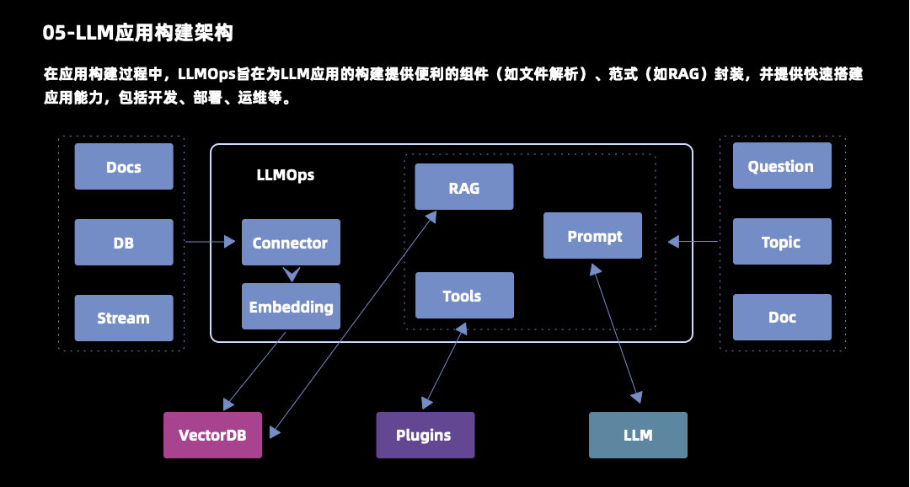

# LLMOps大模型

## 目录：

一、LLMOps的定义

二、LLM微调技术

三、LLM应用构建架构

四、LLM应用构建难点

## 一、LLMOps的定义

LLMOps可以分解为LLM和Ops，其中LLM是指大语言模型，即大模型。Ops是指的平台和工具。完整定义是指基于大模型应用程序的生命周期、管理平台或者工具。

大模型它主要分为三个阶段：

- 第一个阶段是预训练阶段：

  预训练阶段是由数据集通过预训练产生预训练模型，这个过程是我们千模大战的主战场，各类开源闭源的大模型都是通过这个阶段产生。

- 第二个阶段是微调阶段：

  微调阶段是指特定领域的数据集，在预训练模型的基础上面，通过finetune手段，产生特定领域的模型。

- 第三个阶段是应用开发阶段：

  应用开发阶段只是在预训练模型和特定领域模型的推理功能之下，我们给他喂入我们的输入，以及我们经过提示工程进行指令编排，产生我们所需的大模型输出。

对于大模型应用平台来说，关注的阶段主要包括模型微调和应用开发阶段。

大模型应用主要的生命周期包括开发、部署、配置和运维。我们着重提出了配置的阶段，即prompt engine提示工程。这与传统的应用程序可能会不大一样。因为这个阶段类比于传统应用程序的配置阶段，在大模型里面却是非常重要非常核心的阶段。

## 二、LLM微调技术

介绍完大模型的定义后，我们先对大模型的微调技术进行了解。在Bert出现之后，模型的微调技术得到广泛流行，即固定预训练模型的权重，根据具体任务在特定场景进行微调。

如右上图所示，展示了各类开源大模型在特定领域数据进行加权设计之后，通过增量微调技术，产生的特定领域模型的一个过程。这个过程是循环迭代，循环增强。不停的对各个领域的数据进行清洗补充之后，提升特定领域模型的效果，产生更强的模型。

目前使用的微调技术通常被称作PEFT，参数高效微调技术。这个技术在尽可能减少所需的参数和计算资源的情况下，实现对预训练语言模型的有效微调，解决了传统微调技术需要大量资源的问题。

### 基座大模型概述

在了解具体的微调技术之前，先对基座大模型进行简单的了解。目前的基座大模型主要有三种技术路线：

- BERT模式
- GPT模式
- 混合模式

追溯它的发展历史，在BERT于18年提出之时，大模型真正开始了流行，那个时候流行的都是与BERT相似的Encoder-Only的架构，在19年基本上是独霸江湖。然后在19年谷歌提出了一个T5的模型，这个模型主要是为了解决Text-to-Text的统一框架结构，这个模型也是取得了比较好的结果，引领了encoder到decoder的新一轮变革。之后大概在20年，GPT3的出现，Decoder-Only架构已经开始慢慢的枝繁叶茂了。最后到22年的ChatGPT横空出世，Decoder-Only目前看起来大有一统江湖之势。

先看下三种架构的主要区别：

- 第一种Encoder-Decoder，又称为T5模式。它的训练包括编码和减码阶段，主要的模型类型是判别式，任务的类型是全面型。它主要的代表模型是T5，BART以及GLM等等；

- 第二种Encoder-Only，这是BERT模式。这种模式的模型主要类型是判别式的，任务的类型是理解任务以及单任务模式，它的主要代表是BERT以及文心的早期版本；

- 第三种Decoder-Only，也就是GPT模式。它采用的训练方式是自回馈模型的类型的生成式类型，任务类型是生成类以及多任务，现在常见的GPT系列以及Palm、 LaMDA、Bloom等等都是采用这种方式。包括文心3.0也更改为这种模式。

### PEFT

回到大模型的微调技术上，目前主要的微调技术包括以下几种：

1. Adapter Tuning：

   Adapter Tuning的方式就是新增adapter的层再嵌入前方目的结构里面，在训练时固定住原来的训练模型参数不变，只需要对新增的层进行微调。它优点是在只额外增加3.6%的参数规模下就相当于做了一次完整的finetune。

2. Prefix Tuning：

   这是前缀的策略模式，在输入的TOKEN之前先构造一段任务相关的虚拟TOKEN（Virtual TOKEN）作为前缀，然后在训练的时候只更新前缀部分，在transformer里面，其他部分是固定的，相比原来的finetune，对于不同的任务只需要不同的prefix就可以保证不同的训练效果

3. Prompt Tuning：

   这是前缀Prefix Tuning的一个简化版本，只要在输入层加入prompt tokens，并不需要加入MLP进行调整来解决比较难训练的问题。在这种情况，很多时候只需要调整最上面的一层。这是现在用的比较多的方式，只需要训练模型足够强大，Prompt Tuning的结果会越来越接近于Fine-Tuning。

4. P-Tuning：

   P-Tuning与Prompt Tuning的区别是在于它将prompt那层换成了embedding，embedding在实际上表应能力更强，它的优点就是微调参数只有0.65%，比之前的微调技术参数更少。

5. LoRA：

   LoRA是在整体的微调中在涉及矩阵相乘的模块引入a、b两个低秩矩阵去模拟Full-finetune，也就是全微调的逻辑。这的好处在于它跟之前的所有推理方式都是正交的，在推理阶段不会引入额外的计算量。

## 三、LLM应用构建架构

了解完当前主要的微调技术，我们来了解LLMOps的核心部分，即大模型应用构件的架构。

在应用构建过程，大模型平台需要为大模型应用的构建，提供便利的组件，以及具体的范式，提供快速搭建应用的能力，包括开发步骤运维。

那么大模型应用主要应该如何来构建？首先需要了解到大模型的四个缺点：

- 第一个缺点，大模型是静态的，大模型训练成本比较高，它的所有的数据可能终止在某个时间点，在这之后的数据没办法实时更新
  而且大部分情况下，我们其实也没有很高的成本去做finetune。
- 第二个缺点，大模型对于特定领域的数据，特别是私有数据是没法获取到。
- 第三个缺点，大模型的成本问题，公司或者个人开发者没法实现微调过程。在大部分情况下还是会使用云端的大模型。
- 最后一个缺点，大模型是一个黑盒，在很多情况下我们没法知道大模型回答的东西到底是它掌握的知识还是胡编乱造的，它没有一个准确或者保真的逻辑在里面。

基于此，大模型应用的主要构建逻辑就出来了。这一阶段是对大模型的原生能力体现，使用问题question、主题topic或者文档Doc，根据prompt与大模型交互产生需要的内容。这里包括问答、改写、文档生成，包括知识推理，都可以使用大模型原生的能力。但它是没办法知道新的能力，也没办法知道私有化的数据。我们需要引入一个范式（RAG检索增强），检索增强的生成是基于本地的知识库。为了增强它的语言理解，通常会使用如向量数据库的方式来构建。在数据准备阶段，需要引入以下组件：

1. Connector，即数据准备。包括把文档数据，数据库的数据，数据流的数据等通过embedding向量的方式存到向量数据库里面，供RAG调用。在大模型问答的过程中，Prompt可以通过RAG去检索最相近的一些文档、知识，供大模型引用进行问答。这种情况能保证知识的有效，准确真实。
2. 那么在有效准确真实之后，需要扩展一些能力，比如本地的一些API、数据库、或者现实世界更多的知识被大模型给调用。在这种情况下引入一个Tools（工具的使用）过程。我们可以把API调用或者大模型外部工具的使用，作为一个插件。在与大模型交互之前先通过工具去获取一些信息，再与大模型进行交互，达到一个增强的结果。这能极大的提升应用的交互能力。

## 四、LLM应用构建难点

大模型的应用天生是一个Agent的，也就是智能体，这是大模型应用搭建的核心方向，这既是重点也是难点。对于智能体来说，大模型的核心是完成对话和推理的任务，它具备一定的自主行为，需要以下的几个核心部件：

一、工具，即Tools， 依赖大模型的FunctionCall能力

二、记忆，里面包括短期记忆和长期记忆。短期记忆是指大模型的上下文，需要大模型具备多轮对话能力。长期记忆就需要像数据库那样去存储交互的一些细节。实际上知识库也可以认为是记忆的一种。毕竟人类的学习过程是存储记忆的一个过程。

三、Planning，规划能力，指依赖大模型的一个内置COT，即思维链的能力。

### 常见Agent技术

在构建的难点里面提到了agent，agent主要包含以下几种类型：

- 第一种是自主式智能体。自主式智能体是指根据指令或者引导自动完成任务，达成目标结果，明确工具属性的一个智能体。目前主要的项目如：
  - Auto-GPT：它是大模型思维链自主实现任务目标的项目。

  - BabyAGI：它基于前序任务结果和目标来创建新任务。

  - GPT-Engineer：它是根据向AI提供一些动人的解释或者指导来完成完整的代码库。

- 第二种是生存式智能体，这种智能体是模拟人类具备记忆和自主决策能力。但不是以服务人类为目标，而是以模仿为目标，这里面的优秀项目如：
  - GPTeam：它内置了很多智能体，每个智能体都有独立的记忆，能够相互的交流进行协作。
  - GBT Researcher：根据定制化的需求，生成详细客观不带偏见的研究报告。
  - MetaGPT：多个智能的不同角色协作来完成一个复杂任务。

### 技术难点

Agent在真正的落地过程中会碰到如下5个难点：

- 可靠性。大模型的幻觉是非常难克服的点，经常在planting阶段或者说少载阶段会提出一些不真实或者环境无法满足的操作或者推论，导致应用比较难执行
- 稳定性。大模型是非常随机性的，在用户多次结果中，可能会拿到一个截然不同的结论。对于生成式智能体，大家可能会觉得这个东西具有一定的吸引性。但是如果是放在具体的任务场景，会是比较难以接受。
- 准确性。对于大模型来说，它的知识欠缺的逻辑。我们需要给他一些参考的知识，基于参考知识来回答。受限于当前的搜索技术，在应用构建中，很难保证获得到的知识或者记忆是最相关。特别在RAG系统里面，这会体现的特别明显。
- 完整性。现在大模型的TOKEN一般来说比较限制的，如4096或者现在推的比较多一点的是6K，但也达不到一个文档的完整的长度。在这种情况下，我们不可能将一个完整的文档或者任务作为上下文投喂给大模型。这会导致一些任务比如法规读取或者coding比较难取得很好的体验。
- 成本。我们的智能体在实际的运用过程中，特别是比较复杂的一些诸如使用思维链、思维树或者React这种大模型交互的智能体。他需要与大模型进行反复的交互。即使是一个极小的任务，也会产生比较高的一个成本。

## 五、LLM应用解决方案

针对以上难点，我们针对性的提出了相应的解决方案

针对可靠性，稳定性问题。我们有称为Prompt IDE的解决方案，它的核心逻辑是为我们的提示词建立一个稳定可靠的解决方案。Prompt IDE中文名可以称为提示词工作区，主要的目的是为了保证与大模型交互的提示词，最终能够产生一个稳定可靠的版本，它的核心能力：

- 参数化模板：

  参数化模板的作用主要是为了扩展或者批量量产数据，它需要支持参数化的模板是自由替备参数，提升Prompt的场景应用效率。比如根据你的具体职位，会提供一些与某些知识领域相关的话题。你的工作就是使用某种新闻风格，来为某类目标人群解释这些相关概念并提供提示示例。这个地方我们有一些参数，比如职位、知识领域、新闻风格和目标人群，可以产生比如100条的评测数据。对每个职位或者资质领域都会列一下，然后再整理评的这个参数化模板的功能或者效果怎么样。
  
- 大模型的调试：

  不同大模型针对于指令或者具体的一些参数会有不一样的响应结果。我们通常调的就是在提示工程词里面加一些指令性的设置或者在最后的参数的随机性上面做一些调试，这需要我们能够灵活的在不同模型下快速的获得相应的结果来保证写Prompt的效率。

- 多版本的支持：

  大模型会有一个比较玄学的点，它不是线性也不是全能的。我们在不同版本的调优过程中可能会发现a版本对于a任务表现比较好，b版本是在a版本的基础上进行改良，针对于a任务确实效果更好，但是对于b任务来说，它效果反而降低了。在这种情况下，可能需要对于不同场景产生不同版本来进行沉淀。

- 批量化回测功能：

  由于Prompt的不稳定，我们应该如何评测Prompt的好坏？我们不能针对一条数据好就觉得这个Prompt的好，也不能因为一条数据差就直接将此Prompt pass。我们需要比如100条或者200条等的批量数据发起批量调用，根据结果做标注。认为它批量回测和评估的结果做一个优质结果的占比，来更科学地评价Prompt的优点。这是针对于稳定和可靠的一个解决方案。

针对于成本和增效的方案，主要包括一键部署和监控：

- 一键部署主要是指我们大模型应用平台，能够让用户快速构建应用上线，并且能够在线调优实时部署整个SOP里能够获得一个比较好的体验，这就需要我们有以下核心功能：
  - 低代码的构建，我们很多组件都需要去把它快速给沉淀下来。然后用户在这些组件的基础上能够快速搭建出相关的一个场景；
  - 场景的模板化，我们搭建场景需要能尽可能的复用，因为大模型实际上很多的流程都是比较固定的，那么在提供了丰富的模板之后，能够快速孵化出一个新的场景；
  - 配置的在线化，即Prompt工程。它实际上能够进行快速的替换、调节，让线上的一些效果快速的更改，调试发布。

- 针对线上的效果，我们需要做到效果的监控和成本的监控，包括：

  - 针对于知识问答的点击场景，也是比较核心的场景。它依赖于召回结果的准确性，因此知识库的命中率和相关性的监控，就为这一效果做保证。

  - 敏感词调用，这是针对于大模型的监管问题。大模型通常会命中一些敏感词，导致输出结果异常。这通常是输入的问题，由于RAG的影响，输入其实大部分是来自知识库的内容。因此知识库或者问题产生敏感词会极大的降低用户的体验，产生不可预知的行为。这种情况下，如何评估知识库的好坏就，得尤为重要。实际上可以采用对敏感调用率进行监控，来保证场景下是以极低风险在运行，而不是经常命中敏感词，导致应用不可用。

  - 成本的考虑，需要对token消耗进行监控。特别在改写或者agent的场景，在大模型进行多次交互过程中，消耗的token数量是非常可观的。企业在控制成本的考量下面，需要直观的获取每个场景token消耗速度，来保证核心成本不被浪费。
