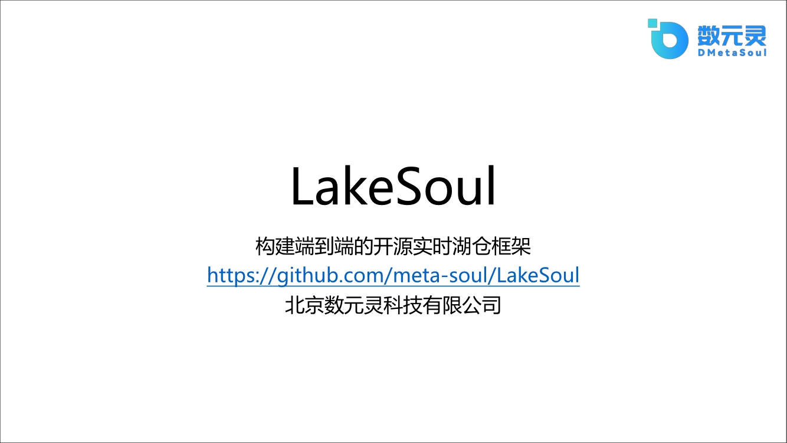
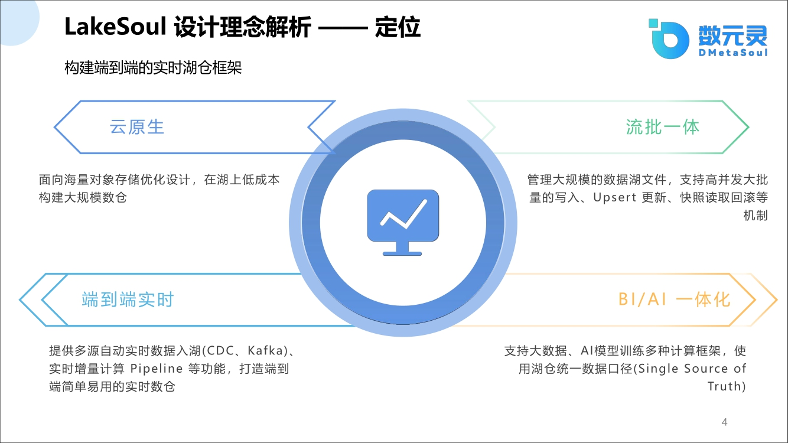
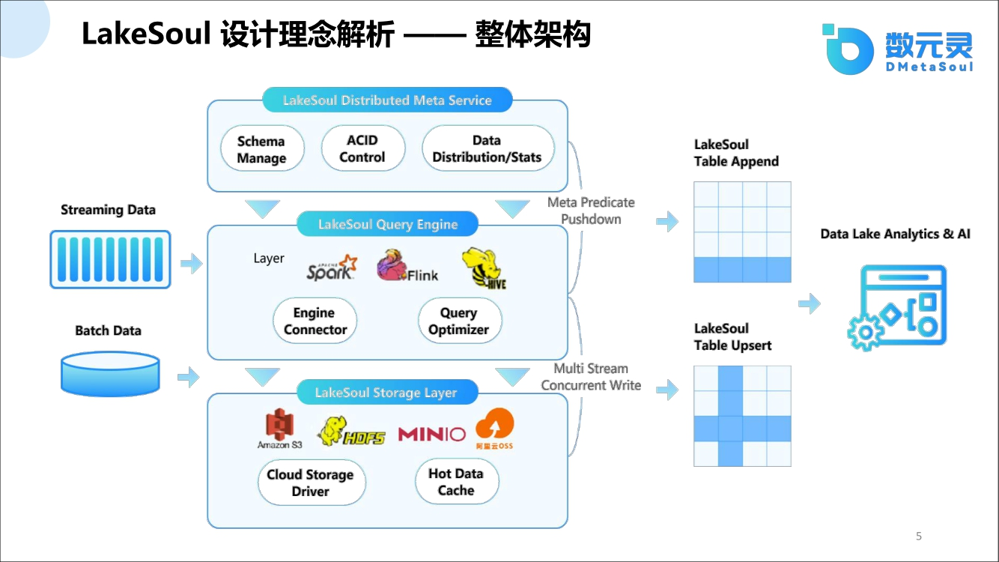
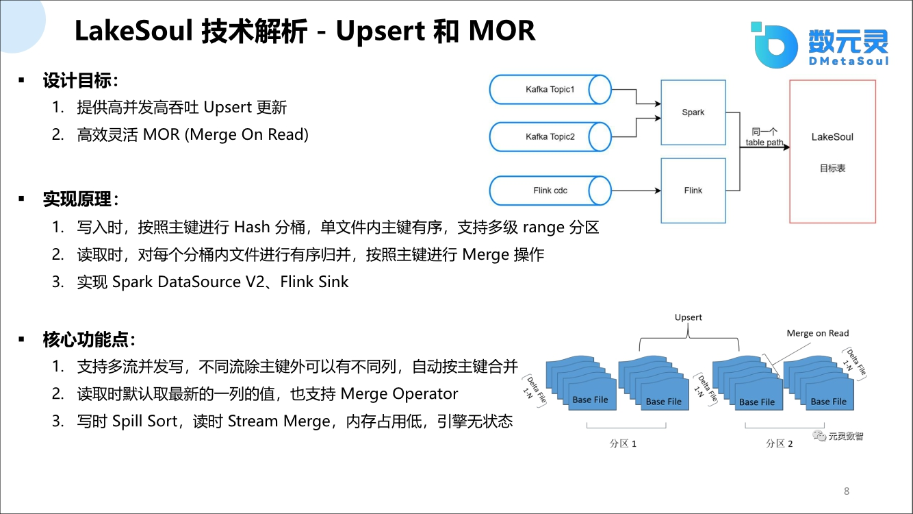
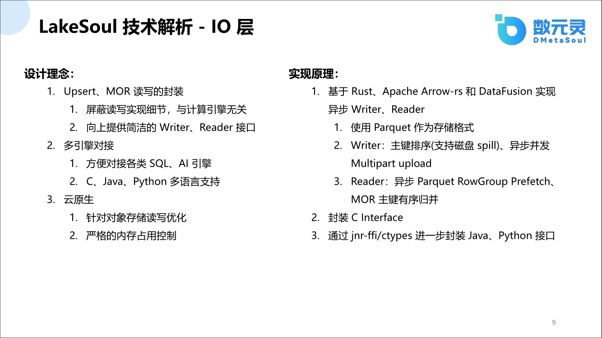
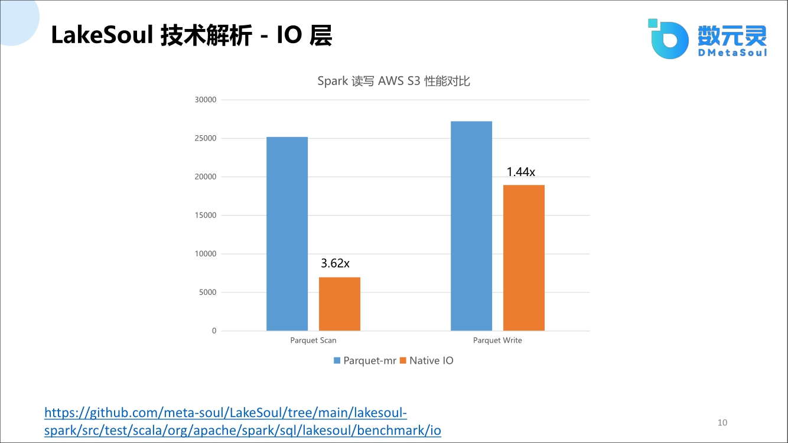
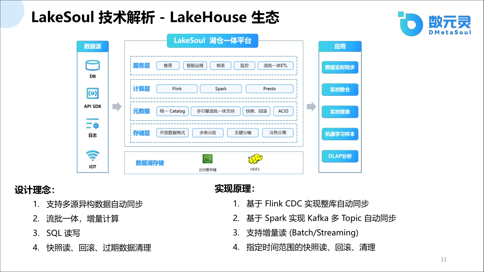
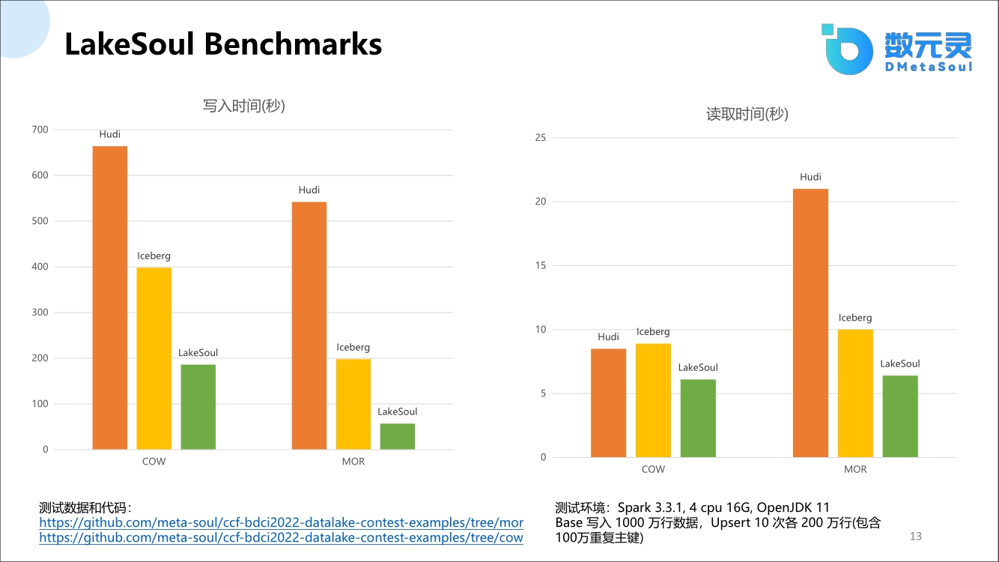
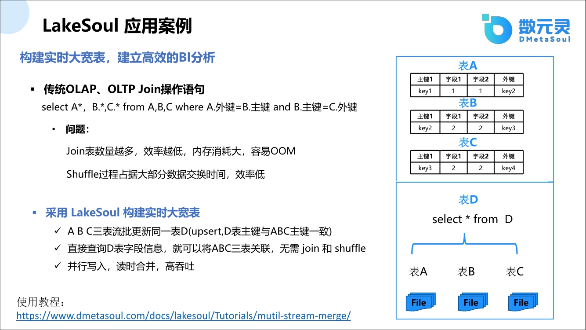
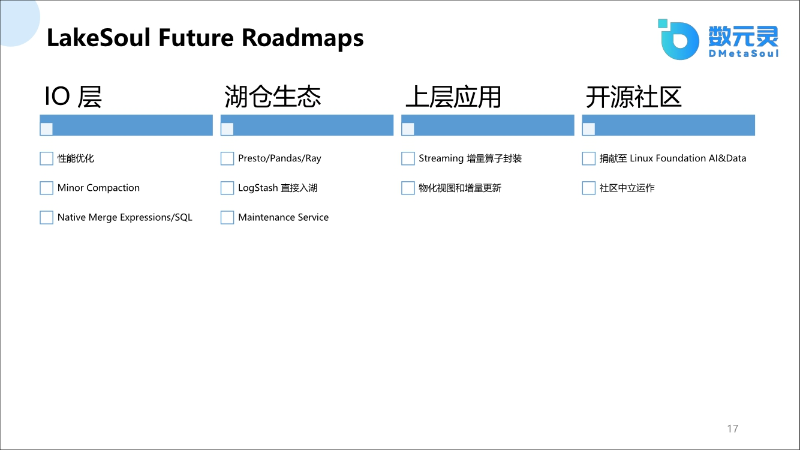

背景：这次分享的主题是数元灵开源一年多的数据湖产品Lakesoul。数元灵同时还开源了另外一个产品，一站式机器学习平台MetaSpore，在上面可以做很多搜索，给大家在业务上带来一些非常方便的体验。

Lakesoul在我们公司主要的定位是希望构建成一个端到端的开源实时湖仓的框架。

该框架如何实现端到端的实时湖仓呢？

这里涉及到一些设计理念的问题，Lakesoul作为现有国产唯一的开源框架是完全由我们自研的，并不是基于其他的框架之上开发的。从底层设计到上层应用，包括整个生态系统的建设，整个链路都是我们自己实现。今天在这里详细分析一下我们是如何设计的、为什么要这么做、做好之后会带来什么好处、有什么样的应用价值以及未来怎么做。本次分享的目录：

- LakeSoul 设计理念解析
- LakeSoul 技术解析
- LakeSoul Benchmarks
- LakeSoul 应用案例
- LakeSoul Future Roadmaps

### LakeSoul 设计理念解析

因为湖仓一体框架概念比较新，大家不太了解，可能会思考为什么要使用湖仓一体的框架，所以在正式讲解技术主题之前，由我先介绍一下湖仓一体的技术背景。

提起湖仓一体的技术背景就离不开云原生，云原生给我们带来很多便捷的体验，比如随时拉一个镜像，搭建几台集群，基本上通过一件事或者几行命令就能把一个集群或者一个应用部署上去，这极大减少了使用和维护成本。并且云原生在底层，都是以对象存储为基础的，对象存储带来的最大的好处就是特别廉价，同时它的性能也不差，存储数据的格式多样化，包括结构化、非结构化、还有半结构化等等。

对于数据分析来说，这样的一个廉价的存储就能存储更多的数据，也会带来更多意想不到的收获。首先是带来数据链路模式的转变，有一段时间特别兴起的一个名词：”数据入湖“，同时相应的出现了一个新的工种： “入湖工程师”。针对数据，先入湖，而不是像传统模式，数据结合使用方先做处理。我们归结这种处理方式的转变是从传统的ETL转成到现在的ELT。

ELT的含义可以理解为这样的一种模式：

- E: 是从源头拉数据过来
- L: 是先加载在我我这个数据湖仓里面，就是先加载数据然后再做处理
- T: transform，就是说再做处理，比如做count，或者做字段这抽取，或者做其他处理等

传统ETL模式是：

- E: 新数据抽取不变
- T: 做转换，还是做count的distinct
- L:转换之后的load，在传统框架里面具有很多不同的实践方式，比如会分流和批：
  - 对于批的数据，一般会用spark去做处理，处理T+1的数据，处理完之后存在数仓里面，典型的就是Hive。
  - 对于流数据，一般就用flink处理，也没法直接存在hive里，需要找一个更强劲的数仓引擎，典型的比如clickhouse或者Doris。
  - 如果还需要日志型的数据话，就需要存在Elasticsearch引擎里面.

传统的ETL这里面会造成了一些困扰：

1. 链路多样：包括一个流链路和一个批链路，导致流批不一致

2. 存储不一致：比如离线数据存储T+1的数据，日志数据存入elasticsearch，实时数据存入clickhouse。这会导致整体成本都很高：
   a. 维护成本高：可能需要一个团队或者几个团队来维护这一套产品。对于数据分析师，如果对某个表提出了一个新的处理方式，比如新增几列或者修改几列，需要及时同步数据工程师对相应的任务进行调整，对任务进行不断的修正。在传统模式下，先把T任务按照数据分析师的要求重新转换，再把T+1的数据重新从源端拉取回来。但是源端的数据可能存在保质期（比如7天或者一个月），如果需要拉取更久的时间，数据可能就存在丢失，数据的价值也就体现不出来。
   
   b. 开发成本高：对于上层的AI/BI开发者，也造成了一定的开发困扰。比如说对于AI开发者希望用的数据越广泛越好，包括存在hive的离线数据和存在clickhouse里面的在线的数据，还包括存在elasticsearch的日志数据等。尤其是类似最近比较火的chatGPT这种大模型，需要大数据量才能完成神经网络的模型训练。大数据量意味着数据多特征的特性，对于AI工程师开发就比较痛苦，既要集成Hive，开发Hive的接口，又要开发集成clickhouse的接口，还要集成elasticsearch的接口。存储的不统一，导致开发成本巨高，也造成了AI和BI工程师之间开发不统一的一个现象。

所以说传统的模式存在现象比较多的问题，因为历史原因，它也是发展必经的一个过程，但是现在是云原生时代，我们希望实现一个大杂烩。

数元灵的设计理念是认为现在的ELT模式是一个通用的比较流行的模式，即数据先入湖仓，再在上面做处理，并且处理的链路要统一，不能像以前那种spark和flink两条链路。

只有湖仓数据已经统一了，在上面做计算才能更方便。但流批统一可能还有很多其他的一些实现细节，这在后面会有提到。另外流批统一之后，自然而然的AI/BI，都可以在上面做计算，也做到了统一。

结合上面的背景总结，我们对lakesoul的定位是在云原生之上存储海量数据的数据湖技术，首先云原生是我们一个很重要的特性，提供海量数据的数据湖技术。我们提供输入仓库，这和数据仓库不一样。数据仓库是有自己独特的计算引擎和存储引擎。

Lakesoul的使用模式是不一样：

- 第一点：直接在数据湖上面去勾选数据仓库
- 第二点：在ELT模式下需要将所有数据进入到这个湖仓框架里面，那必须要提供一个端到端的数据转入能力，而且实时和批量的数据转入能力都需要支持，不同的异构数据都能进入到湖仓里面，而且必须是简单易用。因为之前大家可能已经用flink写了很多任务，如果要做额外转化的话，开发成本和入门成本都会很高。现在要提到端到端的话，基本上用户不需要很多东西，直接配置连接信息，剩下的数据都要进入到这个湖仓里面，不需要去做很多操作。在这之上，我们提供了很重要的流批一体的能力。流批一体最重要的点在于并发写的时候，要提供一个高吞吐的能力，可能会在很多模式都需要高吞吐，比如upsert模式，还有copy on write模式是都需要提供。另外在不断的写的时候，还能提供timestamp的能力，这在后面会再详细展开。
最后所有能力都统一之后，我的AI和bi框架都能用这个数据去做进一步的分析，lakesoul不是说简单的只支持sql，同时也支持如Pandas这类AI的引擎。

从整体架构上来看，我们是做了一些分层的处理。
上层是一个元数据的分布式的服务层，这个元数据服务层是做schema的管理，同时提供acid的并发控制。不同于以前那种分裂的存储，只有hive有元数据信息，而clickhouse里没有，也没有一个总体的生命周期。我们的元数据层对数据能够提供上帝的视图，就是在这一个服务层能够将数据湖里面所有的文件都展示出来，AI和BI分析人员都能够从中获取文件的所有信息。

在计算引擎层，我们对接了一些开放的引擎比如说flink、spark、hive，未来还会对接presto，对引擎对接都是开放的。

在底层，我们对接很多对象存储，包括HDFS、S3、MINIO、OSS等都是有能力去支撑。另外数据写入格式是用的一些开源的格式，如parquet/arrow等开源格式，而不像某些数据仓库，使用自定义的格式，对于使用其他数据仓库就显得不够通用。

最后这一套整体架构，不管是流还是批数据都能进入到湖仓框架里面，流批数据统一，高并发高吞吐，对于上层AI/BI的分析师，可以直接从中取出全部数据。

### LakeSoul 技术解析

通过概述整体框架之后，给大家总结一下我们的几个特色的技术能力：

1. 我们提供的基于ACID的高并发高吞吐的能力。

   当想要实时写入的时候，通过ACID能控制写时不冲突，遇到冲突的时候会做一些冲突检测。
   另外我们提供行列级别的upsert，这样比表级别在吞吐量上表现的更细腻度，并发就会更高。在元数据这一层，我们提供分布式元数据，对比现有的同业产品，它们产生小数据文件的元数据文件会比较多，会造成一些困扰。

2. 在对接计算存储引擎上面。

比如说对接现有云原生的对象存储上，我们是做了大量的加速优化，后面会详细介绍我们是如何做的，这在性能有几倍甚至十几倍的提升。

深入细讲介绍一下我们的元数据层是如何设计的。我们设计元数据层的主要目标是，希望能提供高并发的实时更新和批量更新的能力。

在以前传统的数据仓库上面，比如在同一个路径下面同时写数据可能会造成覆盖，你也无法知道读的是否是最新的数据。如果事先引入元数据层的话，在高并发读写的时候就能够实现读写分离，在读时能读到比较一致的数据。另外在高并发写的时候，有很多元数据，会产生很多元数据的小文件，比如在hudi/iceberg里面，会产生很多delete file。元数据的文件规模一旦变大，会造成很高的性能瓶颈。虽然有各种各样的优化方法，但是我们实现的方式是直接使用postgresql数据库来做元数据管理，我们可以管理表、管理分区、管理文件，在每一个管理表里设立主键，可以认为这就是它的索引。另外我们通过数据库的事务机制来控制着并发写的时候产生的冲突，同时我们实现了快照读的方式，快照读指你只能读某个历史的版本，或者读最新的一个版本。而正在写还没有提交的数据，是不会读出来的，这就是通过快照读实现了读写分离。

另外PG数据库的性能高，单机模式上面可以支持千万级别的一级分区的文件。众所周知HDFS上面的小文件问题是一个比较头疼的问题，因为它不能做增量更新，你只能采取一些其他的处理方式。如果在云上面就可以使用PG数据库的分布式数据库协议来做横向扩展，满足更大规模的数据要求，能达到几十亿级别。另外在元数据并发写的时候，为什么我们能实现并发控制呢。是因为我们对任务在提交的时候，根据提到类型做了细分，比如区分为append操作、update操作、merge操作和compaction操作。细分不同任务类型的好处是在提交的时候，我们会对不同类型做判断是否允许并发，如果产生冲突就会回退，这也是基于MVCC的技术实现的快照图。因为MVCC是数据库上常见的实现方式，我们做了很多借鉴。

最后在元数据提交的时候，是支持读写分离的。我们在写时提供了两阶段提交协议，在数据写入后，再提交的时候确保数据是exactly once。

接下来着重讲的点是upsert和mor（merge on read）的能力。对比之前提到的copy on write，在lakesoul里面merge on read是天生支持的。比较copy on write 和mor的两种场景：

copy on write一般大家可以认为是面对读多写少的场景会比较好，因为copy on write的实现方式上面是在写入一批数据时，会把之前的数据先读出来，做一次合并，然后再写数据。所以说在写数据时，会产生写增大的性能问题。在面对读多写少的情况下会比较好。

但是在写多读少的场景下是需要有upsert的能力，即update and insert的能力。我们引进upsert，在写多读少场景下提供一种高并发的写入机制，每次upsert就产生一个新版本，在读的时候都会做一次merge on read，对已写的数据做一次合并。我们的实现方式是在upsert的时候要求必须提供主键，然后按照主键进行hash分桶，单个文件再按主键做一次排序，可以理解在每一个文件里面的数据也是有序的。另外我们还支持多级range分区，可以运用到一些分区查询中。在读取的时候，因为我们单独文件是有序的，在多版本文件产生后，把几个有序的文件做一次归并排序，实现merge操作，这样的归并操作效率会比较高一点。另外如果在归并的时候，需要做一些其他的操作，比如对于同一个主键的不同版本数据，拿最新的数据求和，可以使用我们提供的operator的功能。这个operator的功能能够控制主键的行为，目前默认的行为就是用最新版本的文件去覆盖以前版本的文件。又比如需要对同一个主键，做一次求和操作，但是这个主键里面有null值，希望用之前版本的非null值来做，这也是支持的。

在upsert的能力上，因为多流并发写的功能，我们可以扩展出很多新颖的东西。多流并发写是指不同的流同时往一个表里写，不同流需要满足一个条件，就是主键必须相同，但是非主键列可以不同。因为有acid，可以相互往同一个表里写，即使发生冲突了也不要紧，能保证数据的一致性。所以在写的时候，都可以并发的往里写，提高吞吐率。在最后读的时候，是如何去做合并的呢？其实读的时候主键是不变的，但是非主键列如果有就取出来，即不同流里面的主键都能取出来，这叫做schema引进。最后就可以像一个个join操作，自动扩展成大宽表，这是一个很特色的功能。

另外在写的时候内存占用率是极低的，同时是与引擎无关。其实大家在使用hudi或iceberg的时候，比较关注它们的性能，但是没有关注它们的资源消耗，比如内存消耗等。会发现它们的内存消耗是很高的。同比lakesoul的内存消耗是非常低的，因为我们使用rust做了底层的处理。

正如上面说的，我们在io层上最近实现了很大的突破。比如传统的hudi或者iceberg的框架，对不同的spark版本，或不同的flink版本，可能都需要实现一套merge on read或者是copy on write，开发成本会比较高。所以我们专门独立出一个io层的概念，该io层与计算引擎无关，只提供简单的读和写的接口，上层引擎只要调用读和写接口就能使用server 的upsert功能、merge on  read功能、copy on write功能，以及引入其他operator的功能。

针对计算引擎，我们只提供最简单的writer和reader的接口。开放计算引擎接口，对接flink、spark或者AI引擎。AI引擎接口不是简单的SQL就能搞定，还要用Pandas接口，在分布式场景下，还有tensorflow或者pytorch的接口，因此IO层得支持多语言。我们底层是用rust实现，提供c的接口，Java的接口，Python的接口。另外我们的底层是是天然支持云原生的，底层利用rust做了大量的存储优化，而且严格控制内存消耗，内存使用非常低。我们结合参考了arrow-rs 还有arrow-datafusion的一些实现的方式，写了很多rust的代码，实现了异步式的writer和reader，这对读写加速非常重要，对性能有很大的提升。

我们现在主要实现的是parquet的格式，后面会接其他格式。另外在writer的时候，按照主键排序实现了异步的multipart upload的机制。另外在reader的时候，我们尝试row group预读的方式，在读当前row group的时候，下一个row group已经出来了，整个效率也会非常高。

最后我们也实现了 merge on read按照主键进行有序的归并。

我们通过JNI提供Java接口，通过ctypes提供Python的接口，后续大家可以在我们的github上面去看一下我们的最新的接口文档。

这里简单介绍一下，我们用这个io层到底有多大的加速。通过使用spark去读aws  s3的数据，把spark里面的底层原生的parquet mr替换成我们的native io，进行对比实验。发现在读方面，我们会有3.6倍的提升，在写的时候也会有1.44倍的提升。

大家可以根据上面贴的链接去尝试做对比。我们的代码都是公开评测的，数据也都是开放的，我们希望在国产这一块，可以做到一个很好的领先水平。现在大家比较讨论国产化，在这个背景下，作为国内现有目前唯一的开源湖仓框架，也是有我们很多独特的设计和优势，这也比较符合当前的政治理念。

上面讲了很多细化的功能，现在从整体生态来讨论。

在生态系统上面，就像之前的定位一样，首先对于数据，我们希望任何异构的数据都能同步过来。同步进来之后，做增量计算或者流批一体的计算都在这个系统这里做，包括ods、dwd、dws这种数据分层的设计也在这个系统里实现。上层提供面向用户的接口支持，不同的用户可能需要不同的接口，比如SQL，AI公司的append接口等其他接口。

另外最重要的功能是在很多细化工作上，数据不断进来之后都会带版本，可用于快照读，也可以实现回归，做增量操作。我们把湖仓一体平台搭建好，建好之后只需要解决上端的数据源问题，直白点就是考虑如何把同步迁移到湖仓里面。

大家在考虑使用湖仓框架，会有很多问题：

- 第一个问题是在现有技术框架下，比如hive中已经有很多数据，需要做数据迁移。如何解决数据迁入到湖仓里的问题。
- 第二个问题是面对不同的数据源，需要自己做很多支持。比如当前已经有Flink CDC，可能同时还有很多Flink SQL，需要先去mysql里面拉取数据，再在后排起一个表，往这个表里面塞，会产生很多开发成本。我们在这方面做了考虑，基本上只需要用户做一些简单的配置，填写连接信息，就能享受到湖仓一体带来的优势，在数据的同步中出现数据failover的时候，也需要提供保证exactly once的机制。包括数据源的动态调整，在底层对用户都做了屏蔽。
- 第三个问题是数据在解决上层数据入湖之后，需要对接下游数据，提供给用户使用。这里有很多不同的方式的，比如只是做一些简单的bi报表分析，就可以直接提供JDBC接口或者restful接口供用户使用，直接拿数据就可以做一个简单的报表分析，这在我们规划中，未来可能会有一个开源的产品给大家去看。另外对于bi分析师来说，都是希望数据更多更广。正好湖仓里面的数据是又多又广，可以拿来做各种各样的数据加工处理。先前提到的我们支持流式upsert，大宽表的拼接能力，可以认为这是无限扩大的特征能力，在后面会再进一步介绍。

然后在生态里面，我们现在已提供了flink CDC的整库入湖，自动ddl同步的能力。

举mysql的例子，如果在mysql上面新建的一张表，或者在表里面做了更新，比如新增或者删除，是无法原生感知到的。你需要把flink作业停了，之后再修改sql语句，完成之后再起flink作业，才能把新的数据同步进来。这样的话对开发是比较困难，需要不断改不断停，要是任务多了就会造成麻烦。我们在这快的核心是只需要配置一个库，配置库的用户名密码，后面这张库不需要做任何管理。新增表，新增数据，或者在数据表里面修改数据，都全部自动化处理。在这块我们改了很多内核的源码，做出了类似于商业化的产品能力。另外在kafka上面我们也对topic自动感知，topic一但进来之后自动去后台的lakesoul里面建相应的表，然后数据自动同步，只需要配置kafka的连接信息即可。

在数据入湖的时候，我们还提供增量读的能力，增量读、快照读我们都支持。增量读是一个比较有挑战的技术，同时能够不断的读取增量数据是有很大的商业意义。意味着每同步一批，就去拿这一批的数据。下次同步一批再拿下一批数据。这样的话就可以做很多的增量计算。比如新增用户都可以自动感知到。

如果用户不太喜欢写SQL和一些比较复杂的处理流程，在lakesoul里面也做了一些考虑。我们把所有的常用算子，比如简单算子、比如过滤算子、比如group by能力、比如left join能力、再比如distinct用yaml做成一个文件表现形式，在yaml文件里定义操作。举个例子，比如我想对这张表做group by，之后想做sum统计求和，只需要填一下yaml文件，或者在前端点两下，就能把整个pipeline构建起来。在下面是一个flink任务，对任务的状态都不用关心，lakesoul底层自动会去做，同时还能保证意外情况，因为我们做了大量的failover的保证机制。

### LakeSoul Benchmarks

上面这张图可能好多人会比较关心，我们就直接拿数据，进行一对一比较。

这个benchmark的数据是通过我们和CCF举办的数据湖仓比赛产生的。这个比赛公开竞争，我们提供赛题，实现方式大家自己定，任何框架都可以用。但是严格控制机器资源使用，比如在4C16G下运行，每个参赛者都最大限度的使用这个资源，但不能超过。然后计算引擎的版本也都定死。具体数据内容如下：

模拟一个真实的业务场景，总共11个文件，其中一个base文件，数据量1000万，每次会有一个增量数据，共10个，代表10个版本。比如从版本1到版本10，代表今天的数据、明天的数据，后天到第10天的数据。每批增量数据里有200万数据，其中有100万数据的主键会重复，不是指文件内部主键重复，而是和前面的比如base0或者base1的一些数据的主键重复，这衡量了merge的能力。我首先把这11个文件写到一个对象存储里面，比如S3存储桶里，之后还要做一些读逻辑的计算，对这11个版本的文件有两列要做特殊计算，一列全是long型的做sum求和，另一string类型的，把新版本里有null值的去掉，用之前非null值的数据来替代，比如我第10个版本里面有null值，在第1个版本里面对应这个主键是非null值，必须要用第9个版本的非null值作为最新的数据，而不是第10个版本的null值。对于计算框架可以任意选择，lakesoul、iceberg、hudi都行。

最终形成上图的参考结果，我们分不同模式做了对比：

- 对于写入时候，lakesoul在copy on write和merge on read的模式，都能比其他快几倍不等。
- 对于读取时候，lakesoul在copy on write和merge on read的模式，跟其他的差异不是很大。仔细比较merge on read的结果，其实还是有点差异，lakesoul还是能够更快。还有很重要一点，lakesoul的copy on write, merge on read的这两个模式的读取时间差不多，这得益于我们底层的IO设计，做了很多异步加速。

PS，如果大家对这个benchmark感兴趣的话，我们代码和数据都是公开的，都在上方的链接里。大家可以在我们的社区尽情的交流和讨论。大家可能会发现，在hudi或iceberg提需求的时候，社区满足这个需求可能会比较慢。我们作为国内的社区，这个需求评估通过之后，可能在第二天或第三天就会上到社区里，这也是我们的优势。

### LakeSoul 应用案例

在应用案例上，简单的给大家介绍一些，主要是指我们提供了一个对外异构数据实时入湖的能力。你可以任意建湖仓，支持数据kafka的自动同步。可以通过flink CDC来做自动同步。还支持自动发现新表，以及新表里面的schema变更。

需要强调一下，lakesoul是必须严格支持exactly once，因为如果不支持exactly once的话，可能会导致很多数据的不一致。

另外一个案例就是大宽表，这是比较有意思的点。因为大家知道大宽表过去的时候都是通过join实现，join的坏处就是效率比较低，内存消耗比较大，而且数据一清洗非常容易产生oom。另外在join的时候肯定会有一个shuffle过程，shuffle过程是最杂乱无章，效率比较低的过程，本身也比较耗时。如果采用lakesoul的，是如何实现这个过程呢？Lakesoul需要先定义一个基表，然后比如有3个流过来A、B、C，只要保证主键一致，剩下的非主键列不需要一致，通过底层的acid控制，就可以并发往里写，也不会产生shuffle过程。最终这些写入数据只需要直接通过一次读就能产生大宽表，因为读的过程会产生merge on read，merge on read会自动把一些非主键列扩充，形成一个大宽表的形式。这在性能上会有几倍或几十倍的提高。

另外在机器学习里面，比如个性化推荐或者营销行动，都会有比较普遍的用户特征、物品特征和用户交互反馈这么几张特征表。这些表很重要，要把它们做join，合并成一个大宽表，这是非常贴近实际的应用场景。可以尝试通过lakesoul的多流合并大宽表来替代原来的join方式。

在商业案例上，我们非常强调lakesoul里面flink CDC的能力比较强，是因为有一客户跟我们提了这个需求，他有一个大量的在线数据库，一个库里面好几千张表，这几千张表每天都会有变更，或者会新增表，人工维护这些变更会比较麻烦。希望能够引进这么一个湖仓框架来解决这个问题，数据最终提供给BI做分析。Lakesoul正好比较符合这个需求，就为这个需求做了大量的修改，达到满足商业化的成果。

大家如果感兴趣的话，可以去我们官网上，把这个CDC的案例好好看一下，这个案例是非常具备商业能力，而且和其他竞品是不一样的。

### LakeSoul Future Roadmaps

最后介绍一下我们的整体生态建设，诚然我们的roadmaps落下了很多。这里简要提一下我们接下来要实现的目标，主要分为如下几个方向：

1. 在io层上面我们还要进一步的优化，因为我们还看到了很多优化空间。同时compaction还没有做进io层，因为之前是与引擎绑定的compaction，现在我们希望把它做成与引擎无绑定的compaction。
2. 实现native merge into的能力，其实我们已经支持merge into的语句，但是只是针对主键表，后面我会做非主键表，同时主键表实现merge into的表达能力。
3. 在生态上面我们还需要扩大，现在已经提供了Python接口和c接口，后续还会对接presto，doris、clickhouse等。因为我们接口已经是非常简单丰富，大家只要把开源的source和sink接口对接上去就没问题了。在机器学习上面的pandas和arrow都已对接，但这肯定不会走其他那些SQL的方式了，得使用Python接口或者c接口的方式。
4. Lakesoul当前还缺失了数据湖的一个重要东西，就是日志。我们考虑接入日志格式，跟别的接入方式类似，让用户尽可能的配置简单，只需简单配置一下而不用关心中间的细节
5. 另外我们还要提供一个服务层，这个服务层提供compaction和清理数据clean up的功能。我们通过参数控制来做自动发现，因为一旦compaction和数据写入发生冲突的时候，是非常耗资源的，而且阻碍数据写入的效率。所以我们希望把它拎出来，做一个单独的服务层，即可单独用一套资源专门做这些东西，对线上的业务不产生影响。因为在hudi或者iceberg中也会遇到很多类似案例，在自动compaction之后，影响了数据的写入和读出能力。
6. 当前我们已经分封装了七八个算子，未来达到一定的商业价值之后，我们也会把它分享出来，或者直接让大家参与一起开发。
7. 在上层应用上面其实还会做很多事，包括物化视图和增量更新等，物化视图上我们后面会着重去做。
8. 最后在最近，我们正在将项目捐献到linux foundation AI&data开源组织，我们想要通过引入中立社区运作的方式来扩大lakesoul的影响力，也扩大国产湖仓的影响力。

如果大家还有比较关心的问题，可以去关注我们的公众号，或者在我们群里面做各种各样的技术讨论，源码讨论，以及提一些诉求。今天我的分享嗯就到这，谢谢。

### Q & A
Q：Lakesoul相比于iceberg/hudi的优势有哪些？
A：首先在源数据层面上，我们不同于iceberg/hudi对小文件的处理是利用文件系统的方式，如果小文件多了之后就会影响使用效率，做compaction会导致OOM的问题。Lakesoul在这块引进PG，千万级、亿级的分区文件都不会有问题。

另一个优势是flink CDC，目前我们直接把商业化的能力开源出来。你可以试一下配一个1000张表的库，只需要配置库的用户名和密码，CDC就可以把表的所有东西全部给同步过来，后台你就看到1000张表的全部数据在里面，做的任何变更，新增表都能够自动感知，不需要启停flink作业。

另外我们着重强调我们是新兴的国产技术，对比它们已经走了四五年的路，我们现在只走了一年多。但是我们在IO设计上面，也是有比较独特的设计。我们想要实现用最少的人做最简单的事的方式，io上面我们用rust实现，如果了解rust，就知道底层内存的安全性，包括内存的使用率和加速机制。比如向量化引擎这种非常强悍的能力都是在IO层全部实现。

大家可以通过benchmark，查看我们IO加速的能力。还有在读和写方面的巨大提升，上面这3点优势是非常独特的。

最后在merge on read的时候我们提供operator功能，这其实也是我们比较独特的一种方式。可能认为operator
类似于hudi的payload，但是可以看到hudi payload需要写很多代码，operator只需要写一行即可。这比较注重的用户体验。我们是按照商业化来考虑，希望在开源社区就能做到一步到位。在底层框架我们要做一些前线技术，在上游的系统对接和下游用户的使用，我们也都要考虑减少用户一些不必要的工作。

Q. schema变更思路

A. 基本上底层都是全部被我们修改了，没有以前的影子了。但是底层刚开始去拿souce的时候，比如mysql source 的时候还是用的flink CDC的source，这个没有做修改，使用增量读和全量读这块没变。但是取完数据之后就变了，在schema里面我们分两个流，一个ddl流和一个dml流。ddl指所有的数据变更都能从这个流拿出，包括数据的insert、update、delete等。dml指拿到数据所有的schema变更，同步到lakesoul表去做相应的变更。在dml的变更时，我们底层是用binary raw data去实现。以前的flink可能是用raw data，效率会比较低，binary raw data实现的效率极高。更细节一点，dml raw data之后是能够感知到是具体哪张表的变更。即一个dml里面配置整库1000张表都能同步，同时也可以指定哪些表需要同步。但是如果配置的是整库，会把一个库全部写进一个流里，这个时候就需要区分是具体哪张表，再去做分区写，做hash排序。并且我们底层使用native io，效率会更高。总结就是我们实现了分流，并且在底层做了加速优化，提升吞吐量。

Q: 是否支持Oracle？
A: 我们现在支持Oracle，可以看我们源码里面Oracle的实现。同时我们现在所有东西都是开源免费的，可以随便使用。如果遇到问题可以随时找我们，我们都会第一时间就协助解决问题，非常欢迎讨论。

Q：Oracle DDL同步的问题
A：Oracle DDL同步是有一点问题，是受限于版本的问题。

Q：compaction的性能如何
A：我们compaction性能是非常不错的。因为compaction的原理是把所有历史的增量文件，合并成一个。如果是在hudi或者iceberg里面是走文件系统，小文件的合并会比较慢。我们直接通过数据库表，把所有的文件取出，取出速度非常快，而且走的主键索引，所以单纯拿元数据层是完全没问题。在合并文件的时候，上面也看到了我们的写入和读出能力，同其他几个框架相比都有几倍的提高。

Q：非主键merge into是怎么做的？
A：主键merge into已经是lakesoul的一个功能。非主键merge into，因为里面有各种各样的where条件，我们现在是想是把它做一层转换，转换成下层的lakesoul的语义。这块具体实现方法没有想好，有个大体思路。既然是大家比较关心的问题，肯定不出很长时间就能看到具体的实现。因为大家提的这个需求是非常有必要的，是实践中非常常见的问题。

Q：DDL变更和DML的Schema变更的数据是怎么处理的？
A：首先DDL晚到的情况发生的比较少。其次结合实际情况，在由于网络抖动引起的窗口抖动，产生延迟。会有新的数据要比上一部分数据早到，在表结构一块写入的时候，可能会造成一点困扰。但是如果一旦我们一旦把schema扩增做了，通过schema的扩增功能，在schema晚到之后再读的时候，按照最后那个schema模式读数据，从不同文件里面读取摘取，最后数据可能会多一列或者少一列，但数据不会多写少写，最后在上层读的时候，自动做一次过滤的，这不影响最终的结果。

Q：整库写入会有压缩吗？
A：我们在写入parquet的文件中时，都是有做压缩处理的。

Q：时间线回述是必须支持吗？
A：这是特有功能，时间线回述是指快照按照指定时间戳，想要同时支持快照和增量的话是要必须有。

